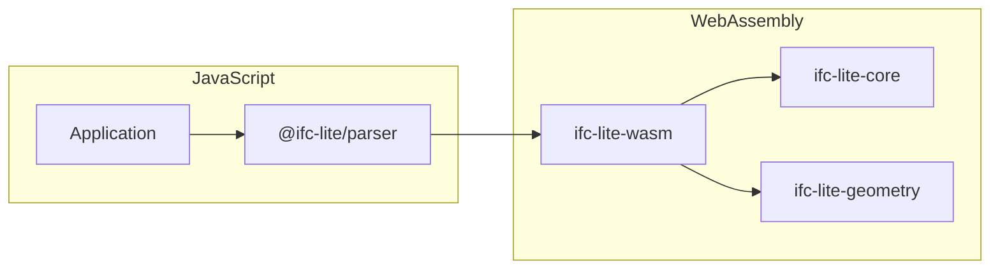

# WASM Bindings API

API documentation for the WebAssembly bindings.

## Overview

IFClite provides WebAssembly bindings for high-performance parsing and geometry processing in the browser.



## Loading the WASM Module

### Automatic Loading

The TypeScript packages handle WASM loading automatically:

```typescript
import { IfcParser } from '@ifc-lite/parser';

// WASM is loaded automatically
const parser = new IfcParser();
await parser.parseColumnar(buffer);
```

### Manual Loading

For custom setups:

```typescript
import init, { IfcAPI } from '@ifc-lite/wasm';

// Initialize WASM
await init();

// Or with custom URL
await init('/path/to/ifc-lite_bg.wasm');

// Create API instance
const api = new IfcAPI();
```

## IfcAPI Class

Main entry point for WASM functionality.

### Constructor

```typescript
class IfcAPI {
  constructor();
}
```

### Methods

The methods below reflect the real `IfcAPI` surface (see `packages/wasm/pkg/ifc-lite.d.ts`). There is no single `parse()` call: scanning, geometry, and export are separate entry points.

#### Measured Plane Calibration

`IfcAPI.calibrateAppearancePlane(requestJson)` returns UTF-8 JSON containing a
world-space planar mapping, four raster corners (top-left clockwise), and metres
per native source unit. The request is capped at 8 KiB. This fixed-size
calculation does not load IFC geometry, decode an image or apply an edit.

Supply `rasterToSource` (the six-element pixel-edge-to-native-source affine),
`rasterSize`, two native `sourcePoints`, their measured `distanceMetres`, and a
`worldAnchor`, `worldDirection` and `planeNormal` in IFC Z-up metres. For PDF
pages, use the raster recipe's `pixelToPdf` affine; paper dimensions and DPI do
not establish drawing scale. Keep the native landmarks when recropping or
rotating the raster. The returned mapping uses IFC's bottom-left UV origin.

Zero spans, invalid directions, sheared rasters, oversized images and
unrepresentable coordinates return errors. Each reconstructed edge and anchor
displacement must preserve its intended vector within one part per million,
independently of the absolute world origin. Calibrating a plane does not provide
bounded image compositing: preserving prior appearance outside a PDF page
requires the separate projection/bake stage.

#### Appearance Planning

`IfcAPI.planAppearance(content, requestJson)` accepts an effective IFC STEP
snapshot as `Uint8Array` and an `AppearanceRequest` JSON string. It returns
UTF-8 `AppearancePlan` JSON bytes and never mutates the source. Run this
synchronous operation in a dedicated worker; terminate that worker to cancel.
Free the `IfcAPI` handle in `finally` when the job ends.

The browser client rejects source snapshots above 128 MiB before copying them to
the worker. The binding limits request JSON to 256 KiB and serialized results to
64 MiB; the Rust planner separately bounds aggregate geometry and texture work.
Budget errors require a smaller source or scope and do not return a partial edit.

The request supplies `schema` (`IFC4` or `IFC4X3`), `sourceRevision`, the reserved
`nextExpressId` allocator watermark, `productIds`, a safe relative `imageUri`,
`repeatS`, `repeatT`, and `mapping`. Mapping accepts `existingUv` with scale,
offset and rotation in radians; `planar` with an item/world frame, orthonormal
axes, origin and tile dimensions in metres; or `box` with an item/world frame,
origin and three tile dimensions in metres. Exact shapes are defined in
`rust/processing/src/appearance/types.rs`.

Only direct, unshared `IfcTriangulatedFaceSet` Body representations are initially
eligible. The result reports exclusions per product; hosts must obtain explicit
acceptance of a reduced scope. Plans contain created IFC entities, positional
attribute edits and canonical source/target triangle indices with preview UVs
in triangle-corner order. Consumers must validate geometry provenance; matching
vertex counts alone cannot establish UV correspondence.

Before committing, the host must revalidate the source revision and allocator,
retain the referenced image bytes, and prepare all renderer and IFC changes.
Apply the complete plan atomically with one undo entry. Package the image at its
relative URI when exporting IFCZIP. Planning does not provide asset persistence,
GPU preview, history or collaboration by itself.

#### Entity Scanning

SIMD-accelerated scanners that return entity references for the data-model layer to decode.

```typescript
scanEntitiesFast(content: string): any;         // all entities, from a decoded string
scanEntitiesFastBytes(data: Uint8Array): any;   // all entities, straight from bytes (no TextDecoder)
scanGeometryEntitiesFast(content: string): any; // only entities that carry geometry
```

**Example:**
```typescript
const api = new IfcAPI();
const text = await fetch('model.ifc').then(r => r.text());
const entities = api.scanEntitiesFast(text);
```

#### Geometry Pipeline

Geometry is produced in two phases: a pre-pass over the file, then one or more batched mesh-production calls.

```typescript
buildPrePassOnce(data: Uint8Array): any;
buildPrePassStreaming(
  data: Uint8Array,
  onEvent: (event: unknown) => void,
  chunkSize: number,
  disabledTypeNames: string[] | null,
  skipTypeGeometry: boolean,
): any;

// jobsFlat is [id, start, end] triples from the pre-pass; the trailing args
// carry unit scale, RTC offset, void keys, and styles (see the .d.ts).
processGeometryBatch(
  data: Uint8Array,
  jobsFlat: Uint32Array,
  unitScale: number,
  /* rtcX, rtcY, rtcZ, needsShift, void + style + material args */
): MeshCollection;
```

`processGeometryBatchInstanced` (returns an IFNS instancing shard as a `Uint8Array`) and `processGeometryBatchPartitioned` (returns a `PartitionedBatch`) are variants of the same call. Each returned `MeshCollection` exposes `length`, `get(i)` / `takeMesh(i)`, and RTC offsets (see Data Types).

To avoid re-copying the file bytes on every batch, call `setSourceBytes(data)` once and then use the `FromSource` twins, which read the held bytes and are byte-for-byte identical to the legacy calls:

```typescript
setSourceBytes(data: Uint8Array): void;
processGeometryBatchFromSource(jobsFlat, unitScale, /* same trailing args */): MeshCollection;
processGeometryBatchPartitionedFromSource(jobsFlat, unitScale, /* ... */): PartitionedBatch;
```

The sharded pre-pass can reuse the same installed source before geometry batches:

```typescript
scanEntityIndexShardFromSource(start: number, end: number): any;
resolveStyledItemsShardFromSource(spans: Uint32Array): any;
finalizePrepassStylesFromSource(
  orphanIds: Uint32Array, orphanColors: Float32Array,
  geomIds: Uint32Array, geomColors: Float32Array,
  colourMapSpans: Uint32Array, materialDefSpans: Uint32Array,
  relMaterialSpans: Uint32Array, voidSpans: Uint32Array,
  fillsSpans: Uint32Array, aggregateSpans: Uint32Array,
  planeAngleToRadians: number,
): any;
```

Call `setSourceBytes` before these methods and `setEntityIndex` before resolving
or finalizing styles. They use the same scanner and style processing as the
byte-taking methods, with identical arguments after omitting the source bytes.
`clearPrePassCache()` releases the installed source and index; use it on completion,
cancellation, or failure. Install the new source and index before reusing an API
instance for another model. JavaScript input arrays remain usable after
`setEntityIndex`; its binding adopts its own WASM allocations, while the Rust
`set_entity_index` method continues to accept borrowed slices.

#### Export

Each exporter takes the raw IFC bytes (or already-produced meshes) and returns a `Uint8Array`.

```typescript
exportGlb(content, includeMetadata, hidden, isolated, hiddenTypesCsv, lit?): Uint8Array;
exportGlbFromMeshes(/* flattened MeshData buffers */): Uint8Array;
exportKmz(glb, latitude, longitude, altitude, xAxisAbscissa, xAxisOrdinate, name): Uint8Array;
exportObj(content, includeNormals, hidden, isolated): Uint8Array;
exportCsv(content, mode, delimiter, includeProperties): Uint8Array;
exportJson(content, pretty, includeProperties, includeQuantities): Uint8Array;
exportJsonld(content, context, includeProperties, includeQuantities, pretty, included): Uint8Array;
exportIfcx(content, onlyKnownProperties, pretty): Uint8Array;
exportStep(content, schema, included, mutationsJson): Uint8Array;
exportMerged(concatenated, lengths, schema): Uint8Array;
exportHbjson(content, name): Uint8Array;
```

**Example:**
```typescript
const obj = api.exportObj(ifcContent, true, new Uint32Array(), new Uint32Array());
const hbjson = api.exportHbjson(ifcContent, 'my_model');
```

`exportGlb` fails closed: when the visible mesh set is empty it throws an `Error` whose message starts with `NO_RENDER_GEOMETRY` rather than returning an empty GLB.

`exportStep` also fails closed on `mutationsJson`: an empty string means "no mutations" and exports cleanly, but a non-empty string that fails to parse throws (message prefixed `exportStep:`) instead of silently exporting the model with none of the caller's edits applied.

#### Other Parsing

```typescript
extractProfiles(content: string, modelIndex: number): ProfileCollection;
parseGridLines(content: string): Float32Array;                        // flat line-list vertices
parseGridAxes(content: string): GridAxisCollection;                   // axes with tags
parseAlignmentLines(content: string): Float32Array;
parseSymbolicRepresentations(content: string): SymbolicRepresentationCollection;
diagnoseGeometry(content: Uint8Array): any;                           // CSG / opening diagnostics
```

#### Diagnostics and Tuning

```typescript
getPipelineDiagnostics(): any;
getMemory(): any;

setEntityIndex(ids: Uint32Array, starts: Uint32Array, lengths: Uint32Array): void;
setMergeLayers(enabled: boolean): void;
setSkipSmallCuts(on: boolean): void;
setRectParamFastPath(enabled: boolean): void;
setTessellationQuality(level?: string | null): void;
setComputeGeometryHashes(tolerance?: number | null): void;
setReferencedRepmaps(ids: Uint32Array): void;
setMappedInstancePlan(sourceIds: Uint32Array): void;
setInstantiatedTypeIds(ids: Uint32Array): void;
setMaterialLayerIndex(/* per-element layer buildup columns, see the .d.ts */): void;
clearPrePassCache(): void;
```

#### Getters

```typescript
readonly version: string;   // build version string
readonly is_ready: boolean; // true once the API is initialized
```

### Other Exported Classes

Beyond `IfcAPI` and the mesh types below, the module exports `ClashSession` / `ClashRunResult` (native clash detection over ingested mesh buffers), `GridAxisCollection` / `GridAxisJs` (parsed grid axes), `ProfileCollection` / `ProfileEntryJs`, `PartitionedBatch`, `MeshOutlineJs`, `SpacePlateHandle` (interactive space-sketch topology), `Contours2D` (see below), and the `Symbolic*` classes (`SymbolicRepresentationCollection`, `SymbolicPolyline`, `SymbolicCircle`, `SymbolicText`, `SymbolicFillArea`). See `packages/wasm/pkg/ifc-lite.d.ts` for their full definitions.

### 2D Boolean Operations (contour sets)

General union / difference / intersection over 2D contour sets, backed by the same `i_overlay` engine the void/CSG paths use. This is the general form of `meshOutline2d`: where that unions one mesh's projected triangles into a silhouette, these combine two silhouettes. Use them for analytic hidden-surface removal (subtract an accumulated occluder from each element's outline), screen tiling, or any downstream 2D CSG.

```typescript
class Contours2D {
  // Build from flat [x0,y0,x1,y1,…] coords + per-ring VERTEX counts.
  // Throws if the counts don't sum to coords.length / 2. Degenerate rings
  // (< 3 vertices, non-finite, or exactly collinear) are dropped at construction.
  constructor(coords: Float64Array, ringLengths: Uint32Array);

  // Adopt a meshOutline2d result directly (widens its f32 coords to f64).
  static fromMeshOutline(outline: MeshOutlineJs): Contours2D;

  readonly ringCount: number;   // total boundary rings across all shapes
  readonly shapeCount: number;  // disjoint shapes; 0 for a raw, unresolved set
  readonly isEmpty: boolean;

  shapeOffsets(): Uint32Array;  // ring index where each shape's OUTER ring starts
  ring(index: number): Float64Array | undefined;  // one ring, flat [x,y,…]
  coords(): Float64Array;       // every ring concatenated (one boundary crossing)
  ringLengths(): Uint32Array;   // vertex count per ring, matching coords()
  bounds(): Float64Array | undefined;  // [minX, minY, maxX, maxY]
  free(): void;
}

function union2d(a: Contours2D, b: Contours2D): Contours2D;         // a ∪ b
function difference2d(a: Contours2D, b: Contours2D): Contours2D;    // a − b
function intersection2d(a: Contours2D, b: Contours2D): Contours2D;  // a ∩ b
function resolve2d(a: Contours2D): Contours2D;  // self-union a ring soup into shapes
```

**Winding is the contract.** The fill rule is always `nonzero`, and input winding is respected — matching `meshOutline2d` output and SVG `fill-rule="nonzero"`, so holes survive a round trip. Because it is NonZero, winding is relative to the rings around a point, not absolute: a counter-clockwise ring covers area, and a clockwise ring subtracts only where it overlaps positive winding — so a CW ring nested inside a CCW ring is a hole, but a *lone* CW ring still fills (it has non-zero winding). Raw contours that all mean "covered" (e.g. projected triangles) must be wound CCW before use.

**Results keep every disjoint shape.** `difference2d` that splits its subject returns one shape per island (grouped via `shapeOffsets()`) — a wall seen past a column is two visible slivers, not one. The `b` contour set may itself hold any number of clip rings; they subtract as their union, so there is no separate "difference against many" overload — collect the clips into one `Contours2D` and pass it as `b`.

**Manual freeing.** Every returned `Contours2D` owns wasm memory and the operations return **new** handles without mutating their operands. An accumulating loop must `free()` the handle it replaces:

```typescript
import { Contours2D, difference2d, union2d } from '@ifc-lite/wasm';

let occluders = new Contours2D(new Float64Array(), new Uint32Array()); // empty
for (const outline of frontToBackOutlines) {
  const visible = difference2d(outline, occluders); // may split into islands
  const grown = union2d(occluders, outline);
  occluders.free();          // free the handle we're replacing
  occluders = grown;
  emitSvgPath(visible);      // fill-rule="nonzero"
  visible.free();
  outline.free();
}
occluders.free();
```

`bounds()` is cheap enough to gate the boolean itself: skip the difference when an accumulated occluder's bounds miss the next element.

## Data Types

### MeshCollection

Returned by `processGeometryBatch`. Holds the batch's meshes plus RTC and totals.

```typescript
class MeshCollection {
  readonly length: number;
  get(index: number): MeshDataJs | undefined;      // clones (non-destructive)
  takeMesh(index: number): MeshDataJs | undefined; // moves out (read-once, faster)
  hasRtcOffset(): boolean;
  readonly rtcOffsetX: number;
  readonly rtcOffsetY: number;
  readonly rtcOffsetZ: number;
  readonly totalVertices: number;
  readonly totalTriangles: number;
  readonly buildingRotation: number | undefined;
  readonly diagnostics: any;
  // Geometry-diff hashes, populated when setComputeGeometryHashes() is on
  readonly geometryHashIds: Uint32Array;
  readonly geometryHashValues: BigUint64Array;
  readonly geometryHashCount: number;
  readonly geometryAabbValues: Float64Array;  // 6 per id, see below
  readonly geometryVolumeValues: Float64Array; // 1 per id, NaN = not provable
  readonly geometryClosureFlags: Uint8Array;   // 1 per id, packed verdict
}
```

#### geometryAabbValues

Per-entity world bounding boxes from the same pass as the hashes, gated by the
same `setComputeGeometryHashes()` switch — empty when geometry hashing is off.

Six `f64` per entry, `[minX, minY, minZ, maxX, maxY, maxZ]`, in
`geometryHashIds` order: entry `i` occupies `[6*i, 6*i+6)`, so
`geometryAabbValues.length === 6 * geometryHashCount` always. An entity that
produced a hash but no box reserves its six slots as `NaN` rather than
shortening the array, which would mis-attribute every later entry.

The box is in the **WebGL Y-up frame**, like `positions`, `origin` and
`localBounds` — not the IFC Z-up frame the hasher accumulates in. It holds
absolute world coordinates while `positions` are RTC-relative, so fold the
collection's RTC offset in (itself Y-up-swapped) before comparing the two:

```js
const world = [
  origin[0] + positions[3 * v + 0] + collection.rtcOffsetX,
  origin[1] + positions[3 * v + 1] + collection.rtcOffsetZ,
  origin[2] + positions[3 * v + 2] - collection.rtcOffsetY,
];
```

Why it exists: a changed geometry hash conflates *moved*, *reshaped* and
*re-tessellated* into one bit. The box separates them — same extent at a new
centre is a move, a different extent is a reshape, an identical box with a
different hash is retriangulation.

`@ifc-lite/geometry` reads this for you: the box lands on `MeshData.geometryAabb`
(and, for entities whose whole geometry went to the GPU-instanced shard, on
`GeometryResult.instancedGeometryAabbs`). The `NaN` sentinel is resolved to
`undefined` at that boundary, so a `geometryAabb` you hold is always a real box.

#### geometryVolumeValues and geometryClosureFlags

Two companions from the same pass, gated by the same
`setComputeGeometryHashes()` switch and following the same index-parallel rule:
one value per entry in `geometryHashIds` order.

`geometryVolumeValues` is the enclosed volume in **cubic metres**, and `NaN`
means no trustworthy volume — the same absent convention as the box. It is
`NaN` for roughly a third of entities BY DESIGN. A divergence-theorem volume
needs a closed, consistently wound surface, so a value is emitted only when the
entity produced exactly one segment and that segment was exactly one closed,
orientable component. An open `SurfaceModel`, a material-layered wall (whose
slices are open bands by construction) and any element assembled from more than
one representation item all report nothing rather than a plausible wrong number
— summing overlapping items produced a volume larger than the element's own
bounding box on 987 measured elements.

`geometryClosureFlags` says WHICH clause failed, so a refusal is actionable:
bit 0 (`1`) all segments closed, bit 1 (`2`) all orientable, bit 2 (`4`) all a
single connected component, bit 3 (`8`) exactly one segment. `0x0F` is exactly
the set that carries a volume. "This wall is an open shell" (bit 0 clear) and
"this door is a multi-item assembly" (bit 3 clear) are different findings with
different fixes.

A clear bit means **not proved**, not proved-false. Almost always the two
coincide, but bits 0-2 are also *retracted* when the mesh was edited after the
verdict was taken: the f32-collapse degenerate-triangle backstop runs at the end
of mesh production, and a dropped triangle turns each of its three edges' other
side into a boundary edge, so an element that dropped anything can no longer be
certified closed and ships no volume.

Closedness is a property of the surface, not evidence it is the RIGHT surface:
when the CSG budget trips, the uncut host is still a flawless closed solid that
merely still contains its openings, so a consumer that cares must also read
`diagnostics.totalCsgFailures`.

`@ifc-lite/geometry` reads the volume for you, exactly as it reads the box: it
lands on `MeshData.geometryVolume` (and, for a fully GPU-instanced entity, on
`GeometryResult.instancedGeometryVolumes`), with the `NaN` resolved to
`undefined` at that boundary. Nothing downstream ever holds a NaN-bearing
number, and a `geometryVolume` you hold is one the mesher proved. The closure
flags are **not** plumbed to JS: their audience is a model checker asking why a
volume is missing, and re-deriving the answer from a byte on every batch would
cost every load for a diagnosis nothing on that side consumes.

### MeshDataJs

A single triangulated mesh. All typed arrays are copied to JS on access.

```typescript
class MeshDataJs {
  readonly expressId: number;
  readonly ifcType: string;           // e.g. "IfcWall"
  readonly positions: Float32Array;   // xyz triplets
  readonly normals: Float32Array;     // xyz triplets
  readonly indices: Uint32Array;      // triangle indices
  readonly uvs: Float32Array;         // uv pairs (empty when untextured)
  readonly color: Float32Array;       // [r, g, b, a]
  readonly origin: Float64Array;      // per-element local-frame origin (metres)
  readonly vertexCount: number;
  readonly triangleCount: number;
  readonly geometryClass: number;     // 0 = occurrence, 1 = orphan type, 2 = instanced type

  // Optional capture of the local frame (undefined when not captured)
  readonly localBounds: Float32Array | undefined;   // object-space AABB [minX..maxZ]
  readonly localToWorld: Float64Array | undefined;  // resolved placement, row-major 4x4

  // Surface textures (empty / false when untextured)
  readonly hasTexture: boolean;
  readonly textureRgba: Uint8Array;   // decoded RGBA8 bytes (width*height*4)
  readonly textureWidth: number;
  readonly textureHeight: number;
  readonly textureRepeatS: boolean;
  readonly textureRepeatT: boolean;
  readonly shadingColor: Float32Array | undefined;  // authored SurfaceColour, when distinct
}
```

### Pre-pass Streaming Events

`buildPrePassStreaming` invokes its callback with one of:

```typescript
type PrePassEvent =
  | { type: 'meta'; unitScale: number; rtcOffset: [number, number, number]; needsShift: boolean; buildingRotation?: number }
  | { type: 'jobs'; jobs: Uint32Array }   // [id, start, end] triples
  | { type: 'complete'; totalJobs: number }
  // Auxiliary events — carry data the pre-pass already computed so callers can
  // skip a second file scan. Consumers that only need geometry jobs can ignore
  // them. Each shape below lists its principal fields; the styles / columns
  // events also carry additional material-plumbing arrays (see
  // `geometry-parallel.ts`).
  | { type: 'entity-index'; ids: Uint32Array; starts: Uint32Array; lengths: Uint32Array }
  | { type: 'styles'; styleIds: Uint32Array; styleColors: Uint8Array; voidKeys: Uint32Array; voidCounts: Uint32Array; voidValues: Uint32Array }
  | { type: 'prepass-columns'; referencedRepmaps: Uint32Array; instantiatedTypeIds: Uint32Array; mliElementIds: Uint32Array };
```

The auxiliary events (`entity-index`, `styles`, `prepass-columns`) carry the scanned entity index, style colours, and pre-pass column data. Type the callback against the full union above so exhaustive handling does not silently miss them.

## Error Handling

WASM functions surface failures as standard JavaScript `Error` objects (a Rust `Result::Err` is mapped across the boundary). Wrap calls that can fail:

```typescript
try {
  const glb = api.exportGlb(content, true, new Uint32Array(), new Uint32Array(), '');
} catch (error) {
  if (error instanceof Error) {
    console.error('Export error:', error.message);
  }
}
```

### Sentinel Messages

Some boundaries fail closed with a sentinel-prefixed message so callers can distinguish an expected empty result from a real failure. For example, `exportGlb` throws an `Error` whose message starts with `NO_RENDER_GEOMETRY` when the visible mesh set is empty, instead of returning a structurally valid but empty GLB.

## Performance Tips

### 1. Stream the Pre-pass for Large Files

```typescript
// Good: stream jobs as the file is scanned (time-to-first-geometry drops sharply)
api.buildPrePassStreaming(bytes, onEvent, 512, null, false);

// Avoid on very large files: a single blocking pre-pass over the whole file
api.buildPrePassOnce(bytes);
```

### 2. Read Each Mesh Once

```typescript
// Good: takeMesh moves the mesh out (one fewer vertex-data copy per mesh)
const meshes = api.processGeometryBatch(bytes, jobsFlat, unitScale /* ... */);
for (let i = 0; i < meshes.length; i++) {
  const mesh = meshes.takeMesh(i);
  if (mesh) uploadMesh(mesh);
}
```

### 3. Release Memory

```typescript
// Clean up when done
api.free();
```

## Browser Compatibility

| Feature | Chrome | Firefox | Safari | Edge |
|---------|--------|---------|--------|------|
| WebAssembly | 57+ | 52+ | 11+ | 16+ |
| WASM SIMD | 91+ | 89+ | 16.4+ | 91+ |
| Streaming | 61+ | 58+ | 15+ | 16+ |
| Threads | 74+ | 79+ | 14.1+ | 79+ |

## Module Size

The built artifacts land in `packages/wasm/pkg/` (`ifc-lite_bg.wasm` binary plus `ifc-lite.js` glue). `scripts/build-wasm.sh` targets a 1100 KB budget for the single-thread bundle and warns when the binary exceeds it (`wasm-opt` is disabled in the crate's wasm-pack profile). The threaded bundle is built separately and carries no budget. Sizes vary by build profile and target.

## Building from Source

Use `scripts/build-wasm.sh` — it's the build CI and Vercel run, and the one
this repo wants people running. It sets `CARGO_UNSTABLE_BUILD_STD` (needed for
the single-thread and threaded bundles) and the wasm-target `rustflags`
before invoking `wasm-pack`; running `wasm-pack build` directly, without that
env var, silently produces a different (larger, `build-std`-less) bundle than
the one CI ships.

```bash
# Install wasm-pack
cargo install wasm-pack

# Build WASM module
bash scripts/build-wasm.sh

# Output files
# packages/wasm/pkg/ifc-lite.js
# packages/wasm/pkg/ifc-lite_bg.wasm
# packages/wasm/pkg/ifc-lite.d.ts
```

### Build Targets

| Target | Output | Use Case |
|--------|--------|----------|
| `web` | ES modules | Modern browsers |
| `bundler` | CommonJS | Webpack/Rollup |
| `nodejs` | Node.js | Server-side |
| `no-modules` | Global | Script tag |


### Streaming prepass source fingerprints

`IfcAPI.buildPrePassStreamingWithSourceFingerprint` and
`IfcAPI.buildPrePassStreamingShardedWithSourceFingerprint` accept the same arguments
as `buildPrePassStreaming` and `buildPrePassStreamingSharded`, respectively. They
run the same prepass and add `sourceContentKey` to the final `complete` event. The
key is the existing full-byte FNV-1a source identity, including comments and any
unparsed tail. Existing methods and their Rust signatures remain unchanged and do
not compute this extra key. Feature-detect the new methods when supporting older
WASM builds. The viewer uses these methods only when a matching parser has a fresh
fingerprint cell; no additional file-sized buffer is created.


### Effective appearance scope catalog

`IfcAPI.catalogAppearance(content, requestJson)` accepts the same effective IFC
STEP snapshot as planning, plus `{schema, sourceRevision, productIds}`. It returns
UTF-8 JSON with `sourceRevision`, sorted `products` (`productId`, canonical
PascalCase `ifcClass`, sorted `typeIds`), sorted `types` (`typeId`, `ifcClass`, exact
IFC `Name` or null), and sorted `missingProductIds`. Missing/deleted IDs and
non-`IfcProduct` owners are explicitly ineligible. Duplicate type names retain
separate identities. Membership comes from effective `IfcRelDefinesByType` rows.

Call from a worker. The host must serialize its current overlay first and validate
its captured revision/checkpoint before accepting selectors; the source store's
original relationship tables do not include SDK edits. The existing `planAppearance`
API is unchanged. The viewer client shares cancellation, supersession, timeout and
worker disposal across `catalog()` and `plan()` jobs, without retaining a WASM
context or transferring caller-owned source storage.

Catalog limits are 10,000 requested IDs, a 4,096-byte revision, the planner's shared
128 MiB source/200,000 entities/eight-million-value parse bounds, 200,000 unique
owner/type memberships and 4 MiB total type-name bytes. Request JSON is limited to
256 KiB and output serialization uses the existing 64 MiB ceiling. A refusal throws
instead of returning a truncated selector catalog.

### Finite page appearance output

`IfcAPI.planPageAppearance(content, requestJson, rgba)` is the worker-oriented
binding for `plan_page_appearance`. The JSON request is
`{appearance, page, sourceImages: [{imageUri, raster}], texelsPerMetre}`; raster
ranges use `{width, height, byteOffset, byteLength}`. It preserves existing
appearance outside the finite planar page by baking bounded PNG atlases. The
original image-only `planAppearance` method remains unchanged.

The returned bytes contain the ASCII magic `IFPA`, a little-endian `u32` JSON
byte length, UTF-8 JSON metadata, then concatenated PNG payloads. Metadata is
`{plan, itemImages, assets, texelsPerMetre}`. Each asset is
`{imageUri, width, height, byteOffset, byteLength}` with its range relative to the
PNG section. `itemImages` maps `geometryItemId` to `imageUri`. The metadata ceiling
is 64 MiB and the complete envelope ceiling is 160 MiB. No PNG bytes are expanded
into base64 or JSON number arrays. Hosts should run this synchronously expensive
operation in a cancellable worker, validate the source/allocator checkpoint,
and atomically register every digest-named PNG before applying its IFC plan.
See [finite page appearance](rust.md#finite-page-appearance) for quality limits
and explicit refusals.

### Calibrated annotation creation

`IfcAPI.planAnnotationPlane(content, requestJson)` returns UTF-8
`AnnotationPlanePlan` JSON from the native creation planner. Requests use
`{schema, sourceRevision, nextExpressId, containerId, GlobalId, containmentGlobalId,
Name, imageUri, frame: {origin, axisU, axisV, sizeMetres}}`. No image bytes or new
model-load call are needed: retain the already registered image URI and commit
its asset lease together with the typed creation plan. Run in a cancellable worker
and revalidate the captured source/allocator immediately before publication.

The viewer's `annotationPlan()` shares cancellation, supersession, timeout,
worker teardown and stale-result validation with image/page planning and catalog
requests. Its `mesh` is canonical native Z-up geometry, while UVs already use
bitmap top-down orientation. See [calibrated annotations](rust.md#calibrated-image-annotations)
for the exact coordinate/containment contract and bounded refusal conditions.

### Captured textured surface creation

`IfcAPI.planCapturedMesh(source, requestJson)` plans one explicitly segmented
textured surface as `IfcBuildingElementProxy`. It shares annotation creation's
canonical placement, container validation, IFC entity planning and ordinary
geometry producer. It does not decode a scan, reconstruct a surface, or infer a
semantic class.

The request contains `schema` (`IFC4` or `IFC4X3`), `sourceRevision`,
`nextExpressId`, `containerId`, `GlobalId`, `containmentGlobalId`, `Name`,
`imageUri`, and `mesh`. The mesh contains `positions` in IFC world Z-up metres,
zero-based `triangles`, independent `uvs` in IFC V-up convention, and zero-based
`uvTriangles`. Independent UV indices retain seams without conflating geometry
and image vertices. The non-repeating image must cover UVs within `[0, 1]`.

Each of the position, UV and triangle arrays is bounded to 200,000 rows. The
request and serialized result each have a 64 MiB ceiling. Invalid indices,
non-finite coordinates, degenerate triangles, stale allocation, duplicate IFC
identities and unrepresentable canonical coordinates fail before publication.
The planner retains original image URI ownership; callers must bundle the exact
image bytes and publish the entity plan, canonical mesh, hierarchy and history
atomically after checking the revision and allocator again.

The UTF-8 JSON response contains `plan`, `objectId`, `geometryItemId`, `mesh`,
`coordinateSpace: 'ifc-z-up'`, and `rtcOffset`. As with annotation creation,
canonical mesh UVs are already top-down for GPU upload; do not flip them again.
A fresh import can weld vertices differently, so round-trip correspondence is
measured per triangle corner rather than by assuming an identical vertex layout.

Captured mesh requests accept optional `repeatS` and `repeatT` booleans to retain
an imported image sampler on the authored `IfcImageTexture` and canonical mesh.
Both default to `false` when omitted. This does not extend the current supported
UV range: capture coordinates must still lie within `[0, 1]`.

### Scan correspondence registration

`IfcAPI.registerScanCorrespondences(requestJson)` returns UTF-8 JSON from the
canonical Rust `register_scan_correspondences` solver. It computes a proper rigid
rotation and anchored translation from manually identified point pairs; it does
not load, align or mark a scan as registered, estimate scale, run ICP, or transfer
appearance. Use the existing model/point-cloud alignment path when applying an
explicitly accepted result, preserving decode origins and federation transforms.

The request is `{sourceFrame, targetFrame, fit, heldOut}`. Each frame contains a
lowercase `assetSha256` for the exact source asset/effective IFC snapshot and a
`frameKey` identifying its coordinate frame and placement revision. Source points
are orthonormal native-source **metres**; target points are destination IFC world
**Z-up metres**, before viewer axis conversion or offsets. Convert known units
before creating the request; the solver never guesses them.

Each point pair has `id`, `sourceObservation`, `targetFeature`, `source: [x,y,z]`
and `target: [x,y,z]`. Hosts resolve target features through the normal model/entity
resolver and retain model identity, `GlobalId` and the geometric feature definition.
Source observations identify original points or reviewed neighborhoods. IDs,
source observations, target features and exact coordinates must be distinct across
both sets. Hosts must additionally ensure that differently named neighborhoods do
not reuse the same underlying observation; the solver cannot infer that from IDs.

The fit accepts 3–256 non-collinear points; held-out accepts 0–256. Planar
non-collinear point sets are mathematically valid. Each ID/frame key is at most
256 bytes; coordinates are finite and bounded to ±1e12 m; JSON is bounded to
512 KiB. Nearly collinear source/target scatter or correspondence covariance is
rejected at a second/first singular-value ratio below `1e-10`. Decompositions have
a finite iteration budget. Bounds and ratios are numerical refusal criteria,
not accepted scan accuracy tolerances.

The report contains both frame identities, `algorithm`, `requestSha256`, a
row-major `rotation`, `sourceAnchor`, `targetAnchor`, source/target scatter spectra,
and separate `fit`/`heldOut` residual lists with RMS and maximum in metres.
Apply the transform as `targetAnchor + rotation * (sourcePoint - sourceAnchor)`.
Each residual vector is predicted target minus observed target. Empty checks
produce null summary values, not zero error. No observations are automatically
removed as outliers. Reflections and scale changes remain visible as mismatch;
the emitted rotation is proper and has unit scale.

`requestSha256` hashes the algorithm ID `ifclite-rigid-correspondence-v1`, one
zero byte, and compact typed request JSON in Rust field order. It binds all frame
identities, coordinates, observation identities and the ordered fit/check partition.
Hosts retain the frozen request with the report and invalidate it after any source,
frame, feature or partition change. This digest binds declared inputs; it does not
verify the asset bytes or validate a user's correspondence claim.

A successful solve is not an accuracy verdict. F4 acceptance still requires at
least four fitting and four independently selected, spatially distributed held-out
features at different heights, uncertainty review, frozen tolerance, and explicit
assessment of unknown areas and thin-wall transfer. See the
[real CRAS evidence](../architecture/evidence/scan-transfer/README.md).

### Registered textured-mesh appearance transfer

`IfcAPI.planMeshTransfer(content, requestJson, rgba)` invokes canonical Rust
`plan_mesh_transfer` and returns the same `IFPA` metadata/PNG envelope as page
composition. It is a native/worker foundation; the call does not enable an Apply
button, move a model, approve registration accuracy, or infer IFC objects.

The typed `MeshTransferRequest` contains:

- `schema`, `sourceRevision`, `nextExpressId`, and nonempty `productIds`, with the
  same effective-snapshot/allocator contract as ordinary appearance planning.
- The immutable `registration` request and its `registrationSha256`. Rust repeats
  the fit-only solve and checks the report digest. The target frame's asset SHA-256
  must match the exact supplied IFC bytes. Holding out observations remains a host
  acceptance policy; a mathematical fit alone never authorizes transfer.
- Explicit `targetFromIfcWorld: {rotation, sourceAnchor, targetAnchor}`. This maps
  canonical IFC world Z-up metres into the registration's frozen target frame as
  `targetAnchor + rotation * (point - sourceAnchor)`. It must be proper rigid even
  for identity. The host derives it from actual model/workspace placement; never
  assume identity for federated or repositioned models. Unsupported reprojection
  must be refused until the exact transform is available.
- `sourceMesh: {meshOrdinal, positions, triangles, uvs, baseColorFactor, repeatS,
  repeatT}`. Positions are original GLB scene **Y-up metres**, with node transforms
  and the canonical mesh origin included, before workspace/model placement.
  Triangles use zero-based indices; per-vertex UVs retain duplicated seam vertices
  and the canonical decoder's texture transform. UVs are GLB image-top-down; Rust
  performs the single V conversion at its existing IFC raster-sampler boundary.
- `sourceImage` and existing target `sourceImages` use the page API's RGBA range
  descriptors. The first slice requires one opaque source image and neutral
  `[1,1,1,1]` base-color factor. Tint, alpha, missing old rasters and unsupported
  target materials are explicit refusals, never silently discarded.
- `texelsPerMetre`, positive `maxDistanceMetres` (at most 10), `minNormalDot` in
  `(0,1]`, and `ambiguityDistanceMetres` between zero and maximum distance. These
  are explicit sampling criteria, not estimated registration uncertainty.

The host verifies that decoded mesh, UVs, sampler and pixels belong to the pinned
original GLB. Rust receives decoded data and **does not verify original GLB bytes**.
Only currently supported occurrence-owned direct `IfcTriangulatedFaceSet` targets
are used; conversion policy is fixed to preserve. Canonical geometry, placement,
triangle winding and source-corner correspondence are checked before sampling.
Topology repair or inadequate coordinate precision prevents guessing provenance.

The sampler uses the existing geometry BVH to find geometric-nearest triangles
before filtering oriented normals. An incompatible nearest face becomes unknown;
a farther compatible face cannot paint through it. Near-tied separate surfaces,
duplicate overlaps and UV seams become unknown. Exact continuous shared edges
between consistently oriented, nonoverlapping coplanar triangles remain one
surface. Source UVs come from closest-point barycentrics. This is local surface
matching, not camera visibility reconstruction or confidence learned from scans.

Unknown samples preserve existing target albedo through the shared atlas/material
planner. The output adds `transfer` metadata: `preparedSha256`,
`registrationSha256`, the full `registration` fit/check residual report,
`applicable`, aggregate `coverage`, per-item coverage, target eligibility
`exclusions` (also retained without an applicable plan), and
explicit diagnostics. Fewer than four fit or four held-out observations carries
an insufficient-evidence diagnostic and `plan: null`, `applicable: false`, even
when samples are observed. Operational acceptance additionally requires that the
host verifies spatially distributed held-out observations and
their accepted residuals. Counts distinguish observed, distance, normal and ambiguity
outcomes. Area values are triangle-area-weighted estimates from centroid/interior
texel observations; chart padding is excluded. They are not exact covered-area
integrals. Entirely unknown output has `plan: null` and no PNG assets or mutations.
Partial coverage remains a review decision; it is never hidden behind a percent.

The prepared digest binds the entire typed request, IFC and supplied RGBA bytes.
Its input is `ifclite-mesh-transfer-v1`, a zero byte, little-endian u64 IFC length,
IFC bytes, little-endian u64 RGBA length, RGBA bytes, then compact typed request JSON.
Invalidate prepared results after any source, frame, target, pixel or criterion
change. Atomically adopt all assets and edits through the existing appearance
transaction, retaining owner leases and rechecking snapshot/allocator revisions.

JSON transport is capped at 64 MiB, source revision at 256 bytes, target raster
identities at 10,000 entries of 4,096 bytes, source vertices/triangles at 200,000 each,
source/target RGBA at 128 MiB combined and individual images at the existing
16-megapixel/8192-axis limits. Transfer preparation, BVH traversal/candidate tests
and atlas sampling share 64 million work units and a conservative 256-MiB
transfer-allocation budget. Existing canonical geometry, atlas pixel, PNG and
IFPA output caps also apply. These are separate bounded domains, not a claim
about exact whole-process peak memory. Run inside an owned cancellable worker;
termination discards the pending result, and any exhausted budget returns an
error rather than partial success. Input caps are maxima, not guaranteed capacity
at every combination of density, overlap and geometry complexity.

[Independent transfer evidence](../architecture/evidence/mesh-transfer/README.md)
checks a controlled IFC/PNG roundtrip. No real scan-to-BIM accuracy is claimed
without valid spatially distributed held-out correspondences.
