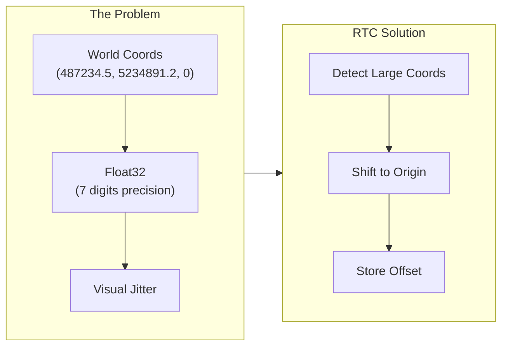
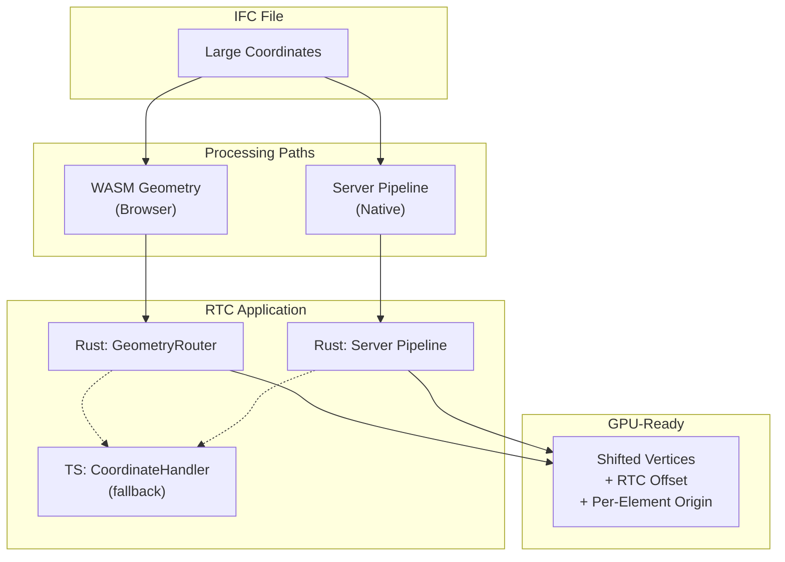

# Coordinate Handling & RTC (Relative To Center)

This document explains how IFClite handles large world coordinates to prevent floating-point precision issues during rendering.

## The Problem

Some IFC models incorrectly embed large world coordinates directly in geometry:

```
Building corner at: (487234.567, 5234891.234, 0.0)
```

**Important**: Large coordinates do NOT mean a model is georeferenced! Proper georeferencing in IFC is done via `IfcMapConversion` and `IfcProjectedCRS`, which store transformation parameters separately while keeping geometry in a local coordinate system with small values.

Large coordinates in geometry are a **bad practice** that has unfortunately become common. They cause rendering issues:

| Issue | Description |
|-------|-------------|
| **Float32 Precision** | GPU uses 32-bit floats with ~7 significant digits. Coordinates like `5234891.234` lose precision in the fractional part |
| **Visual Jitter** | Small movements in camera cause vertices to "snap" between representable values, creating flickering |
| **Z-fighting** | Near/far plane calculations break down at large distances from origin |
| **Picking Errors** | Ray-triangle intersection fails due to precision loss |



## RTC (Relative To Center) Solution

RTC shifts all geometry to be centered near the origin, storing the offset for later reconstruction:

```
Original:  (487234.567, 5234891.234, 0.0)
RTC Offset: (487000.000, 5235000.000, 0.0)
Shifted:   (234.567, -108.766, 0.0)  ← GPU-friendly!
```

### Thresholds

| Constant | Value | Purpose |
|----------|-------|---------|
| `LARGE_COORD_THRESHOLD_METERS` | 1,000m (1km, was 10km before #4934) | Triggers RTC shift detection. Rust-side; ask `coord_is_large` rather than comparing against it, so the comparison (strictly greater, any axis, absolute value) stays in one place. One live exception, `ModelBounds::has_large_coordinates`, compares the six scaled bbox extents directly; it uses the same `>` so it agrees today, and routing it through the predicate is the obvious follow-up |
| `NORMAL_COORD_THRESHOLD` | 10,000m | Max expected coordinate after RTC |
| `MAX_REASONABLE_COORD` | 10,000,000m | Reject obviously corrupt values |

## Architecture Overview

RTC is applied at different layers depending on the parsing path:



## Rust Layer (WASM & Server)

### GeometryRouter

The `GeometryRouter` (`rust/geometry/src/router/`, RTC logic in `rtc_offset.rs`) handles RTC:

```rust
impl GeometryRouter {
    /// Sample the file's own geometry entities, in file order, and fall back
    /// to the placement-bounds scan when none of them yields a usable
    /// translation. `None` = neither rung found a coordinate to judge, which
    /// is distinct from "judged, and no shift needed" (`RtcVerdict::Small`).
    /// `MeshFrame::select` in `ifc_lite_processing` decides what `None` means.
    /// Scans lazily and stops at the sample cap.
    ///
    /// The ONE detector every pipeline calls: the native processor, both
    /// browser pre-passes and the overlays. There is deliberately no variant
    /// that takes a caller-supplied job list (#4611) - a job list is a
    /// SCHEDULE, so a caller-supplied window made the anchor a function of the
    /// scheduler and one file resolved to several anchors.
    pub fn detect_rtc_offset_for_file(
        &self,
        content: &[u8],
        decoder: &mut EntityDecoder,
    ) -> Option<RtcVerdict>;

    /// The sampler alone, over the same window, with no bounds fallback and no
    /// verdict. Live: `resolve_partial_rtc` calls it TWICE, once against the
    /// partial index (over the scanned head) and once against a freshly built
    /// full index, and neither call can go through the entry point above
    /// because the retry has to happen before any bounds fallback. Reach for it
    /// only when you need that same "detect again, decide later" shape.
    pub fn detect_rtc_anchor_for_file(
        &self,
        content: &[u8],
        decoder: &mut EntityDecoder,
    ) -> Option<(f64, f64, f64)>;

    /// Set RTC offset - all subsequent transforms will apply this
    pub fn set_rtc_offset(&mut self, offset: (f64, f64, f64));

    /// Check if RTC offset is active
    pub fn has_rtc_offset(&self) -> bool;
}
```

`RtcVerdict` (`ifc_lite_core::limits`) carries the decision and the anchor
together, because the decision is not a property of the anchor: the
placement-bounds scan decides on the bbox CORNERS and answers with the bbox
CENTRE, which can be inside the gate while the coordinates still need re-basing.
`RtcVerdict::offset()` reads the translation to subtract - the anchor when
`Large`, zero when `Small`.

A scan-only detector without the verdict or the fallback
(`detect_rtc_offset_from_first_element`) was removed in #4611: it collapsed "no
sample" into `(0, 0, 0)`, and it had no production caller once the overlays
moved onto `detect_rtc_offset_for_file`. The two job-list entry points
(`detect_rtc_offset_with_fallback`, `detect_rtc_offset_from_jobs`) went in the
same issue, for the reason on `detect_rtc_offset_for_file` above.

### RTC Detection Logic

Detection is sample-based, not first-element-wins:

1. Scan the FILE for entities whose class carries geometry (`geometry_flags_by_name`, schema-driven, plus a spatial container that exceptionally carries a Representation). This window is the detector's own, never a job list the caller passes in.
2. Sample each element's placement translation, up to 50 usable samples (elements that abstain, such as origin-placed axis-only representations, do not consume the budget).
3. Take the per-axis **median** of the samples.
4. If any median axis exceeds `LARGE_COORD_THRESHOLD_METERS` (1 km, `coord_is_large`: strictly greater, any axis, absolute value), the verdict is `RtcVerdict::Large` anchored on that centroid; otherwise it is `RtcVerdict::Small` and the offset reads as `(0, 0, 0)`.
5. Only when no element gives a usable sample, fall back to the placement-bounds scan (`ModelBounds::rtc_offset`). It decides on the bbox corners: if any corner is past the gate the verdict is `RtcVerdict::Large` with the bbox centre as the anchor, even when that centre is itself inside the gate. `MeshFrame::select` honours a `Large` verdict as given; it does not re-judge the anchor's magnitude.

Using the median of many samples instead of the first element makes detection robust against a single outlier element parked at a survey point.

**The streaming pre-pass has one extra rung.** `MetaMode::StreamingPartial` runs
against a PARTIAL entity index, where the placement chain of a job may not be
resolvable yet, so `resolve_partial_rtc` (`rust/processing/src/stream_meta.rs`)
sits between steps 4 and 5: when the partial pass found no large offset AND
either the `IfcSite` has not been scanned yet or the partial index resolved no
usable sample at all, it builds a FULL index and detects again. Only if that
also comes back empty does it drop to the bounds scan. A successful partial
"no shift" that DID resolve samples is kept, not retried. Skipping the rung
sends a model whose world offset lives in late spatial placements to the bounds
scan, which answers a different question (bbox corners, not placements).
`MetaMode::SmallFileSingle` has the whole file already and calls
`detect_rtc_offset_for_file` directly. `MetaMode::StreamingPartial` carries the
byte offset its index reaches, and rung 1 samples only that head: nothing past
it can resolve a placement chain against a partial index, so sampling further
would decode the rest of the file to learn nothing (measured: 7 of 7 fixtures
walked to EOF, 235 ms on a 343 MB model) inside the mid-scan emission that
exists to keep time-to-first-geometry short. That head is the one place a
consumer of the same bytes can still land in a different frame: the overlays
(`MeshFrame::for_overlay`) sample the whole file, so on a model whose head does
not represent the rest of it, streamed meshes and overlays disagree. Closing
that means handing the emitted frame to the overlay parse APIs rather than
recomputing it there (#4611).

### Consistent Per-Mesh Application

**Critical**: RTC must be applied consistently to ALL vertices in a mesh. The decision is made once per mesh, tracked by an explicit flag rather than re-derived from coordinate magnitudes:

```rust
// rust/geometry/src/router/transforms/mesh_world.rs (abridged)
let rtc = self.rtc_offset;
// Apply RTC once per mesh; `rtc_applied` guards against double-shifting
// meshes that already went through an RTC-aware path (e.g. CSG operands).
let needs_rtc = self.has_rtc_offset() && !mesh.rtc_applied;
// Resolve the offset ONCE from `needs_rtc`: (0, 0, 0) when the shift must not
// be applied, so the subtraction below is a no-op for already-anchored meshes.
let (rx, ry, rz) = if needs_rtc { rtc } else { (0.0, 0.0, 0.0) };

for chunk in mesh.positions.chunks_exact_mut(3) {
    let point = Point3::new(chunk[0] as f64, chunk[1] as f64, chunk[2] as f64);
    let t = transform.transform_point(&point); // full f64 transform
    chunk[0] = (t.x - rx) as f32;
    chunk[1] = (t.y - ry) as f32;
    chunk[2] = (t.z - rz) as f32;
}
if needs_rtc {
    mesh.rtc_applied = true;
}
```

**Why per-mesh, not per-vertex?** If some vertices in a mesh get RTC applied and others don't, the mesh becomes corrupted with vertices at wildly different scales.

## Per-Element Local-Frame Origin

RTC removes the model-wide offset, but a building placement of a few hundred metres is still enough to degrade f32: one ULP at 220 m is about 15 um, which can collapse adjacent vertices of finely tessellated geometry into degenerate needles. To prevent this, meshes carry a **per-element origin**:

```typescript
// MeshData (packages/geometry/src/types.ts)
// Per-element local-frame origin (metres): world position of vertex i =
// origin + positions[3i..3i+3].
origin?: [number, number, number];
```

The framed transform path (`mesh_world.rs`) transforms every vertex in f64, tracks the AABB, and then stores positions relative to an AABB-derived origin so the f32 payload stays small. `origin` is `[f64; 3]` on the Rust side (`MeshData.origin`). Every world-space consumer (raycasting, measurement, export, snapping) must fold `origin` back in; normals are translation-invariant and unaffected. The renderer relativizes all batches against a shared scene-level origin and expresses it as a translation in the model matrix, so the GPU only ever sees small local coordinates.

## TypeScript Layer (Fallback)

### CoordinateHandler

`packages/geometry/src/coordinate-handler.ts` provides TypeScript-side coordinate handling as a fallback when WASM doesn't apply RTC:

```typescript
export const NORMAL_COORD_THRESHOLD_M = 10000;

export class CoordinateHandler {
    private originShift: Vec3 = { x: 0, y: 0, z: 0 };
    private readonly MAX_REASONABLE_COORD = 1e7;

    // Authoritative pre-pass state. Undefined is reserved for native producers
    // that cannot report their coordinate frame and therefore need inference.
    private wasmRtcApplied: boolean | undefined = undefined;
    // Active threshold used by both bounds validation and position cleanup.
    private activeThreshold: number = 1e7;

    /**
     * Record the world→render metadata the WASM pre-pass resolved for this
     * model: the length-unit scale and the RTC offset the mesh path actually
     * subtracted. Pass `rtcOffset: null` when no shift was applied.
     */
    setWasmMetadata(lengthUnitScale: number | undefined, rtcOffset: Vec3 | null, exactFrame?: RtcFrame): void;

    /**
     * Process meshes incrementally for streaming, using the authoritative
     * WASM metadata when `setWasmMetadata` has been called.
     */
    processMeshesIncremental(batch: MeshData[]): void;

    /**
     * Coordinate info during (nullable) and after streaming
     */
    getCurrentCoordinateInfo(): CoordinateInfo | null;
    getFinalCoordinateInfo(): CoordinateInfo;
}
```

### WASM RTC Detection

`setWasmMetadata` records whether the WASM pre-pass applied an RTC shift, rather than
the TypeScript layer inferring it from coordinate ranges:

```typescript
setWasmMetadata(lengthUnitScale: number | undefined, rtcOffset: Vec3 | null, exactFrame?: RtcFrame): void {
    const frame = resolveWasmMetadataFrame(rtcOffset, exactFrame);
    this.lengthUnitScale = lengthUnitScale;
    this.appliedWasmRtcOffset = rtcOffset ? { ...rtcOffset } : null;
    this.wasmRtcApplied = rtcOffset !== null;
}
```

### Threshold Consistency

**Critical**: The same threshold must be used for bounds calculation AND vertex cleanup.
`processMeshesIncremental` derives it from `wasmRtcApplied` on every batch:

```typescript
processMeshesIncremental(batch: MeshData[]): void {
    // Applied WASM RTC uses the stricter post-RTC validation threshold.
    // Known-not-applied and unknown native coordinates start broad.
    this.activeThreshold = this.wasmRtcApplied === true
        ? NORMAL_COORD_THRESHOLD_M
        : this.MAX_REASONABLE_COORD;

    // Use same threshold for bounds...
    const batchBounds = this.calculateBounds(batch, this.activeThreshold);

    // ...and for vertex cleanup
    for (const mesh of batch) {
        this.shiftPositions(mesh.positions, this.originShift, this.activeThreshold);
    }
}
```

Native buffer streaming and adaptive native processing have no pre-pass decision and
retain the legacy first-vertex vote; WASM callers set their authoritative frame first
through `setWasmMetadata`.

## API Reference

### WASM APIs

The RTC offset is computed once by the pre-pass and then applied by every
geometry batch. There is no separate "GPU geometry" entry point — meshes come
out of `processGeometryBatch` already shifted into RTC-local coordinates.

#### buildPrePassOnce

```typescript
const pre = api.buildPrePassOnce(bytes);

// pre.needsShift  — true when the model has large coordinates needing RTC
// pre.rtcOffset   — Float64Array [x, y, z] origin to subtract (or undefined)
if (pre.needsShift && pre.rtcOffset) {
    console.log('RTC origin:', pre.rtcOffset[0], pre.rtcOffset[1], pre.rtcOffset[2]);
}
```

#### processGeometryBatch

The pre-pass RTC offset and `needsShift` flag are passed straight into each
batch call, so positions returned by `collection.get(i)` are already
RTC-shifted (subtract was applied in WASM):

```typescript
const collection = api.processGeometryBatch(
    bytes, jobs, pre.unitScale,
    pre.rtcOffset?.[0] ?? 0, pre.rtcOffset?.[1] ?? 0, pre.rtcOffset?.[2] ?? 0,
    pre.needsShift,
    pre.voidKeys, pre.voidCounts, pre.voidValues,
    pre.styleIds, pre.styleColors,
    // ... plus optional plane-angle scale and material palette arguments
);
```

### TypeScript APIs

#### CoordinateHandler

```typescript
import { CoordinateHandler } from '@ifc-lite/geometry';

const handler = new CoordinateHandler();

// Process streaming batches
for (const batch of batches) {
    handler.processMeshesIncremental(batch);
}

// Get final coordinate info
const info = handler.getFinalCoordinateInfo();
if (info) {
    console.log('Origin shift:', info.originShift);
    console.log('Original bounds:', info.originalBounds);
    console.log('Shifted bounds:', info.shiftedBounds);
}

// Reset for new file
handler.reset();
```

#### CoordinateInfo Structure

```typescript
interface CoordinateInfo {
    originShift: Vec3;        // Shift applied to vertices
    originalBounds: AABB;     // Bounds in original coordinates
    shiftedBounds: AABB;      // Bounds after shift (GPU coordinates)
    hasLargeCoordinates: boolean; // True if RTC shift was needed
}
```

**Note**: `hasLargeCoordinates` indicates the model had coordinates requiring RTC shift. This is NOT the same as being georeferenced - proper georeferencing uses `IfcMapConversion`.

## Usage Patterns

### Pattern 1: Streaming via GeometryProcessor

The high-level `@ifc-lite/geometry` processor surfaces the RTC offset as a
stream event before the first batch, then yields RTC-shifted meshes:

```typescript
const geometry = new GeometryProcessor();
await geometry.init();

for await (const event of geometry.processStreaming(buffer)) {
    if (event.type === 'rtcOffset') {
        // Store for coordinate conversion back to world space
        setRtcOffset(event.rtcOffset);
    } else if (event.type === 'batch') {
        // Meshes already have RTC applied
        renderer.addMeshes(event.meshes);
    }
}
```

### Pattern 2: Server Streaming

When using server-side parsing:

```typescript
const response = await fetch('/api/parse', { body: file });

// Server applies RTC and returns shifted meshes + offset
const { meshes, coordinateInfo } = await response.json();

// coordinateInfo.origin_shift contains RTC offset
const rtcOffset = {
    x: coordinateInfo.origin_shift[0],
    y: coordinateInfo.origin_shift[1],
    z: coordinateInfo.origin_shift[2]
};

// Original bounds = shifted bounds + offset
const originalBounds = {
    min: {
        x: meshes.bounds.min.x + rtcOffset.x,
        y: meshes.bounds.min.y + rtcOffset.y,
        z: meshes.bounds.min.z + rtcOffset.z
    },
    max: {
        x: meshes.bounds.max.x + rtcOffset.x,
        y: meshes.bounds.max.y + rtcOffset.y,
        z: meshes.bounds.max.z + rtcOffset.z
    }
};
```

### Pattern 3: Converting Back to World Coordinates

For measurements, export, or display:

```typescript
function toWorldCoordinates(localPoint: Vec3, rtcOffset: Vec3): Vec3 {
    return {
        x: localPoint.x + rtcOffset.x,
        y: localPoint.y + rtcOffset.y,
        z: localPoint.z + rtcOffset.z
    };
}

// Example: Display measurement in world coordinates
const localStart = getMeasurementStart();
const localEnd = getMeasurementEnd();

const worldStart = toWorldCoordinates(localStart, rtcOffset);
const worldEnd = toWorldCoordinates(localEnd, rtcOffset);

const distance = Math.sqrt(
    Math.pow(worldEnd.x - worldStart.x, 2) +
    Math.pow(worldEnd.y - worldStart.y, 2) +
    Math.pow(worldEnd.z - worldStart.z, 2)
);
```

## Debugging

### Common Issues

| Symptom | Likely Cause | Solution |
|---------|--------------|----------|
| Meshes at wrong position | RTC offset not applied consistently | Ensure all paths use same RTC offset |
| Vertices scattered wildly | Per-vertex RTC decision | Fix to per-mesh decision |
| Some meshes at origin | Threshold mismatch | Use consistent threshold for bounds and cleanup |
| Jittery rendering | RTC not applied | Check if `hasRtcOffset` returns true |

### Logging RTC Status

```typescript
// In WASM path
const pre = api.buildPrePassOnce(bytes);
if (pre.needsShift && pre.rtcOffset) {
    console.log('[RTC] WASM detected offset:', Array.from(pre.rtcOffset));
}

// In TypeScript path
const info = handler.getCurrentCoordinateInfo();
console.log('[RTC] Handler info:', {
    wasmDetected: handler.wasmRtcApplied,
    originShift: info?.originShift,
    hasLargeCoordinates: info?.hasLargeCoordinates
});
```

## Implementation Checklist

When adding a new geometry processing path:

- [ ] Detect large coordinates using `detect_rtc_offset_for_file` - never re-derive the window from your own job list - and read the answer through `RtcVerdict` rather than re-judging the offset's magnitude. A path that starts on a PARTIAL entity index needs `resolve_partial_rtc`'s extra rung instead, or it drops to the bounds scan where a full-index re-detect would have found the offset
- [ ] Hand the verdict to `MeshFrame::select` rather than choosing a frame yourself; that is the one place the site tier, the anchor and the wire tag are decided together
- [ ] Apply RTC uniformly to entire mesh (not per-vertex decisions)
- [ ] Use consistent thresholds (10km normal, 10M max)
- [ ] Surface RTC offset to callers via callbacks/return values
- [ ] Include RTC offset in completion stats
- [ ] Document which layer applies RTC (Rust vs TypeScript)
- [ ] Handle originalBounds reconstruction if only shifted bounds available

## Related Documentation

- [Rendering Pipeline](rendering-pipeline.md) - WebGPU rendering architecture
- [Geometry Pipeline](geometry-pipeline.md) - Overall geometry processing
- [Data Flow](data-flow.md) - How data moves through the system
- [API Reference: WASM](../api/wasm.md) - WASM API details
