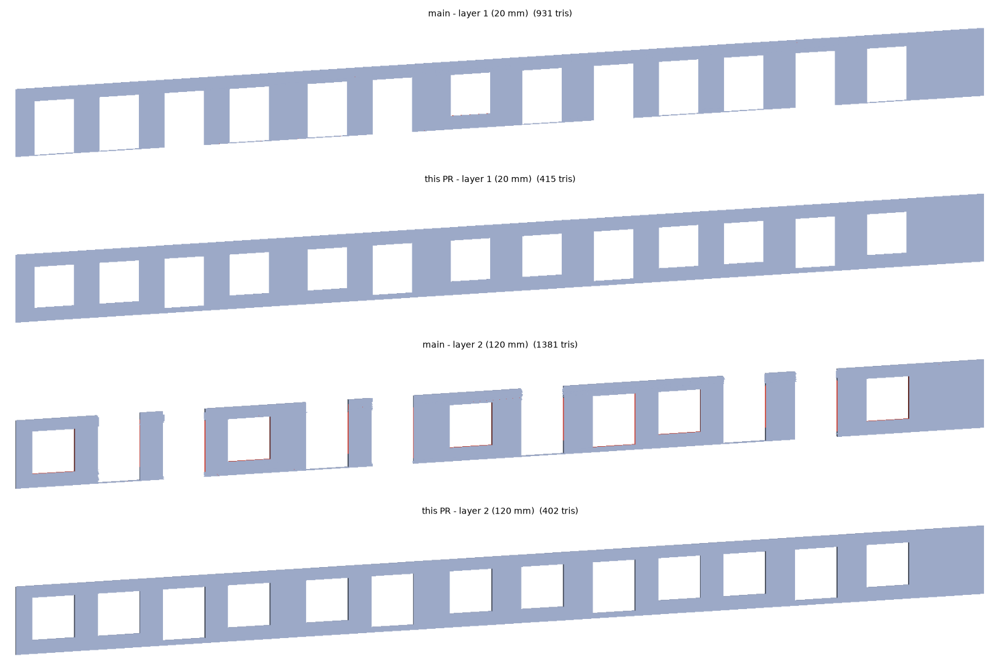

# Redundant openings on a voided Revit wall (#5410)

The Revit 2020 model attached to #5410
(`ifc-lite_bug_viewer_IfcOpeningElement_cut.ifc`). Curtain wall `#181031` is
four `IfcExtrudedAreaSolid` layers over `IfcArbitraryProfileDefWithVoids`, so
the Body already holds all 13 window voids, and 13 `IfcOpeningElement`s with
`Body`/`Tessellation` cutters cut the same voids again. The wall runs at
-34.3° in plan. IfcOpenShell 0.8.5 reports the same volume with and without
openings (22.6599 m³), so the correct output is the uncut host.

Native `process_geometry` output of layers 1 (20 mm) and 2 (120 mm). Before is
`main` at `04dd98f96`, after is this branch. The render is a z-buffered
elevation of the emitted meshes; back faces are tinted red.

Per layer (volume m³ / open directed edges at a 0.1 mm weld / triangles):

| layer | authored | before | after |
|---|---:|---:|---:|
| 20 mm | 1.7674 | 4.2707 / 776 / 931 | 1.7667 / 29 / 415 |
| 120 mm | 9.9224 | 6.6138 / 1684 / 1381 | 9.9220 / 0 / 402 |
| 50 mm | 4.4126 | 13.6461 / 1204 / 1522 | 4.4117 / 69 / 449 |
| 80 mm | 6.5576 | 6.5577 / 0 / 400 | 6.5573 / 52 / 536 |

Most of the open edges left after the fix are T-junction seams from cutting a
plan-rotated wall in its own frame (the existing #1167 path), not gaps: the
enclosed volume does not depend on the reference point to 1e-4.
