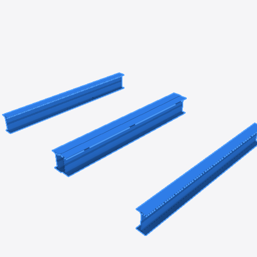
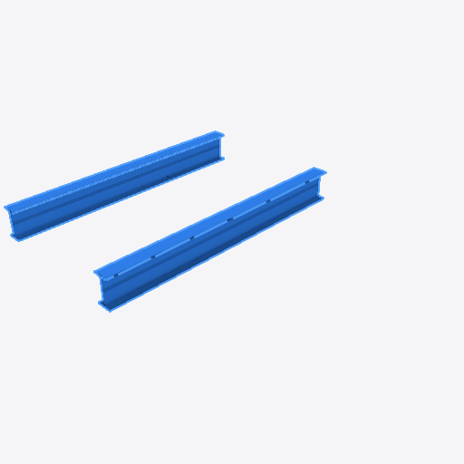

# Complete Duplicate write (#6232 follow-up)

The browser witness opens the public `01_Snowdon_Towers_Sample_Structural(1).ifc`
through the ordinary file input and canonical loader. Autodesk Revit 2024 wrote
this model; its SHA-256 and byte count are in `revit-assembly-duplicate.json`.
The fixture is fetched by `pnpm fixtures` and is not committed here.

The test enters Author → Model, selects real assembly #144910 on its actual
storey #142, and presses Ctrl+D. The copy contains two fresh IfcBeam products,
their placements and representations, and a new IfcRelAggregates relationship:
29 new records in one undo batch. The source aliases are #22347 and #75395.
The actual store subscription observes both copied beam IDs in the wasm re-mesh
replacement event, and both have nonempty geometry afterward. One undo removes
all 29 new records and both copied meshes and restores the prior undo stack.

`revit-assembly-duplicate.png` and `revit-assembly-after-undo.png` are color-buffer
readbacks from the production WebGPU renderer after submitted work completes.
The capture is the renderer's centered 512 × 512 region, so it crops the full
viewport. The before frame contains 39,664 selected mesh pixels; after undo the
original two beams remain. Headless Chrome 153 used software Vulkan/SwiftShader
with `E2E_GPU_STRICT=1`. Compositor screenshots can be blank with SwiftShader;
they are not used as this run's raster witness. The observer does not replace
the renderer, scene, loader, store or commands.





`source-provenance.json` records the tested source and runtime hashes. The
runtime was built by the official `pnpm build:wasm` script from this base's
unchanged Rust source; it matches the default frozen-base wasm SHA-256.

Reproduce after fetching fixtures and building the default wasm:

```sh
E2E_GPU_STRICT=1 pnpm exec playwright test tests/e2e/entity-context-menu.e2e.spec.ts --project=viewer-e2e-ci --grep 'Revit assembly Duplicate'
```

The eight companion viewer regressions use a parsed IFC4 assembly/hosting
invariant. They cover nested assembly relationships and placements, source
aliases, overlay resolution with one and multiple models, late refusal with no
partial writes, full graph undo/redo, explicit root Name, and offset sizing
from mixed flat/instanced geometry in the unrotated owning-model frame.
