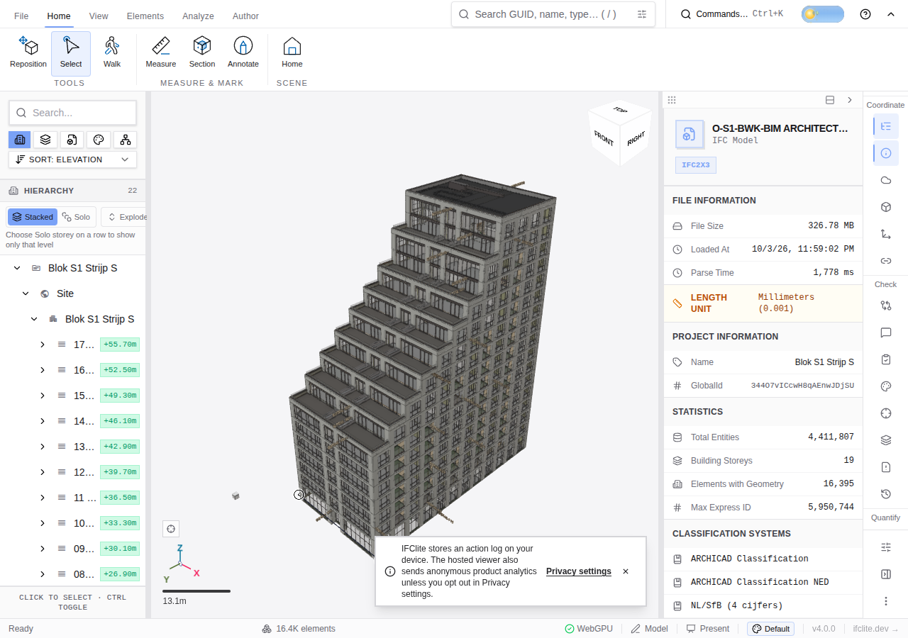

# Canonical viewer source-allocation witness (#6537)

Actual hosted run [37162551281](https://github.com/LTplus-AG/ifc-lite/actions/runs/37162551281) used controller `32f8b91e0de20faa73a9f77f21b810f81d3646cf`, baseline `c61932d4a9d85efe1b0f817a5274a115f0571ee3` and candidate `2feb6545b588e02d55d4d6b4d9afbe8be261452e` (#6780). It made exactly two serial, first-file primary UI loads of the public O-S1 IFC; no retry or replacement. Before, after and terminal branch fences match. Each immutable subject was freshly built through root Turbo, including source-built WASM, before the actual viewer load.

The narrow result is a deferred full-source allocation. A native 342,657,851-byte SAB-to-AB copy occurs before default-pool prepass in baseline. Candidate has no such preparation copy; it makes one equal-size copy after geometry completion for an admitted cache consumer. **Both cases make one total observed full-size copy. This does not prove fewer total allocations, faster normal loading or lower physical peak memory.**

| Actual native copy stage | Baseline | Candidate |
| --- | ---: | ---: |
| Source preparation, before default-pool prepass | 1 | 0 |
| After geometry, before admitted cache-write start | 0 | 1 |
| Total full-size copies observed | 1 | 1 |

The native observer delegated original receivers, arguments, results and exceptions, retained bounded metadata and exact copy ancestry, then restored descriptors before identity work and teardown. The metadata owner is the actual original resident SAB in both cases; only a one-byte view was borrowed to identify it. The source fixture SHA is `e91ddbbd672bbde946af14631de4c732f0cf8a7cfae5dbbf06fbeab03b5c46df`.

## Actual producer and cleanup evidence

Both cases record geometry and metadata producer completion, 4,411,807 entities, 53,769 stored geometry meshes and 237 final consolidated batches. They use separate fresh Chrome profiles/processes with actual Chrome `154.0.8037.57`, executable SHA `4d2512ae84986bf987e6ea8ef14ca1af555ae574fbaff5b5a8c78a8dd73fa36f`, `hardwareConcurrency=4` and two default workers. Source inventories, actual flags/backend, served default WASM hashes, HTTP requests, raw console/stderr, sampled owned RSS, browser/process/server cleanup and screenshots are retained. Both cleanup paths complete with no remaining witnessed processes or sockets.

The original independent audit and root replay each record 40,585 passing data checks. Their raw outputs are preserved exactly. Portable replay below freshly verifies 40,265 immutable Git source SHAs plus archive integrity and core allocation/refusal/cleanup invariants. Its count is different from the original auditor's broader retained checks.

## Refusals and limits remain

**Full appearance identity refused in both cases: `flat/instance scene owner census mismatch`.** This is not an authored-text refusal. Both also retain `geometryLoadState="opening"`, `metadataLoadState="idle"` and `interactiveReady=false`, despite legacy `loadState="complete"`. Full scene and interactive readiness remain unqualified. The source-only census trace explains incompatible filtered/unfiltered owner contracts, but lacks actual missing/extra IDs and does not prove the precise O-S1 discrepancy. No guard was weakened and no runtime was retried.

Each case retains one setup-phase 404 console error with unknown request URL. Neither records a model-phase console error, pageerror, crash or backend fault. The two emitted WASM engines have different SHA values (`f9afb5a4...` and `c8f9b1a0...`), each bound to its own actual source build and served assets. Engine byte identity and timing equivalence are not claimed. The fixed 5 GiB guard uses 250 ms sampled aggregate owned RSS and double-counts shared pages; it is not physical peak measurement or a memory-win verdict.

This is a source-allocation witness, not normal end-to-end timing, full output/appearance identity, pixel fidelity, interactive readiness, federation, all-model success or a fix for the reported 1,778 MB Windows Edge prepass failure. #6537 remains open.

## Lossless packet and offline replay

`raw-hosted-proof.json.xz` contains 40 lossless logical records with 38 SHA-addressed payloads: all 16 uploaded hosted artifacts, actual build/provenance/request/resource/cleanup receipts, original auditor and raw output, root replay, source gates, dispatch fences and the initial refused audit. It preserves 27,051,069 original bytes in a 3,152,100-byte XZ archive. `receipt-manifest.json` pins archive/decoded bytes and SHA plus every original payload. No full IFC, WASM or Chrome binary is included. The original two PNGs are also available directly below; their bytes match the archived PNGs exactly.

`replay.py` treats records only as data. It never extracts paths or executes archived scripts. It checks duplicate JSON keys, logical paths, base64, sizes and hashes, caps compressed input at 16 MiB, expanded JSON at 64 MiB and each payload at 16 MiB; XZ decoding has a 64 MiB memory limit. No network, model processing, app build or browser runs occur. It reads immutable Git blobs only. The repository must already contain the three literal source/controller commits above; missing objects refuse rather than fetching or substituting a revision. Git lazy fetch and terminal prompts are disabled for these read-only commands.

From the repository root:

```sh
python3 docs/architecture/evidence/6537-viewer-source-allocation/replay_tests.py
python3 docs/architecture/evidence/6537-viewer-source-allocation/replay.py --repository .
```

Eight functional reader controls cover native byte preservation, traversal/duplicate records, replaced bytes, invalid byte counts/base64/JSON keys and real XZ expansion-budget refusal. An initial audit rejected a nonexistent WASM filename log marker; the actual logs prove wasm-pack, compilation to WASM, compilation of ifc-lite-wasm, optimized release completion and LLVM-only output. That erroneous marker's refused audit/script is retained, alongside the corrected audit, without rewriting the source or run.

## Unmodified viewer screenshots

These show the stepped O-S1 tower before teardown. They establish a visual observation, not pixel identity or interaction qualification.



