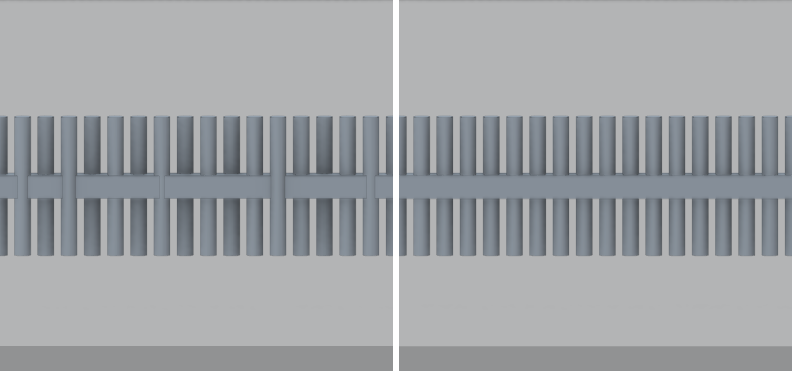
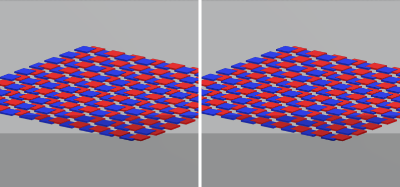

# Hidden surfaces showing through in orthographic views (#6729)

Synthetic IFC4 models rendered by the dev viewer in headless Chrome
(WebGPU over SwiftShader), read back with `Renderer.captureScreenshot`. Before
is `main` at `a1b53db95`, after is this branch. Left is before, right is after.

## Rods through a beam on a 1 km site

A 1000 m x 1000 m `IfcSlab` sets the orthographic depth range (about 1.56 km).
A 0.2 m `IfcBeam` has 40 vertical `IfcMember` rods, r = 0.07 m, running
through it, so each rod sits 3 cm behind the beam's front face. Orthographic,
looking at the beam's side.

Before, most rods are drawn over the beam. The per-entity depth nudge scaled
clip z by `1 + zHash * 1e-6`, which in orthographic depth moves a fragment by
up to `255e-6 * z * range`: about 20 cm here. After, the nudge is four 24-bit
depth units per hash step at every depth, at most `255 * 4 / 2^24` of the range
(9.5 cm here, under 1 cm for a 100 m building). One rod, the one with the
largest hash difference to the beam, still shows at this scale. The same model
on a 300 m slab renders correctly before and after.

## Overlapping coplanar plates (z-fighting check)

100 pairs of overlapping 1 m x 1 m x 0.1 m plates whose top faces are exactly
coplanar (`IfcPlate` red, `IfcSlab` blue), on the same 1 km slab. This checks
that the smaller nudge still separates coplanar faces of different entities.

Against before, no triangle swaps colour. The only changed pixels are side
walls that the old nudge pushed up through the neighbouring plate's top face.
At one and two depth units per step, whole triangles z-fought; four is the
smallest step that did not.

## Annotations stay above the nudged faces

Text and 2D lines that lie on a face are lifted toward the camera by a constant
NDC offset (#812). In orthographic it is now set just above the largest mesh
nudge, so a label never sinks under a surface whose hash happens to be high.
AC20-FZK-Haus, orthographic plan view: before, half of the ground-level
dimensions were hidden under the terrain; after, all of them show, as they do
in perspective.

## Perspective is unchanged

Rendered back to back, before and after perspective frames are bit-identical:
0 changed pixels in 3 views of the rods model and 3 views of AC20-FZK-Haus,
including its annotation lines and text.
