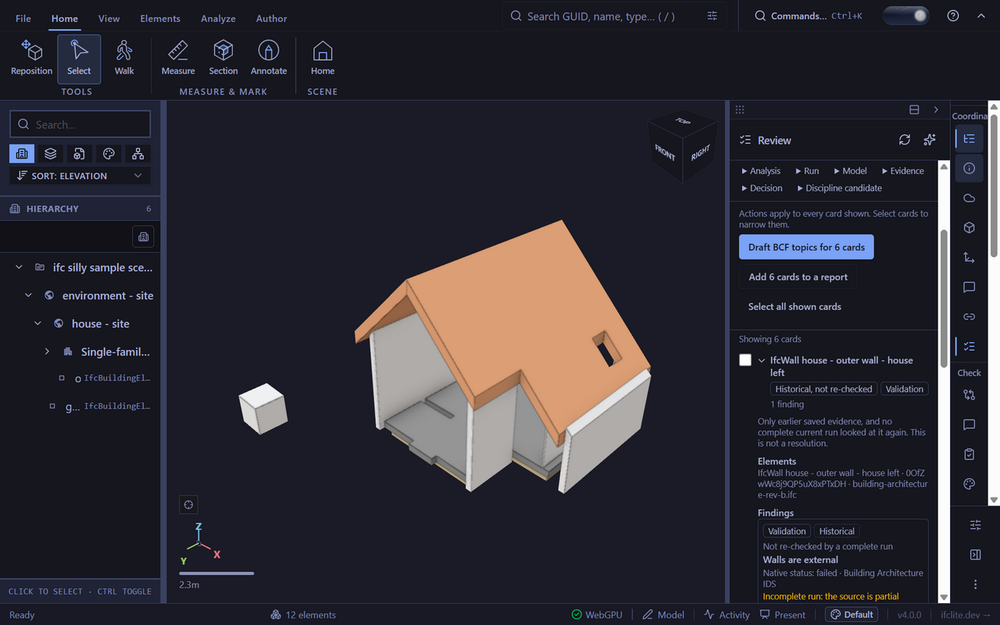
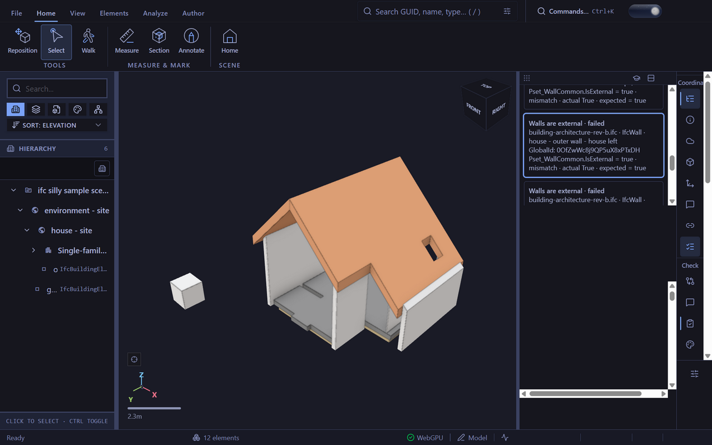

# Saved validation evidence (#7091)

The T3 browser loaded the committed SketchUp revision model through the viewer's canonical sample load path. Its real IDS file was supplied to the native information-rule import input, then **Run** evaluated the imported rules. The importer explicitly reported omitted IFCBOOLEAN datatype checking and IFC-version restrictions. These screenshots demonstrate native information-rule evidence; they do not claim that the import is an equivalent IDS check.

The native result contained eleven entity/specification results, five passes and six failures. **Save report** committed six failure rows. After a full page reload and another canonical model load, the live validation report was absent. Review showed six validated elements, zero current findings and six historical findings/cards, labelled not re-checked with incomplete coverage. Opening the left-wall card's original opened Validation's saved history and focused `failure-2`, preserving its exact GlobalId, model name and native failure detail. The renderer uses the real model; no viewer store or fabricated report was injected.

[Qualification metadata](qualification.json) records the source head, fixture/image hashes and observed native fields. Eleven native regression cases and the production/surgical revert oracles provide independent coverage of persistence, cold hydration, warning retention, capture bounds, disclosures, backup copies and navigation. Live-provider quality and human study acceptance remain separate campaign requirements.
