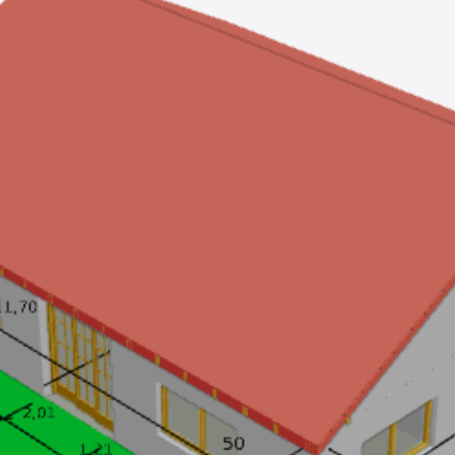
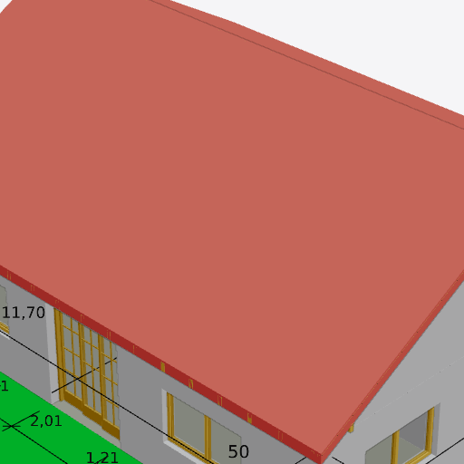

# Canvas at device-pixel resolution (#5383)

Real viewer (`vite` dev server, Chrome 153 with WebGPU under WSLg),
`tests/models/ara3d/AC20-FZK-Haus.ifc`, 1600×1000 window. The canvas element is
926.6×817.5 CSS px. Before and after ran against the same server with only the
#5383 source files swapped.

| | canvas drawing buffer | element in device px | horizontal stretch |
|---|---|---|---|
| before, DPR 1 (issue's measurement) | 896×817 | 926.6×817.5 | 3.36 % |
| before, DPR 2 | 896×817 | 1853.3×1635 | 3.36 % |
| after, DPR 1 | 927×818 | 926.6×817.5 | 0.02 % (rounding) |
| after, DPR 2 | 1853×1635 | 1853.3×1635 | 0.02 % (rounding) |

The images are the centre 512×512 **device pixels** of the screen at DPR 2,
reproduced from the renderer's own colour-frame readback
(`__ifc_lite_capture_color_frame__`, the centre 512×512 buffer texels) by
stretching the buffer to the element's device-pixel box, as the browser
compositor does. A page screenshot is not used because headless and WSLg Chrome
do not composite the WebGPU canvas into `page.screenshot()`.

Before: a CSS-resolution buffer upscaled 2.07× horizontally and 2× vertically.
Dimension text, window mullions and roof edges are soft.

After: one buffer texel per device pixel. The same labels are the same size on
screen (glyph sizes stay in CSS px) and are sharp.

