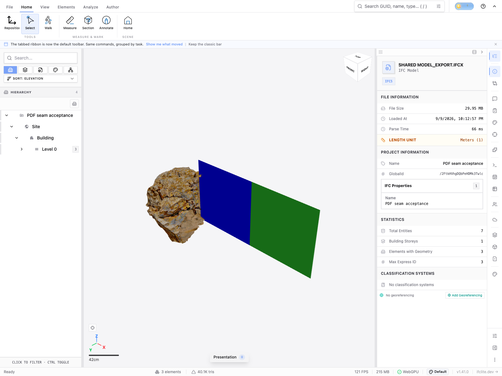
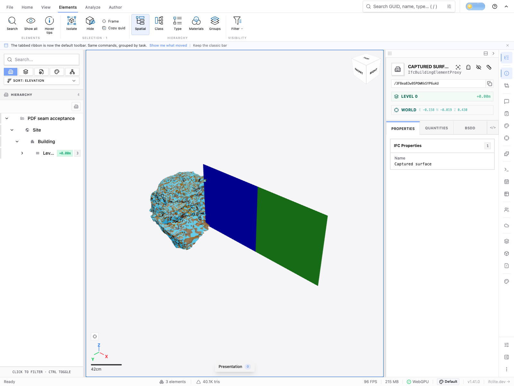

# Captured IFC appearance through sharing (#4380)

A normal Share workflow was exercised using an IFCZIP produced by the captured
region UI: two original walls plus one textured `IfcBuildingElementProxy` with
40,087 triangles. Every stage retained three meshes and 40,091 total triangles.
[Measured results](result.json) pin the input, original JPEG, tested source commit,
WASM runtime and room-export hashes.

The owner opened `/tmp/capture-ui-browser/captured.ifczip` through the ordinary
file input and clicked Share. A fresh browser context followed that signed local
room link. Both original contexts were then closed before a different fresh
context rejoined. That guest exported the room through the ordinary export dialog,
and another fresh context reopened the resulting IFCX. The relay was local, with
an ephemeral secret generated in process; no existing user room or token was used.
All browser contexts and both temporary servers were stopped after acceptance.

## Appearance and geometry

All 120,261 oriented triangle corners of the captured owner were compared through
world position **and associated UV** at each stage. Fresh join and fresh rejoin
retain exactly identical positions/UVs. Reopening the exported IFCX folds the
per-mesh origin into Float32 positions: maximum world component error is
2.9802322387695312e-8 m, maximum Euclidean corner error is
3.332000937312528e-8 m, and UV error is zero. Every component is within one Float32
round-to-nearest step at its local coordinate magnitude. Repeat S/T remain true.
This is much tighter than the declared 1e-5 m world / 1e-6 UV comparison tolerances.

The first exploratory run rejected a rounded-grid signature despite these tiny
errors: values can cross a quantization boundary while remaining far closer than
one grid cell. That hash mismatch was not treated as a geometry defect. The accepted
run compares actual indexed corner differences and checks the Float32 rounding
bound. The unselected screenshot below is from that first exported-model reopening;
the later complete run independently passed geometry, appearance and selection.

Each browser snapshot reports the same decoded 1024×1024 RGBA FNV hash. In addition,
[an independent pixel comparison](pixel-proof.json) decodes the original JPEG with
Pillow and compares all 4,194,304 RGBA bytes directly against the room-export IFCX's
embedded image: they are byte-identical, with SHA-256
`2c2dc5a76bc993bfc7bb86a4ddef95baecbc46161467fd45b7f8ccf1cc6077f1`.
This proves decoded-pixel transport. It does **not** claim that room transport keeps
the original compressed JPEG bytes. The initial IFCZIP separately contains the
original 987,467-byte JPEG with its original digest.

## Actual object selection

Mouse clicks went through normal viewer selection, targeting visible captured
faces rather than either wall. The selected owner was verified as
`IfcBuildingElementProxy`, with the 40,087 textured triangles, in all four contexts.
The ordinary IFC uses EXPRESS ID 65; room IFCX uses 4 and the reopened export uses 3.
The original IFC GlobalId `3F8ea83w95POWKkSYP6ukU` becomes IFCX path
`/3F8ea83w95POWKkSYP6ukU`. Those are documented identity mappings, not a claim of
unchanged numeric IDs or an unchanged IFC GlobalId string across formats.

Additional screenshots: [owner](owner-selected.png), [fresh guest](guest-selected.png),
and [room export reopened and selected](reopened-selected.png). The cyan coverage
is the viewer's selection highlight; the unselected image above shows its albedo.

Raw snapshots, the executable temporary harness and downloaded IFCX remain under
`/tmp/capture-room-acceptance`. Large model/mesh/pixel fixtures are not committed.
This acceptance concerns existing captured-mesh IFC creation and portable sharing;
it does not establish scan-to-BIM semantic inference or scan registration accuracy.
