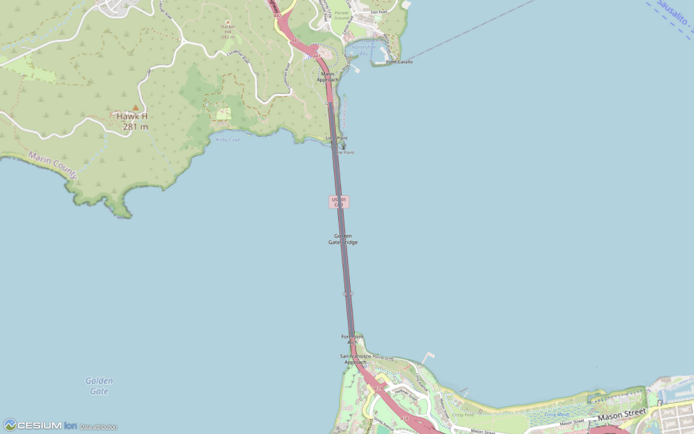

# Cesium ion placement acceptance: issue #6587

Observed on 2026-10-01 using an authorized real account and the catalogued
IfcOpenShell `Georeferencing_georeferenced-bridge-deck.ifc` regression model.
Fetch the model with `pnpm fixtures`. Credentials are not included here.

## Actual tiled geometry

Asset **5969481**, uploaded through the viewer after changing the slab's `Name`
to `Ion acceptance edited bridge deck`, reached `COMPLETE`, 100%. Its downloaded
tiled GLB retained the edit. An unchanged source control, **5969409**, also tiled.
Their root transforms and bounding volumes were identical.

Both were loaded from their actual ion asset endpoints using CesiumJS 1.130,
without changing the tilesets' model matrices, against OpenStreetMap imagery.
The edited asset renders near the Golden Gate Bridge's south approach but runs
east into the bay, rather than following the bridge north.

This is a separate CesiumJS rendering of ion's output. It is not a screenshot
of the signed-in ion dashboard. The unchanged source control was also rendered
and showed the same orientation. The source serializer therefore did not cause
this difference, but successful tiling does not establish correct placement.

## Independent horizontal oracle

The source rectangle extends from local X = 0 to 2025.27948635555 metres.
Its `IfcMapConversion` declares EPSG:32610, eastings 545991.679663973,
northings 4184941.96970872, axis
(-0.0977396728779572, 0.995212015776392), and scale 0.9996.
Applying the standard scale/rotation/translation and independently converting
with PROJ produces these longitude/latitude coordinates:

| Point | Longitude | Latitude |
| --- | ---: | ---: |
| Authored start | -122.47750280356061 | 37.81071150267693 |
| Authored midpoint | -122.4785628774079 | 37.81979587989458 |
| Authored end | -122.47962319819858 | 37.82888023549811 |
| Tiled bounding-sphere center | -122.46599897781184 | 37.81065991557522 |

The authored mathematical rotation is 95.6090255829533 degrees. The midpoint
discrepancy is approximately 1500.7 metres. Matching the tiled origin's longitude
and latitude alone missed this orientation defect. Vertical datum conversion
has not been independently verified and is not claimed here.

Transformation semantics: [buildingSMART IfcMapConversion](https://standards.buildingsmart.org/IFC/RELEASE/IFC4_3/HTML/lexical/IfcMapConversion.htm).

## GeoBIM options control

Asset **5969648** used the unchanged IFC through the same actual transport,
adding the released fork's `position` and `heading` options only for this test.
The fork computes a compass heading of 354.3909744170467 degrees, rather than
the mathematical rotation above. Required description and attribution strings
were retained so the current API accepted the request.

It tiled, but still ran east. Its midpoint longitude/latitude were effectively
unchanged; the maximum root basis difference was 1.33e-8. The position override
also changed the vertical translation by approximately 33 metres. This does not
support shipping the undocumented heading option as a correction.

## Documented database-tiler control

Asset **5969658** (collection 5969656, iModel 5969657) switched only the documented
source type to `BIM_CAD_DB`, preserving the source IFC and its embedded CRS.
It reached `COMPLETE`, 100%, but its tiled center was approximately longitude
-4.49e-7, latitude -4.52e-7 degrees, near 0/0 instead of San Francisco.
It did not pass placement acceptance and is not a tested replacement.

Supported tiler choices: [Cesium's tiler selection guide](https://cesium.com/learn/bim-cad/tiling-bim-cad-models/bim-cad-tiler-selection-guide/).

## Documented input CRS experiment

Asset **5969729** (collection 5969728) preserved the original IFC and supplied
the documented `inputCrs` option as WKT for a `DerivedProjectedCRS`, using the
EPSG:9624 affine conversion and EPSG:32610 base CRS. An independently evaluated
PROJ conversion included the authored rotation and scale. This is a test-only
option, not behavior shipped by the upload implementation.

An initial derived CRS control, **5969702**, tiled in the Pacific. Comparing its
actual center with PROJ showed that the tiler applies the IFC's Eastings and
Northings before evaluating the override. The second experiment accounted for
that observed input frame in the affine translation. It reached `COMPLETE`,
100%, and its actual tiles rendered along the Golden Gate Bridge without a
CesiumJS model-matrix adjustment.

Its bounding-sphere center was longitude -122.47856287106258, latitude
37.81979588145428, ellipsoidal height 67.41936655631595 metres. The horizontal
center agrees with the independent source midpoint within a millimetre.
This is a separate CesiumJS rendering of the actual output, not the signed-in
ion dashboard. It establishes a promising horizontal correction for this
fixture; it does not verify vertical datum conversion, units other than metres,
already transformed source geometry, or other IFC georeferencing variants.
The source declares EPSG:5703 as its vertical CRS, and its elevation still needs
independent verification before claiming full placement acceptance.

Option contract: [Cesium ion OpenAPI](https://ion.cesium.com/openapi.yaml).
Affine operation: [PROJ affine transformation documentation](https://proj.org/en/stable/operations/transformations/affine.html).

## Compound vertical CRS control

Asset **5969770** (collection 5969769) retained the unchanged IFC and supplied
the same anchored horizontal CRS within a `CompoundCRS` with EPSG:5703 NAVD88.
It reached `COMPLETE`, 100%. Its actual tiled center was longitude
-122.47856287106673, latitude 37.819795881485646, ellipsoidal height
34.438104219298346 metres. It retained the northward alignment. The horizontal
center still agrees with the independent source midpoint within a millimetre.

For an independent vertical check, PROJ 9.3 / pyproj 3.6.1 used the source
EPSG:32610 + EPSG:5703 compound CRS, target EPSG:4979, a San Francisco area of
interest, and `allow_ballpark=False`. Downloaded public PROJ/NOAA grids made real
vertical operations available. At the nominal source midpoint and
`0.9996 * 67.5` metre orthometric height, the available GEOID99 operation
returned 34.4881148179993 metres (reported expected accuracy 2.05 metres); GEOID18
returned 34.924909672373786 metres (reported expected accuracy 4.015 metres).
The tiled center is consistent with those independent operations, but this does not
identify ion's exact grid, establish centimetre elevation accuracy, or prove
that its handling of vertical map scale is correct. A bounding-sphere center
is also not an exact mesh-vertex oracle.

The compound override restores a plausible vertical conversion that the
horizontal-only experiment lost. Both experiments remain test-only until
source-unit, map-scale, coordinate-frame and original Infra-Bridge acceptance
cases are verified.

## Unit and scale matrix

Audit qualification: the generated metre, unrotated, Scale = 2 and elevated
controls below contain `1E-05` for context `Precision`, whereas STEP REAL syntax
requires a decimal point in the mantissa
(`1.E-05`). IfcOpenShell accepted their geometry, but these uploads do not by
themselves establish a standards-conforming scale reproduction. The corrected
control is recorded below. The unchanged public fixture used for the
original orientation failure contains the valid literal.

Four independently checked IFC variants also reached `COMPLETE`. IfcOpenShell
produced identical eight SI-metre source vertices for the metre and millimetre
variants. The controls preserved source geometry and used the test-only anchored
compound CRS, with parameters derived for each variant.

The millimetre variant uses millimetre project geometry, metre `MapUnit`, and
`Scale = 0.9996 / 1000`. It does not test millimetre map units; the original
Infra-Bridge has both project and map units in millimetres and still fails
acceptance below.

| Control | Asset | Result |
| --- | --- | --- |
| Millimetre geometry, metre map units | 5969785 | Horizontal placement agrees; vertical scale still unverified by center alone |
| Unrotated horizontal axis | 5969787 | Horizontal placement agrees |
| Map Scale = 2 | 5969784 | Incorrect elevation: canonical vertices lie up to 68 m outside the tiled bounding box |
| Local elevation +100 m, OrthogonalHeight = 23 m | 5969789 | Vertical translation retained; scale discrepancy remains |

The stronger scale check transforms all eight authored corners through the
canonical IFC scale/rotation/translation and a no-ballpark PROJ vertical grid
operation into ECEF, then into the actual tileset's root frame. It compares
those vertices with ion's declared containing bounding box, rather than
comparing two bounding centers. With GEOID99, the Scale = 2 expected vertices
fall outside the actual box by up to 67.9999999999 m; GEOID18 also puts them
outside by about 68.44 m, well beyond either operation's reported expected accuracy.
The actual box remains around the unscaled local height. The 2D affine override
therefore cannot represent IFC's scale of all three coordinates. Successful
horizontal and vertical-datum controls do not make this route merge-ready.

## Full derived vertical CRS attempt

A `DerivedVerticalCRS` using the standard EPSG:9616 vertical offset, together
with the derived vertical axis's length-unit factor, independently represented
the complete source vertical affine transform. PROJ evaluated all six fixtures'
eight corners against their canonical IFC map operations within 1.9e-8 m.
This offline result is not ion acceptance.

Actual source-preserving controls **5969809** (Scale = 2) and **5969808**
(elevated, nonzero OrthogonalHeight) reached `COMPLETE` with that full compound
WKT. Their root transforms and bounding volumes remained effectively identical
to the earlier 2D-compound controls, including the unscaled height in the
Scale = 2 case. The standard vertical derivation was therefore not reflected
in this observed tiler bounding output. Do not ship it based on API acceptance or the
successful independent PROJ evaluation.

### Corrected STEP REAL control

The corrected Scale = 2 source has SHA-256
`970100f73a188cbcda65e0ba147cb2be0646643fe9f0bf84de200819feac3434`.
Its REAL literals pass a separate lexical audit, and IfcOpenShell schema
validation reports no messages. Changing `1E-05` to `1.E-05` preserves the
checked typed attributes; an independent IfcOpenShell extraction produced
eight vertices and twelve triangles. An earlier scratch comparison recorded
empty vertex arrays and is not used as geometry evidence. Asset **5969891**
reached `COMPLETE` using the same full compound CRS. Its root transform and
bounding box retain the prior scale failure: independently mapped corners are
up to 67.99999999948 m outside the containing box using GEOID99, or 68.436140759 m
using GEOID18. Those operations report expected accuracies of 2.05 m and
4.015 m, respectively; these are not guaranteed error bounds. The root basis
is orthonormal to floating-point precision, supporting the inverse-frame check.
No client transform was applied. This corrected control demonstrates that the
lexical defect did not account for the observed placement/bounds discrepancy.
The scale control's tiled GLB vertices have not been decoded, so these bounds
do not distinguish wrong mesh positions from wrong containing metadata.
The [exact source patch](./scale-two-valid-real-from-public.patch) reconstructs
the uploaded bytes from the catalogued public fixture; the
[numeric result](./corrected-scale-two-provider-repro.json) records the source
and WKT hashes, provider frame, independent corners and limitations.

## Original Infra-Bridge database control

Asset **5969775** (collection 5969773, iModel 5969774) used the unchanged original
SketchUp IFC4 Infra-Bridge and the documented `BIM_CAD_DB` source type with no
CRS override. It reached `COMPLETE`, unlike the original tiler, which failed at
41%. Its actual root transform is centered at ECEF approximately
(6378137, 0, 0), near longitude/latitude 0/0. Its millimetre `IfcMapConversion`
instead declares EPSG:32760 with metre-equivalent Eastings 729011.2258823584
and Northings 9063960.607644705. Tiling this real model is demonstrated;
placement acceptance is still failed. This is a control, not a replacement
transport shipped by the PR.

Two further unchanged-source database controls also tiled. **5969795** supplied
the documented `inputCrs: EPSG:32760`; its root translation was approximately
ECEF (26124.15, 498478.42, -6337257.45), far from the authored location, and its
second transform basis was all zero. **5969814** supplied only the independently
calculated longitude/latitude position (179.08012899993923,
-8.462489999999077, 0). Its output was identical to the native database control,
still near 0/0. Neither passed placement acceptance. Position is documented as
inapplicable when embedded georeferencing is present, so its being ignored does
not establish an API contract violation.

An independent IfcOpenShell run produced 48 source meshes with no geometry
errors. Their SI-metre bounds were approximately (-0.965763, -0.904192, -3.5)
to (44.401270, 56.905256, 7.774582), with project and map units both 0.001 metre.
The source dimensions and canonical map conversion, rather than a matching
origin alone, remain the placement oracle for any proposed replacement.

## Verdict

Real upload, retained edits, completion handling and named asset navigation are
demonstrated. Automatic placement acceptance remains **failed** for this public
fixture. Keep that distinction explicit in review and user-facing copy; do not
claim correct orientation from a matching origin, silently rewrite the IFC to
work around the service, or treat the fork's best-effort heading as verified.
