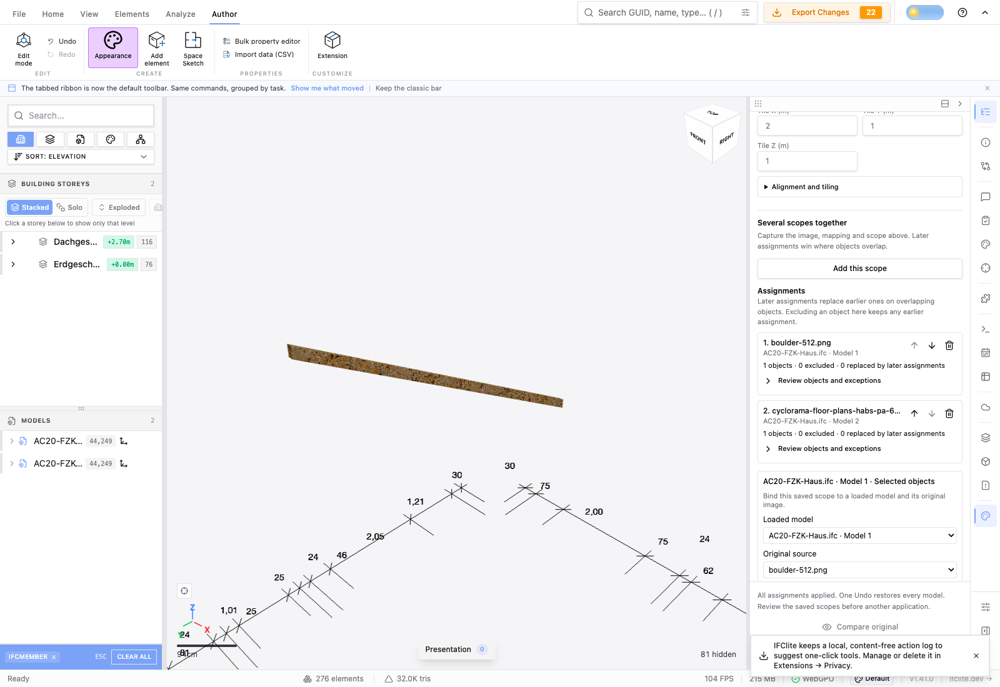
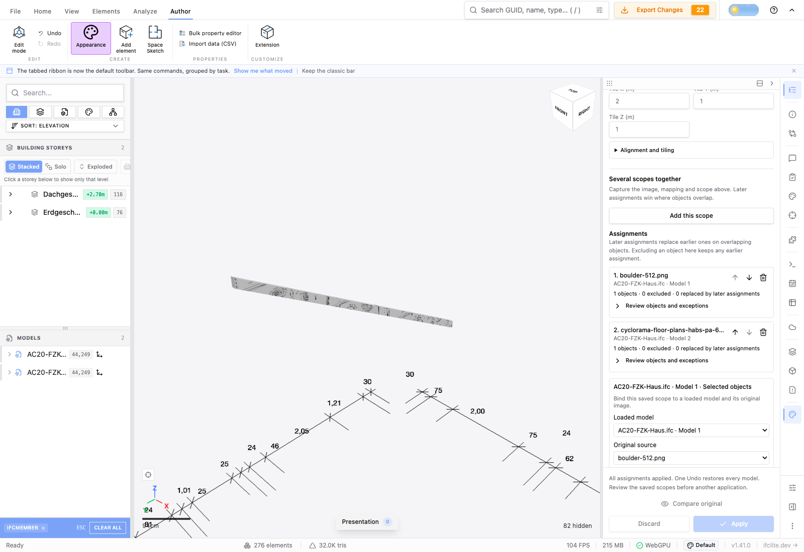
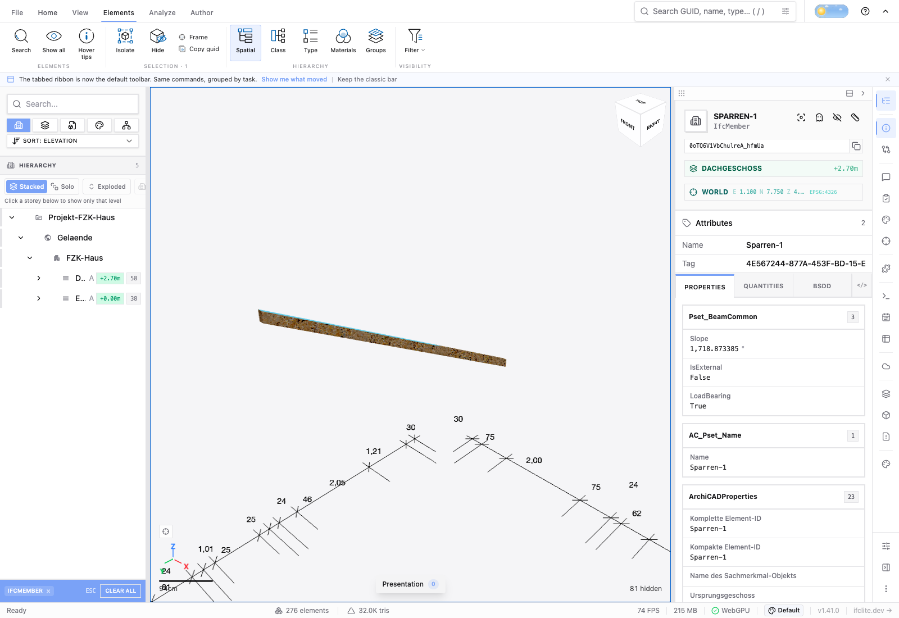
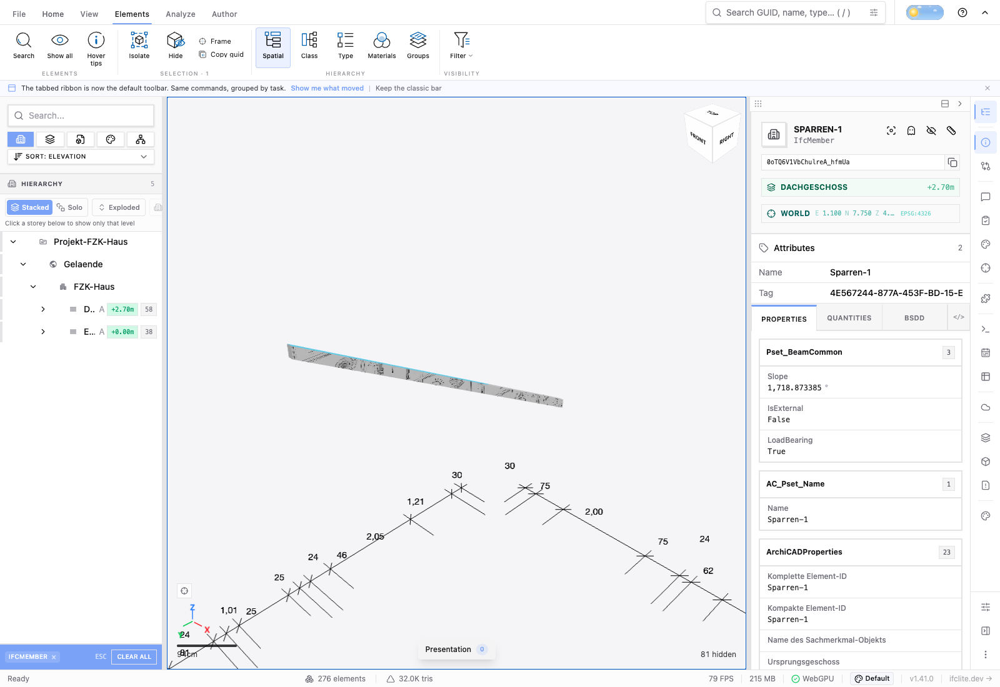
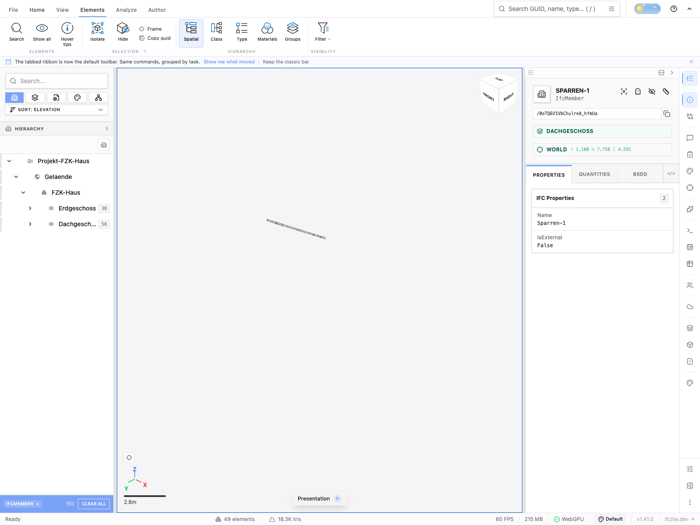
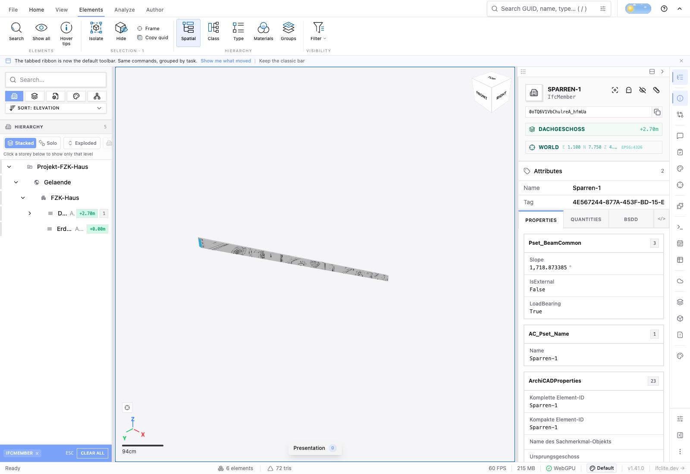

# Coordinated appearance acceptance (#4420)

Two byte-identical copies of the real Archicad IFC4 `AC20-FZK-Haus.ifc` were
loaded through the normal file input with the same display filename. The source
SHA-256 is `ea6f04eaf92fac4d7ad0038bc3d2dfea4c094dd3f516ecc33c50bf1835ca108d`.
Both selected members have local EXPRESS ID 35169 and IFC GlobalId
`0oTQ6V1VbChulreA_hfmUa`; their model slots and global viewer IDs remain distinct.
The published corpus fixture and image provenance are also documented in the
[evaluated occurrence acceptance](../evaluated-occurrences/viewer-acceptance.md).

The first assignment uses the public CC0 boulder PNG and box tile X = 0.5 m.
The second uses the public HABS Cyclorama floor-plan raster and tile X = 2 m.
This second source is an existing PNG derivative; the browser journey does not
claim direct PDF vector extraction. Both explicitly enable supported mapped
conversion. Each selected instance becomes one textured 12-triangle IfcMember;
the untouched mapped sibling #35304 keeps its original positions.

The controlled Chromium 151.0.7922.34 WebGPU run (Node 22.23.2 harness) used the canonical selection actions to name
the initial members, then the actual Appearance workspace, source upload,
assignment capture, Preview all, Compare, Apply, Author toolbar Undo/Redo, recipe
Save and normal IFC export controls. The two identical filenames show Model 1 /
Model 2 cues in appearance and export selectors. [Recorded scene and history
states](journey.json) retain oriented corner inputs rather than only counts.

Compare restored both original instances. Apply installed one textured occurrence
and one linked history marker per model. Toolbar Undo from the active second model
restored both originals, and Redo reproduced both applied scene snapshots. No
independent second Apply or second Undo was used.

## Portable exports and actual picking

The normal IFC export dialog produced separate IFCZIP files. Each contains its
own original PNG byte-for-byte, verified by SHA-256. Fresh normal imports preserve
the member's IFC identity, all 36 oriented triangle corners, world positions and
UVs with zero measured difference. Actual mouse clicks select both reopened
members; [reopen observations](reopen.json) include the canvas coordinates.

Each export then completed its own ordinary Share journey through a disposable,
signed local relay: owner join, fresh guest, both contexts closed, fresh rejoin,
normal room IFCX export and fresh normal reopen. Every stage preserves oriented
world/UV association, repeat flags and decoded image hashes, with actual member
picking. Independently parsing the room IFCX image payload and comparing it with
Pillow-decoded original PNGs verifies every one of 1,048,576 and 1,757,008 RGBA
bytes respectively. [Portability observations](portability.json) record those
checks. No user invitation or production room was used; all owned browsers,
viewer servers and relays were stopped afterward.

Current rooms share the active model, not the whole federation; #4444 tracks
explicit federation sharing separately. These runs waited for the initial room
seed to finish before navigating the owner away. #4446 records the existing
premature-link timing defect; this evidence does not claim immediate owner
closure after the link first appears is safe.

## Subset and independent IFC acceptance

With each member isolated, the ordinary **Export Visible Only** control produced
an IFCZIP subset. Both fresh normal subset imports preserve all world/UV corners
and exact source PNG pixels, and actual mouse clicks select the retained member.
[Subset reopen observations](subset-reopen.json) record these checks.

An independent IfcOpenShell 0.8.2 parse of all four full/subset files follows each
member's actual product placement and indexed texture map. The subsets contain
exactly one IfcMember and zero IfcWall objects. All mapped face corners agree in
world coordinates exactly; native IFC V-up texture coordinates agree with the
browser's top-down coordinates within 1.1920929e-7 (the Float32 UV conversion).
[Independent IFC observations](ifcopenshell.json) retain each check and source
image SHA-256. This is distinct from the zero-difference browser-to-browser
reimport result above.

## Scope of the evidence

This proves two mapped targets with different image sources and shared numeric
IDs, not maximum-capacity performance. Mounted native-worker tests additionally
cover cancellation, late target changes, changed GlobalId membership review,
unchanged-session reopening/intent switching, and staging two original PDF source
bindings before atomically reviewing their shared model slot. A different PDF
original with identical raster pixels is refused. Visible incomplete numeric
inputs block Add this scope while leaving unrelated frozen assignments intact.

The serialized [logical recipe](assignments.json) includes no live native plan,
renderer handle, object URL, source bytes or history transaction. Restoring a file
requires explicit source/model binding and membership review; only proven unchanged
in-session scopes resume without repeated confirmation.
