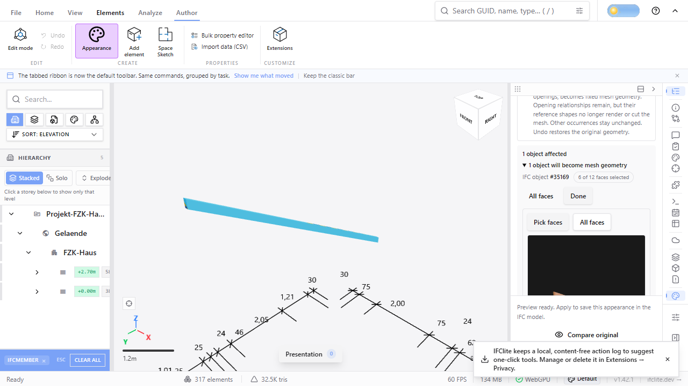
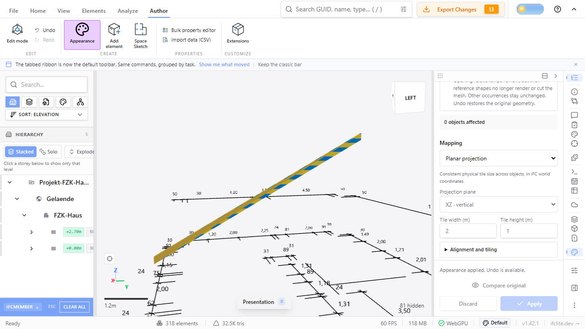
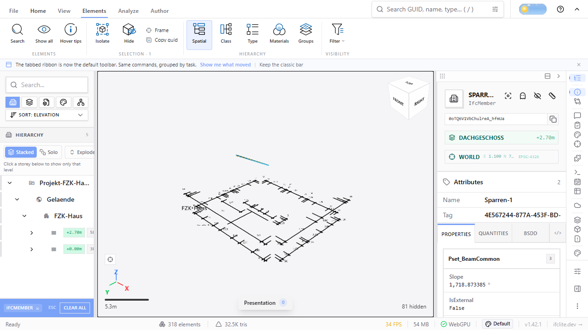

# Face-mask workspace acceptance (#4404, PR-2)

The viewer's face-selection UI, split-part preview and history for masked
evaluated occurrences, verified on the real Archicad IFC4 `AC20-FZK-Haus.ifc`
fixture (SHA-256 `ea6f04eaf92fac4d7ad0038bc3d2dfea4c094dd3f516ecc33c50bf1835ca108d`)
in a real browser, and reopened by an independent reader. The contract is in
[the representation policy](../../../appearance-evaluated-occurrences.md)
("Face masks"); the native plan and its reopening are in
[`../../evaluated-face-masks/`](../../evaluated-face-masks/README.md).

## Browser journey (Playwright, real Chrome, WebGPU on a real GPU)

`tests/e2e/appearance-face-mask.e2e.spec.ts`, project `viewer-appearance-e2e`
(opt-in, not in CI's default lane), against the built viewer served by the
Playwright web server:

```sh
pnpm --filter @ifc-lite/viewer build
APPEARANCE_E2E=1 APPEARANCE_E2E_OUT=/tmp/face-mask-ui pnpm exec playwright test --project=viewer-appearance-e2e
```

The Playwright web server reuses an existing server on its port, so on a host
where another checkout may be serving port 3000, set `PLAYWRIGHT_PORT=<free
port>` so the run serves and tests this build.

The recorded run on this host (Windows 11, NVIDIA GPU, Chrome stable,
headless, the branch's final build after review, served on `PLAYWRIGHT_PORT=3471`)
took 14.2 s including the model load and passed every assertion; earlier
iterations of the same spec passed as well, with journey JSON identical apart
from the random model id. The journey on
`IfcMember` #35169 (one of 42 members sharing a type; sibling #35304 compared
corner-for-corner at every step), recorded in
[`browser-journey.json`](browser-journey.json):

1. Load, select the member, open Author → Appearance, upload a 64 px checker
   PNG generated by the spec, opt into **Convert supported objects to mesh**.
   The whole-surface preview stages one textured part (12 triangles); the
   panel lists the member with the chip `all 12 faces`.
2. **Select faces** opens the editor on the member's evaluated surface; **Pick
   faces**, a marquee over the left half of the canvas selects 6 of the 12
   source triangles (`6 of 12 faces selected`). The preview re-plans with the
   mask and stages two parts of the one owner: item 79109, 6 triangles,
   textured, and item 79111, 6 triangles, untextured with the source colour
   `[0.714, 0.557, 0.333, 1]`. The union of their placed corners equals the
   loaded member's 36 corners exactly. In the screenshot the member carries
   the viewport's selection highlight (the scope *is* the selection), so the
   texture shows only in the applied screenshot below.
   
3. **Discard** restores the loaded member exactly (one part, item 35135); the
   selection survives, and changing the tile width previews the split again.
4. **Apply**: one history step, 14 mutations (12 `CREATE_ENTITY`, the rest on
   the occurrence Body wrapper #35155 — the only existing entity edited), two
   meshes for the member in the model geometry, selection unchanged.
   
5. **Undo** restores the loaded member exactly; **Redo** restores both parts.
6. Clearing the selection and clicking the member in the viewport selects
   product #35169 again.
7. **Export IFC (with changes)** through the export dialog produces
   `AC20-FZK-Haus_export.ifczip` (510 KB) with the checker PNG.
8. A fresh page reopens the IFCZIP: the member renders as its textured and
   retained face sets (6 + 6 triangles, same corners as the original load),
   sibling #35304 is identical to its original load, and a viewport click
   selects the member, whose properties show GlobalId `0oTQ6V1VbChulreA_hfmUa`.
   

No page error was raised in either page. In the browser build both members
load as resident flat geometry, so this run exercises the resident preview
path. The GPU-instanced path is
covered by the mounted node test below (`appearanceInstanceScene`), not by a
browser screenshot.

## Independent reopening (IfcOpenShell 0.8.3.post2)

[`verify-mask-export.py`](verify-mask-export.py) reads an exported `.ifc` or
`.ifczip` and needs no native plan, so it applies to the browser export:

```sh
python docs/architecture/evidence/evaluated-occurrences/face-mask-ui/verify-mask-export.py \
  tests/models/ara3d/AC20-FZK-Haus.ifc /tmp/face-mask-ui/AC20-FZK-Haus_export.ifczip 35169 browser-export-reader.json 35155
```

[`browser-export-reader.json`](browser-export-reader.json): among existing
entities only #35155 changed; the Body is one `Tessellation` wrapper with the
textured face set 79109 (6 triangles, `IfcSurfaceStyleWithTextures`, one
`IfcIndexedTriangleTextureMap`, image present in the archive) and the retained
face set 79111 (6 triangles, original style entity #17391, no texture map),
both over one point list; the authored corners lie on IfcOpenShell's own
tessellation of the original member within 1.0e-7 m in both directions with
equal area (3.07797 m², difference 4e-7); the reader tessellates the export into
the same 12 triangles; all 41 sibling members have identical world tessellation
digests before and after; 170 schema findings before and after, none new.

**Masked opening-bearing product.** The browser journey covers the member, so
the cut slab #59290 (one opening, cloned type-shared wrapper) was exported
through the viewer's own apply path with a 16-of-32 mask by
`tools/texture-authoring/export-face-mask.mjs` and reopened the same way:

```sh
TSX_TSCONFIG_PATH=apps/viewer/tsconfig.json node --import tsx --import ./apps/viewer/src/test/vite-module-hooks.mjs \
  tools/texture-authoring/export-face-mask.mjs tests/models/ara3d/AC20-FZK-Haus.ifc 59290 first-half /tmp/face-mask-slab
python docs/architecture/evidence/evaluated-occurrences/face-mask-ui/verify-mask-export.py \
  tests/models/ara3d/AC20-FZK-Haus.ifc /tmp/face-mask-slab/AC20-FZK-Haus-mask-59290.ifczip 59290 slab-export-reader.json 59286,59354
```

[`slab-mask-plan.json`](slab-mask-plan.json) records the request and the
conversion (masked ordinals 0–15 of 32, the opening companion #59365 removed
from rendering, edits on #59286 and #59354). [`slab-export-reader.json`](slab-export-reader.json):
only #59286 and #59354 changed among existing entities (the
ProductDefinitionShape rewire and the opening's representation becoming
`Reference`); textured and retained face sets of 16 triangles each over one
point list, the retained one keeping source style #34488; the authored 32
triangles lie on IfcOpenShell's tessellation of the original cut slab within
1.1e-5 m in both directions and reproduce its area (211.4991 m² versus
211.4995 m², 2e-6 relative); the three other slabs are unchanged; 170 findings
before, 169 after, none new. IfcOpenShell's *own* re-tessellation of the
exported face sets yields 41 faces and 211.16 m²: OpenCASCADE sews the
48-point list (16 distinct positions) and re-triangulates the faces with holes,
so the reader's remesh — not the authored geometry, which is exact — is what
differs; the oracle therefore compares the authored face sets and reports the
remesh. The planar member reopens 1:1.

## Node-level coverage (real wasm, `node:test` via tsx)

- `apps/viewer/src/components/viewer/appearance/AppearancePanel.faceMask.test.tsx`:
  the mounted panel with the real planner on a controlled two-triangle mapped
  quad, resident and GPU-instanced — select one face through the editor's click
  gesture (the editor's renderer is not re-created by the click or its
  re-plan), preview the split, turn the evaluated policy off (the request
  carries no mask, the policy's own exclusion shows) and on again (the
  selection returns), Compare, Discard, preview again, Apply, export with the
  image, reopen, Undo, Redo; the sibling occurrence unchanged.
- `apps/viewer/src/lib/appearance/face-mask-reopen-wasm.test.ts`: the AC20
  member's masked export (6 of 12) reopened through the loader's parser and
  wasm geometry pipeline: two items under one product, textured binds the
  portable image, retained keeps the colour, corners partition exactly, 41
  siblings byte-identical, one extra mesh.
- `apps/viewer/src/lib/appearance/face-masks.test.ts`: request scoping and
  reconciliation against the real planner; a geometry edit of a masked swept
  box (profile widened) is reported stale and the workspace drops the mask
  with its diagnostic; for a (12.345, 67.891, 0.1) m translation the test
  asserts the invariant only — kept on the identical fingerprint or dropped as
  stale, never misapplied — because the native and wasm planners currently
  disagree on that verdict ([#4550](https://github.com/LTplus-AG/ifc-lite/issues/4550);
  the wasm build keeps both fingerprints).
- `apps/viewer/src/lib/appearance/preview-mask.test.ts`, `preview-history.test.ts`,
  `packages/renderer/src/appearance-partition.test.ts`: the split binder, the
  partition's Undo/Redo inversion and the renderer's exact partition contract.
  The #4556 cases force a six-index streaming threshold over a four-triangle
  surface, select triangles on both fragments, preserve the complete canonical
  corner map and the retained fragments' prior UV/texture references, and
  exercise repeated source/generated item ids, empty halves, Apply, Discard,
  Undo, Redo, overlap, reorder, stale-provenance and work-budget refusal. The
  portable result is still the native two-face-set plan exercised by
  `face-mask-reopen-wasm.test.ts` and the independent-reader runs above;
  streaming fragmentation is a viewer residency detail and does not enter the
  exported IFC.

## Not verified here

No timing or performance claim (no Rust or wasm change in this slice). The
browser run used one GPU and one Chrome build. The face editor draws on its
own WebGPU context and re-renders on demand, so the capture shows only part
of its surface. The face-selection marquee depends on the editor's initial
camera; the spec accepts any partial selection and falls back to a single
click, so the 6-of-12 figure is this run's, not a fixed expectation.
