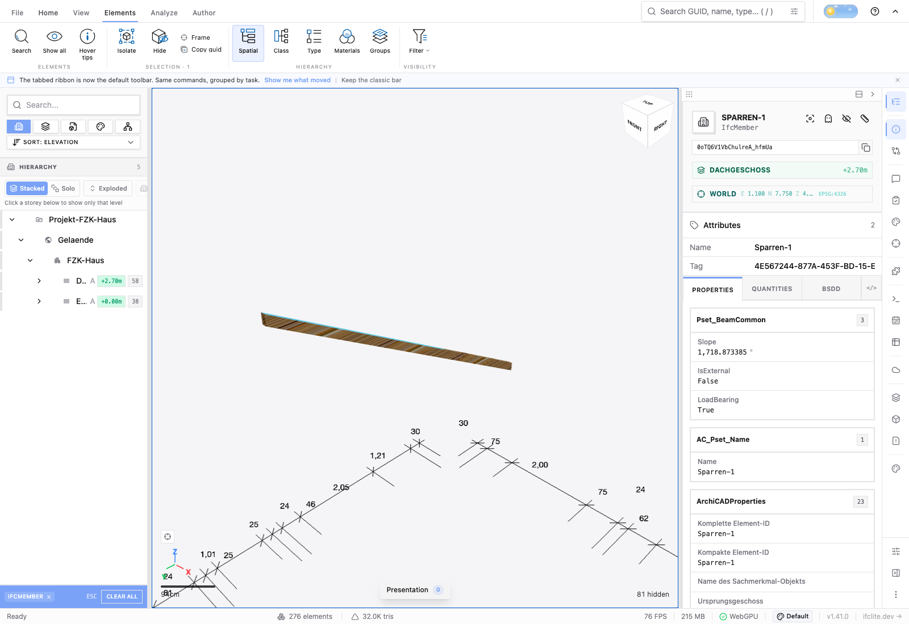

# Evaluated occurrence viewer acceptance (#4404)

The real Archicad IFC4 `AC20-FZK-Haus.ifc` fixture exercises the shipped GPU
instancing path. The selected `IfcMember` #35169 initially has no resident flat
mesh. Its source leaf #35135 is shared with other mapped occurrences. Fixture
SHA-256: `ea6f04eaf92fac4d7ad0038bc3d2dfea4c094dd3f516ecc33c50bf1835ca108d`.

The manual browser harnesses under `tools/texture-authoring/` use a fresh Chromium
WebGPU session and the canonical file input. They exercise the actual Appearance
panel, native worker, renderer, mutation history and IFC export dialog:

1. Upload the public CC0 boulder diffuse image and opt into mapped-object conversion.
2. Preview the selected member, compare its original shared instance, and return
   to the textured preview.
3. Apply once. The member has one textured flat piece; its dormant original is
   excluded from the live instance inventory. The untouched sibling is unchanged.
4. Undo restores the original mapped representation and GPU instance, removing the
   materialized model mesh. Redo restores the textured occurrence.
5. Apply a second tile size, hide and show the owning model, then Undo twice to
   restore its original mapped instance and Redo twice to restore one textured
   occurrence. The real Author toolbar is used in both single and federated runs.
6. Export **IFC + images** through the normal export dialog. The packaged PNG is
   byte-identical to the uploaded 546,426-byte source, SHA-256
   `f2be22cb22f33a21bd40eab8b3da5c2df4f537841687f58af746413a9c172203`.
7. Reopen the IFCZIP in a fresh browser and click the member in the actual
   viewport. Selection resolves its original GlobalId and IFC properties.

[Single-model observations](viewer-history-single.json) and [federated observations](viewer-history-federated.json) record the model and Scene inventory
before, after, and across Undo/Redo. They are behavioral observations, not a load
performance benchmark. The texture uses planar projection in this run; stretching
on faces parallel to the projection direction is not evidence of an existing-UV
transfer. Existing UV mapping remains refused for this conversion policy.

An independent IfcOpenShell 0.8.2 reader reopened the actual browser-exported STEP
file. [The result](viewer-export-reader.json) verifies 12 triangles, the same
GlobalId, and only the occurrence's existing Body wrapper #35155 changed among
original entities. Its maximum source-corner distance is below a micrometre.
The fixture already has 170 schema findings; export retains those 170 with no new
findings. This does not claim that the source model is schema-clean.

Automated coverage uses eight mounted actual-WASM cases: image and finite PDF page,
resident and GPU-instanced occurrence, single model and federation. Instanced cases
mount the real geometry-streaming hook. They verify the portable image/atlas
binding, original/replacement item provenance, sibling isolation, Apply/Undo/Redo,
and hidden-source history retention. The federated cases also exercise a nonzero
registered model translation while keeping publication in model-local coordinates.
The PDF fixture supplies a controlled raster derivative; actual PDF decoder
fidelity is covered by the separate PDF acceptance work.

Choosing an Appearance target model activates its existing model-scoped toolbar
history. In federation, export explicitly selects that model in the export
dialog. This acceptance covers mapped occurrences without openings; post-opening
conversion and stable face-mask work remain tracked by #4404.
