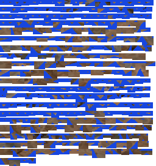

# Interior-texel applicability regression (#4381)

The real captured-boulder UI exposed an applicable transfer whose exported atlas
contained only the target's old blue appearance. Its positive coverage came
entirely from triangle centroids; none of the interior raster pixel centers had
an accepted scan observation. Centroid coverage alone is therefore insufficient
for an applicable texture mutation.

`comparison.json` records the exact captured native request, effective IFC and
RGBA input hashes, runtime hashes, native results and independent Pillow PNG
inspection. Inputs were captured before Apply from the normal transfer UI. The
source is the same CC0 Poly Haven boulder qualified in
[the original transfer evidence](../mesh-transfer/README.md); all 66,122 source
triangles were retained. The selected IFC target is a 350-triangle captured
region prepainted blue. This is a derived scan control, not independent scan/BIM
registration-accuracy evidence.

The sparse control uses 64 texels/metre and 0.001 m ambiguity distance. Before
the fix, 324 of 890 observations were accepted and the plan was applicable.
Independent PNG decoding finds exactly two RGBA colors: the old blue
`(23,70,223,255)` and transparent padding. After the fix, the same geometric
estimate remains visible, but the report distinguishes 324 observed centroids
from zero observed interior texels out of 540. There is no applicable plan or
PNG asset.

The dense control uses 512 texels/metre and 0.00001 m ambiguity distance. Both
versions produce the same PNG bytes. The new report counts 6,117 observed
interior texels out of 7,963, separately from 350 observed centroids. Independent
decoding finds 8,151 colors, including scan albedo and preserved old blue pixels.
Changing both controls establishes the positive case; it does not isolate
density as the sole cause of improved observations.

## Verification and scope

The native regression constructs a small source patch around a target triangle's
centroid, proves that its sparse shared atlas contains only the old blue pixels,
and refuses Apply. A dense version proves that red source pixels and preserved
blue pixels both reach the PNG. The real WASM contract repeats centroid-only
refusal and the dense positive case. Existing unknown-area estimates and sample
counts remain unchanged; additive counters expose how they were obtained.

To repeat the public-model control, capture the transfer worker's frozen request,
effective IFC bytes and RGBA buffer before Apply, run the same payload through
`IfcAPI.planMeshTransfer` with the two density/ambiguity pairs above, unpack IFPA,
and decode the resulting PNG independently. Exact local acceptance inputs are
retained under `/tmp/transfer-texel-real-input`; they are not shipped as fixtures.
The comparison's input hashes prevent substituting a different request or model.
The canonical load path, geometry, nearest-surface predicates, work cap and
texture sampling are unchanged by this fix.

## Ordinary-load performance

`native-load.json` contains exact-base/branch/base/branch probes, five iterations
each, on the qualified AC20 fixture. Base source is `22f3f0d0d`; branch source is
`fd88626ad`. Binaries were built separately, copied immutably, and measured while
all collaborating agents held heavy work. The first pair's parse/geometry/total
changes were +1/+1/+1 ms; the second pair's changes were 0/-1/0 ms. These mixed
phase differences provide no consistently directed change. All runs retain 285
meshes, 35,940 vertices and 19,456 triangles. Separate untimed-for-this-comparison
checks retain ordered mesh FNV `25ac885b6ff4ad00` on both builds. That fingerprint
covers mesh payloads, not textures; dense transfer PNG identity is independently
recorded in `comparison.json`. No browser worker speedup or expanded transfer
capacity is claimed.
