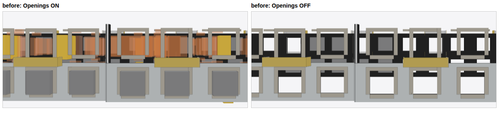
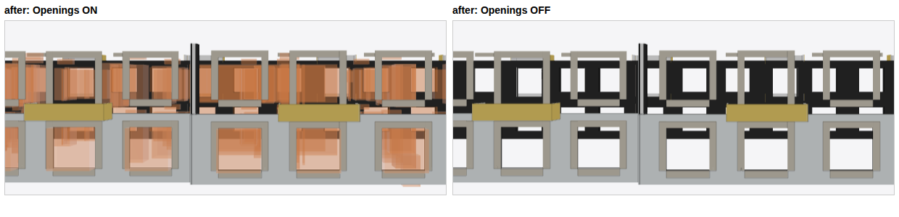

# Opening visibility and overlay colour (#5409)

Real viewer (`vite preview` of the built viewer, Chrome with WebGPU over
SwiftShader under `xvfb-run`), the Revit 2020 model attached to #5409
(`ifc-lite_bug_viewer_IfcOpeningElement_visibility.ifc`, 297
`IfcOpeningElement`). Before is `main` at `76d1119fb`, after is this branch;
both are full builds (wasm + viewer) driven by the same script: all
`IfcOpeningElement` and `IfcCurtainWall` isolated, Back view, camera framed on
the 13 openings of curtain wall `#181031` (host of `2LV5qFwkz5Dx_CWCABUqpn`),
then the **Openings** toggle switched on and off through the store.

Before: with Openings on, the tessellated openings draw as opaque grey solids
and some extruded ones as opaque yellow, beside the translucent orange ones.
With Openings off, grey boxes stay on screen: those are the occurrences the
wasm partition had sent to the GPU-instanced shard, which the toggle cannot
reach.

After: every opening is the translucent orange overlay, and Openings off hides
all of them.

The same model through the real wasm partition
(`processGeometryBatchPartitioned`, the viewer's default path):

| | flat `IfcOpeningElement` meshes | their colours | `IfcOpeningElement` on the instanced shard |
|---|---|---|---|
| before | 289 | 198 overlay orange, 54 grey `0.50`, 34 `0.98/0.71/0.39`, 2 `0.22` grey, 1 white | 8, all opaque grey (incl. `#5125711`) |
| after | 297 | 297 overlay orange | 0 |

The grey is authored: Revit writes `IfcIndexedColourMap` grey (`0.498`) on the
64 tessellated openings and an `IfcStyledItem` on 35 extruded ones.
