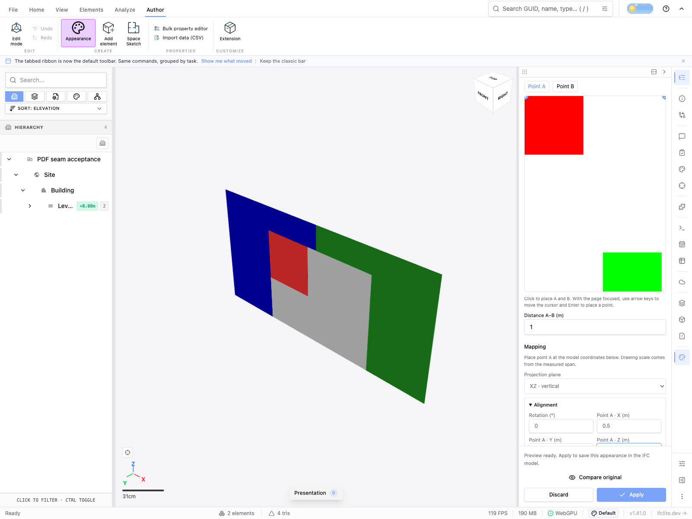
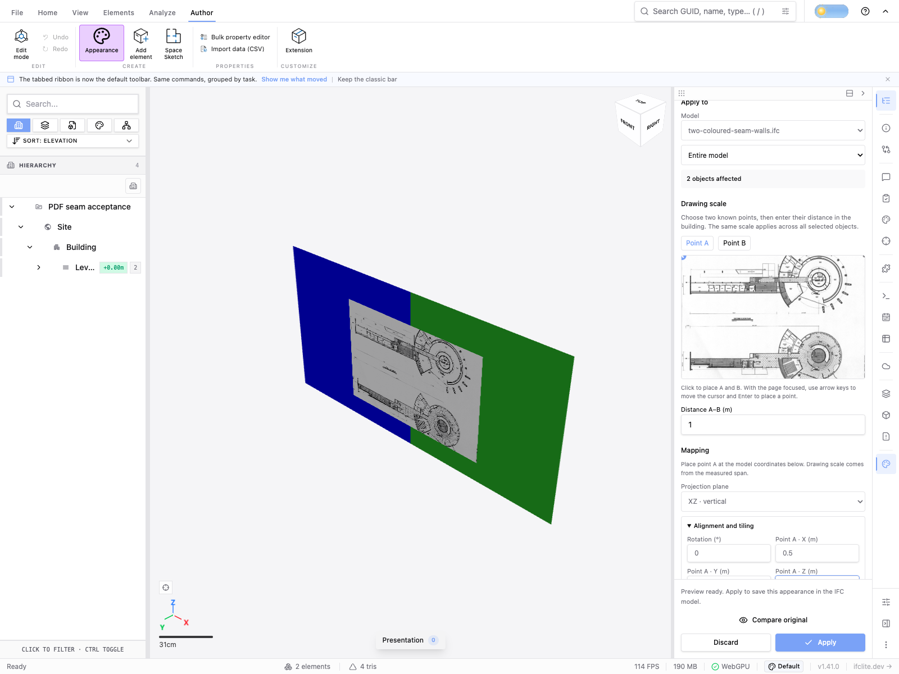
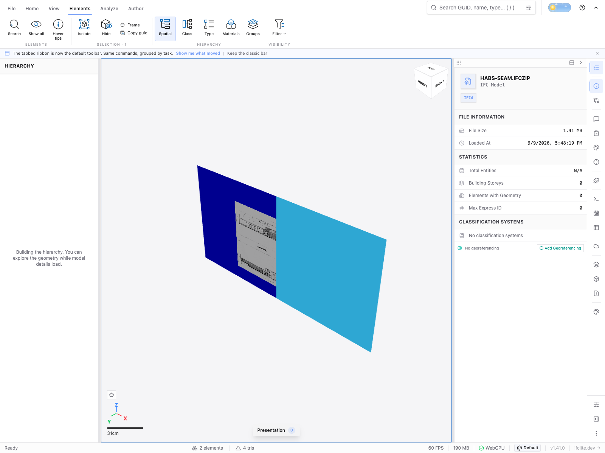
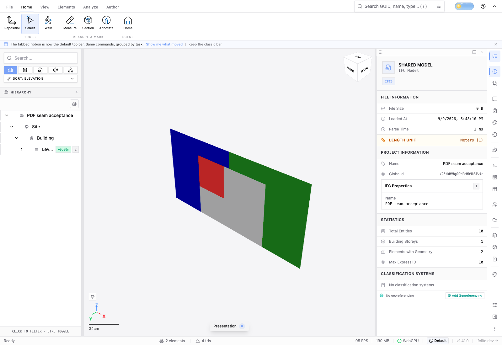
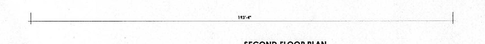
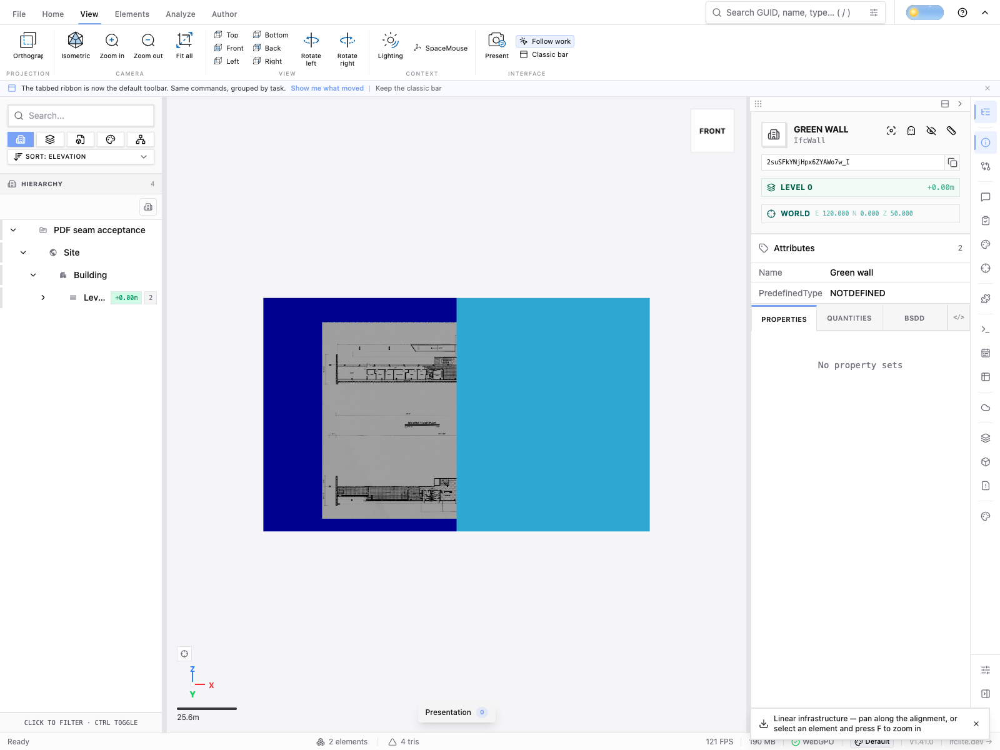

# PDF appearance browser acceptance — #4260

Actual Chromium/WebGPU viewer journeys on the integration runtime recorded in
[runtime.json](runtime.json), 9 September 2026. This qualifies page appearance,
finite coverage, calibration, ownership and transport. The initial run preceded the rendering-style follow-up. The final controlled
and known-span rerun below verifies that follow-up on a separately recorded
runtime; signed-room evidence retains its original runtime identity.

## Controlled seam and independent oracle

IfcOpenShell 0.8.2 authored two adjacent tessellated IfcWall quads in metres:
X=[0,1] and [1,2], Y=0, Z=[0,1]. The hierarchy and owners pass EXPRESS validation.
Distinct blue/green finishes also include diffuse, specular and roughness values.
The original controlled fixture is CC0; [source metadata](controlled-source.json)
records its hash and owner identities. No binary IFC/PDF fixture is committed.

Through the normal file input and Appearance dock, the existing two-page PDF
fixture was uploaded, two landmarks selected using the image's actual browser
bounds, their span set to 1m, projection set to XZ and point A placed at
(0.5,0,0.8). Preview crossed the wall seam while uncovered regions stayed blue
and green. Apply → Undo → Redo → normal IFCZIP export → fresh file input reopen
completed. Both walls were selected by clicking the viewport after reopening.

[The independent oracle](controlled-oracle.json) opens the exported STEP with
IfcOpenShell, validates EXPRESS, traverses the actual triangulated faces and
indexed texture maps, decodes their PNGs and samples known world positions with
barycentric interpolation. It does not use preview UVs to predict pixel values.
Outside samples exactly match the original displayed albedo; a red marker and
white page samples on both sides of the seam match the PDF. Expected page edges
come from the native PDF landmarks and chosen metric span. The observed atlas
edges are within the stated 1cm tolerance. Undo restores original mesh buffers;
Redo and reopened geometry/UV/colour buffers match the applied result.

## Real architectural scan PDF

The one-page [Cyclorama HABS sheet](habs-source.json) is 675,723 bytes. It contains
scanned first/second floor plans, not vector geometry. The
[Library of Congress catalog](https://www.loc.gov/pictures/item/pa3988/)
identifies HABS PA-6709, and the
[National Park Service rights statement](https://www.nps.gov/subjects/heritagedocumentation/collection.htm)
identifies HABS-created material as public domain. The PDF was downloaded from
the linked USModernist mirror; credit: Library of Congress, Prints & Photographs
Division, HABS PA-6709, sheet 4 of 24; National Park Service.

Normal UI rotation to 90° and pointer crop produced the rotated extent
736.299988 × 596 points and crop approximately [36.815,59.600,662.670,447].
Calibration, preview, Apply, Undo/Redo, IFCZIP export, fresh reopen and both owner
picks passed. The 1m landmark span is an intentional test placement; it is **not**
a claim about the building's actual architectural scale.
[IfcOpenShell/PNG checks](habs-oracle.json) independently confirm valid output and
unchanged outside albedo. The resulting IFCZIP is 1,483,040 bytes.

This journey exposed and fixed a real controller defect: the PDF worker already
returns rotated page dimensions; swapping them again made HABS crop bounds
invalid. A mounted non-square rotated-page regression covers the correction.

## Fresh signed room and exported room model

A newly created local signed room received the controlled exported model. An
independent browser context joined; owner and guest then closed; another fresh
context rejoined from the newly minted link. Both textured fragments survived,
and viewport picking worked. Normal room export produced a 2,291,027-byte IFCX;
a fresh non-room viewer reopened and selected its textured geometry.

[Per-owner evidence](room-roundtrip.json) verifies exact associated Float32 world
position, triangle-index, UV and decoded RGBA hashes through join, rejoin and
IFCX reopen. Numeric IDs change, and room IFCX node paths prefix the original
GlobalId with `/`: this verifies owner correspondence, **not** unchanged EXPRESS
GlobalId strings. Local-position hashes can differ because IFCX materializes the
origin; the world-coordinate hashes match. Original PNG-byte retention is not
claimed for the room's decoded-pixel transport. No old user room or token was
used, and no access token is recorded here.

## Final real-dimension and material rerun

The final runtime is recorded separately in [runtime-final.json](runtime-final.json).
The HABS second-floor wing explicitly labels **193′-4″**, which converts to
58.928m using `(193 + 4/12) × 0.3048`. The image below identifies the actual
reference and its end ticks. [Landmark input evidence](habs-known-landmarks.json)
records the PDF CropBox, measured native/rotated PDF coordinates and actual
browser image bounds and pointer coordinates. No page-width or nominal print-DPI
assumption determines the building scale.

Two IfcOpenShell-authored 80m-wide × 100m-high wall quads accommodate the real
sheet scale. The same rotation/crop UI was used; point A was anchored at
(30,0,50), and the printed 58.928m span entered. Apply, Undo/Redo, normal IFCZIP
export and fresh reopen completed. The viewer's automatic linear-model view is
edge-on for this controlled vertical fixture; selecting the normal **View →
Front** preset reveals it, and both owners are selectable.

[The independent exported-IFC oracle](habs-known-span-oracle.json) reconstructs
world samples from the exported face sets, texture maps and PNGs. It detects the
two printed dimension end ticks at X=30.080m and 89.063m: **58.983m apart**, 55mm
from the printed reference. The stated 0.5m acceptance tolerance allows for the
compact UI's integer pointer coordinates and atlas sampling; the sampling step
is 0.01m. It also predicts the crop's world corners from the selected native
landmarks and independently detects its exported left/right image boundaries.
The metadata records both predictions and observations.

The exported rendering styles retain each original SpecularColour=0.2,
IfcSpecularRoughness=0.35 and ReflectanceMethod=NOTDEFINED. Outside albedo samples
still match exactly and EXPRESS validation reports no errors. The final
controlled-PDF rerun also passed the earlier scale/albedo oracle and both owner
picks, with an 8,424-byte IFCZIP. These material checks qualify this fixture's
fields; they are not a claim about every possible material style.

