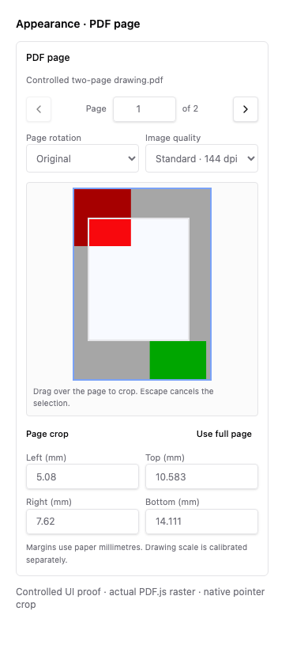

# PDF page controls: bounded browser proof

Issue #4260, presentation commit `c1687d816`. Chromium mounted the production
`AppearancePdfFields` with its controlled props and an actual PDF.js raster of
`apps/viewer/src/lib/appearance/pdf/fixtures.ts`'s original CC0 `controlledPdf()`.
This is a component browser harness, not a completed IFC projection journey.

The first page has CropBox, intrinsic rotation and UserUnit metadata. Its visible
extent is 144 × 200 physical PDF points. Native pointer input dragged from
(10%, 15%) to (85%, 80%) of the full page. The emitted crop was
`[14.3999987, 29.9999949, 108.0000064, 129.9999949]`, matching
`[14.4, 30, 108, 130]` within 0.1 point. The screenshot shows the resulting crop
and corresponding paper-mm margins. PDF scale calibration remains a separate
controller workflow.

Validation also passed plain root `pnpm typecheck` (1,845 test sources), six new
mounted PDF interaction tests, and eight existing Appearance panel tests through
root Turbo. Temporary browser harness files were removed after recording.
