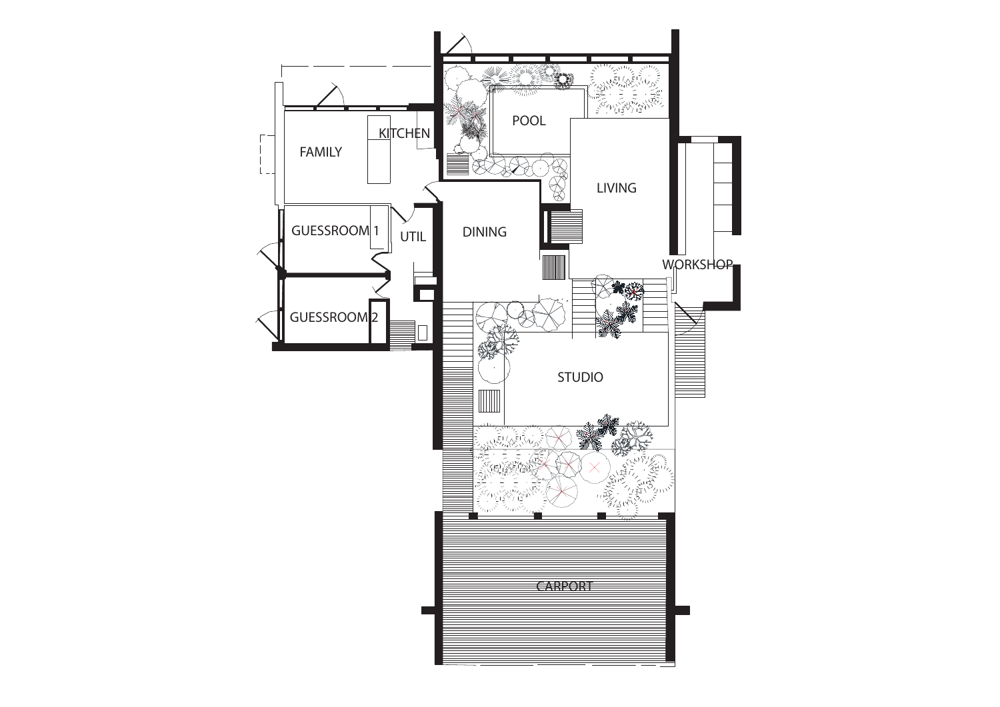
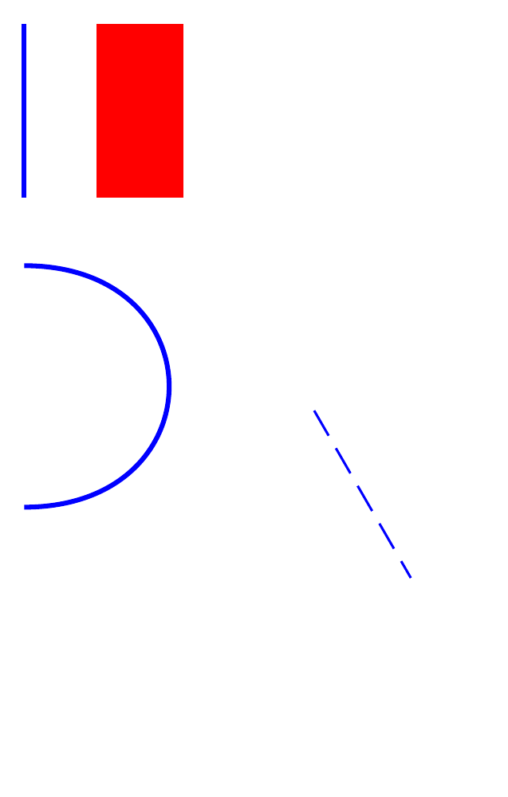
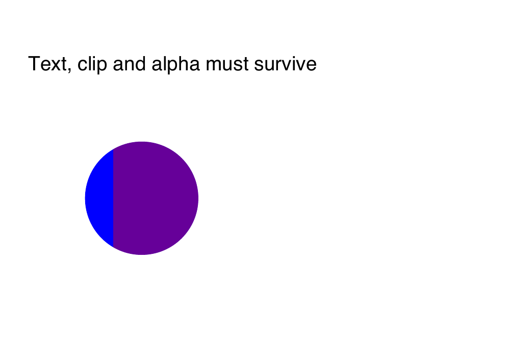

# PDF vector fidelity investigation (#4406, F8)

This is a reproducible input investigation, **not a PDF-to-IFC converter**.
No application action is enabled by this evidence. The scoped issue stays open
until canonical planning, integrated 2D/3D review and independent IFC roundtrips
pass. Reports were generated with the viewer's pinned PDF.js 6.3.289.

## A real vector drawing and a real scanned drawing

[Zaidaudi's ground-floor plan](https://commons.wikimedia.org/wiki/File:Floor_Plan.pdf)
was exported by Adobe Illustrator and is available under
[CC BY-SA 3.0](https://creativecommons.org/licenses/by-sa/3.0/).
[Source identities and attribution](sources.json) pin the 515,902-byte PDF.
The preview below is a Poppler rendering, licensed CC BY-SA 3.0 with attribution
to Zaidaudi; this PNG license is separate from the repository's source-code
license. The PDF itself is downloaded locally, not committed as a test fixture.



[The measured inventory](featherston-census.json) has 12,773 operations:
3,167 constructed paths, 3,133 stroke paints, 33 fills, one clip-consuming end
path, 11 text paints and no raster image paints. Its apparently curved garden
symbols are already polylines in the decoded stream; this source does **not**
exercise Bézier conversion. It also has a Form XObject, a group, graphics-state
changes and optional content. Counts do not measure visible area or establish
that any of those state operations can be ignored.

The existing HABS Cyclorama sheet is a useful negative control:
[its inventory](habs-raster-census.json) contains three image paints and no path
commands. It remains a useful calibrated raster source. Converting it to editable
vectors would be a distinct tracing/OCR operation.

## Controlled cases

The [original CC0 generator](https://github.com/LTplus-AG/ifc-lite/blob/main/tools/texture-authoring/pdf-vector-controls.py)
creates two pages, independently rendered below with Poppler's `-cropbox` option.
Page one has a 72-native-unit line, one rectangle, one cubic curve, and a dashed
line under translation, rotation and non-uniform scale. The page has a nonzero
CropBox, UserUnit 2 and intrinsic rotation 90 degrees. The 72-unit span is
144 physical points (50.8 mm of paper); this is not architectural model scale.
The report retains the actual six-value native-PDF-to-visible-page transform.



[Page-one inventory](control-page-1.json) verifies one cubic command, three
stroke paints, one even-odd fill, one dash-state operation, and no text paints.
ReportLab emits unused font setup; merely finding `setFont` must not classify
visible text as lost. Page two has a circular clipping path, two overlapping
fills, non-unit fill alpha and one painted text label.
[Its inventory](control-page-2.json) records four cubic clip segments, clipping,
graphics state and text. Extracting just its two rectangles would give visibly
incorrect output.



## Decoder contract and implementation order

The pinned decoder's `constructPath` arguments are
`[paintOperator, [Float32Array(drawCommands)], bounds]`; command identifiers are
DrawOPS values (0 through 4), not the public `OPS.moveTo` identifiers. Empty
constructed paths can consume paint or pending clip state. Color setters deliver
CSS color strings in the observed stream. This is an internal, version-sensitive
encoding, so the tool refuses a different decoder version. Requalify against
Mozilla's [CanvasGraphics implementation](https://github.com/mozilla/pdf.js/blob/master/src/display/canvas.js)
and [operator-list implementation](https://github.com/mozilla/pdf.js/blob/master/src/core/operator_list.js)
when upgrading. Do not reuse operator-list positions as render-filter positions.

The next implementation slices are:

1. A worker-owned graphics-state interpreter and fidelity report. Keep native PDF
   coordinates and page transforms separate from drawing calibration. Retain
   source digest/page/crop and paint order. Bound paths, coordinate scalars, state
   depth and work; cancellation terminates the owning worker. Unsupported visible
   operations prevent exact conversion. Partial conversion is an explicit choice
   identifying the omissions, with the original raster available for comparison.
2. Canonical Rust annotation planning and rendering. Existing drawing-markup
   writers create IfcPolyline, IfcTextLiteralWithExtent and IfcAnnotationFillArea,
   but the current 3D geometry router explicitly reports these standalone items
   as unsupported. New PDF code must not assume that writing schema-valid rows
   makes them visible or selectable. Extend the shared canonical processor and
   styling path, with bounds and independent-reader evidence, before enabling
   the action. Avoid a second temporary mesh/IFC authoring path.
3. Start with qualified line/fill geometry and bounded curve approximation with
   a declared metric error. Preserve fill rules, holes, line caps/joins/dashes,
   nonuniform transforms and paint order. Text/font substitution and blending
   require their own demonstrated policies; schema validity alone is insufficient.
4. Reuse registered-reference planes and the normal Appearance transaction:
   source inspection → calibration → conversion report → 2D/3D compare → Apply.
   Prove selection, Undo/Redo, export/reopen and fresh-room viewing of the saved
   annotations. Keep editable source recipes distinct from portable IFC output.

IfcAnnotationFillArea is suitable schema geometry for planar filled boundaries;
its style is associated through IfcStyledItem and IfcFillAreaStyle. See the
[buildingSMART definition](https://standards.buildingsmart.org/IFC/RELEASE/IFC4/FINAL/HTML/schema/ifcpresentationdefinitionresource/lexical/ifcannotationfillarea.htm).
This suitability does not establish our processor, font or compositing fidelity.

## Reproduce

Install workspace dependencies, download the PDF from `sources.json`, then run:

```sh
uv run tools/texture-authoring/pdf-vector-controls.py /tmp/controlled-vectors.pdf
node tools/texture-authoring/pdf-vector-census.mjs /tmp/controlled-vectors.pdf 1
node tools/texture-authoring/pdf-vector-census.mjs /tmp/controlled-vectors.pdf 2
node tools/texture-authoring/pdf-vector-census.mjs /path/to/Floor_Plan.pdf
pdftoppm -cropbox -scale-to 1000 -png /tmp/controlled-vectors.pdf /tmp/control
```

The offline census uses a disposable worker with a 60-second deadline and a
256-MiB JS heap cap, and refuses files over 64 MiB, more than 100,000 operations
or two million path scalars. PDF.js allocates its full operator list before the
latter checks; native decoder memory is not bounded by the JS heap cap. These
limits are evidence-tool safeguards, **not** production-ingestion qualification.
Malformed PDFs and invalid page requests fail instead of returning a successful
empty inventory. The committed JSON records observations, not a public API or
byte-layout compatibility snapshot.
