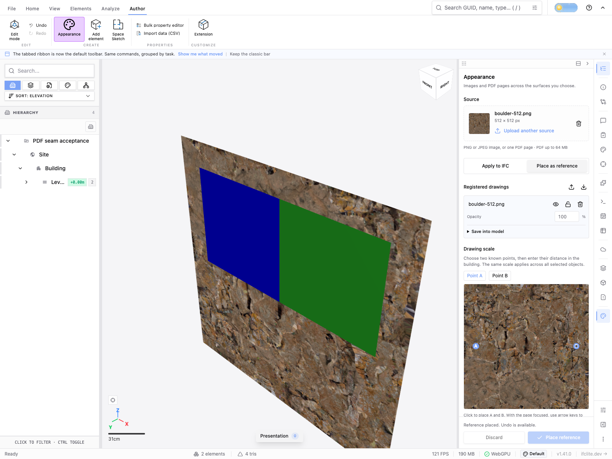

# Registered reference runtime evidence

Issue #4308, runtime PR #4375. The screenshot was captured through the integrated Appearance dock on commit `11f109396`, which includes the runtime source from this PR plus the dependent UI. It shows the uploaded 512 × 512 boulder image registered as a plane behind two IFC walls: wall colours and IFC element count remain unchanged, and the image is visibly depth-occluded by the walls. The source asset digest is `f2be22cb22f33a21bd40eab8b3da5c2df4f537841687f58af746413a9c172203`.

This capture proves reference drawing in the real viewer. It does not establish annotation creation, export, sharing, selection, or complete UI acceptance; those remain in their respective integration slices. The runtime branch's automated tests separately exercise nearest unlocked selection, scene depth, failed/late/cancelled uploads, exact resource destruction, delayed decode leases, frame mismatches and active-model-independent federation offsets.
