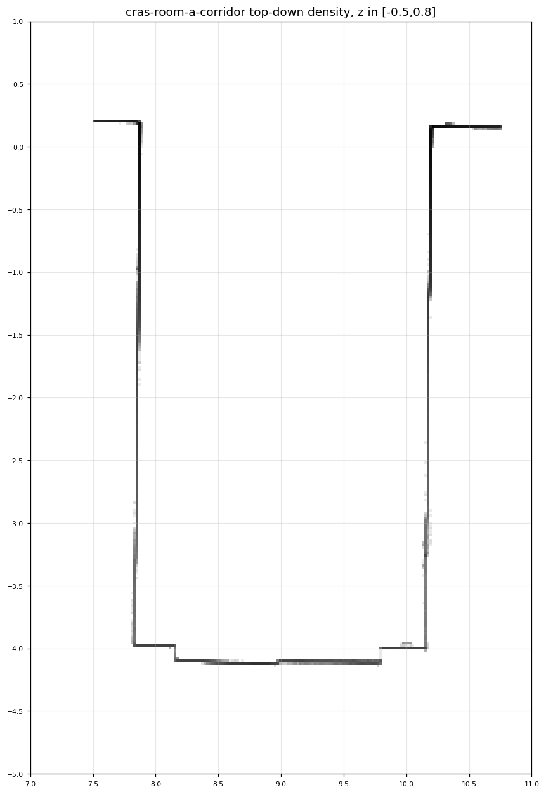
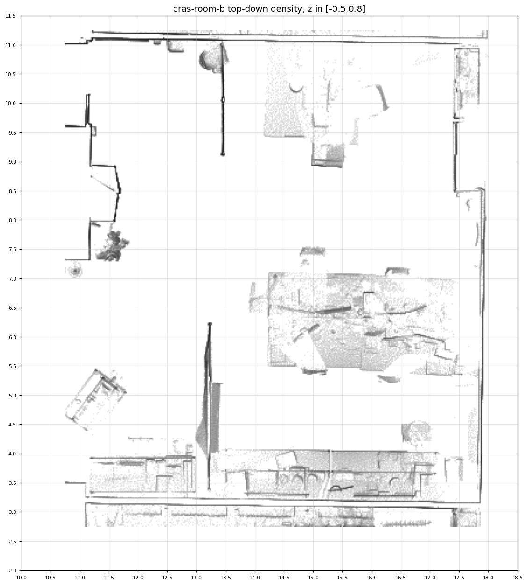
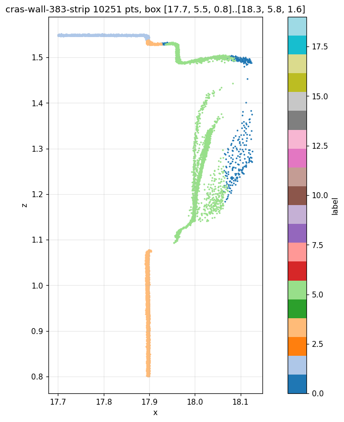
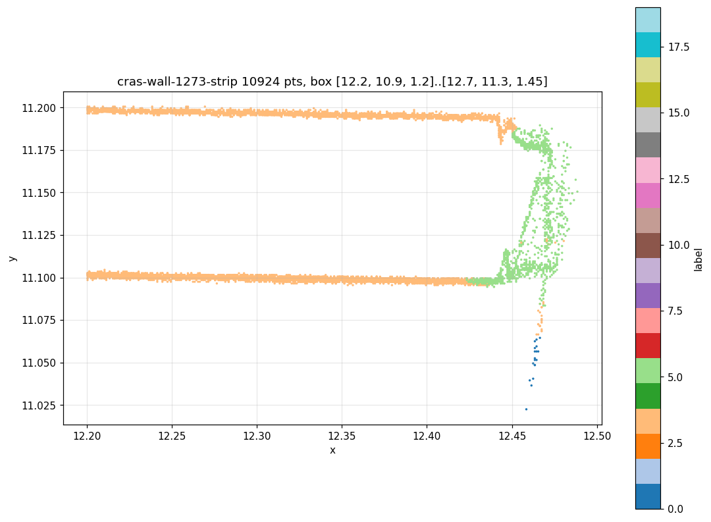

# CRAS real pair: independent registration checks and RGB point transfer (#4381)

This directory closes the real-pair gate of #4381 with measured numbers. It
records what was done, exactly how, and what the held-out residuals do and do
not support. Nothing here is an accuracy approval: the tolerance below was
*derived from* held-out residuals after the solve, by a rule fixed beforehand,
and every coverage number is reported as the planner measured it.

## Source data and licence

- Scan and model: Abreu et al., *CRAS laboratory* record
  [Zenodo 7948116](https://zenodo.org/records/7948116), **CC BY 4.0**. Retain the
  attribution and the record DOI in any derivative. The paper's 3 mm figure
  concerns scan-to-scan registration and is not used here.
- Archive `craslabannotated.zip`, 4,267,281,425 bytes, downloaded complete on
  2026-09-12 (`curl -L -C - --retry 5`, 2 min 37 s at ~26 MB/s); MD5
  `e5ecedab8f2a1d1f91861a3aec028a72` **matches the record**; SHA-256
  `933732e81910116cec5e74c9205074b82d1f571f3d9816386b68a0a909112671`. Its single
  member `CRASLAB_annotated.asc` (26,752,658,348 bytes) holds a header row, a
  count row (`584701977`) and tab-separated `X Y Z R G B Intensity Classification`.
- Model `craslabbim.ifc`, 67,553,572 bytes, MD5 `e20658f0d2d9e13c62363169b7fa3193`
  (matches), SHA-256 `a83e5730…`, IFC2X3 (see `cras-ifc4-migration.json`).
- No point data is committed. Archive, subsets and the full IFC live under
  `~/ci/cras/` on the host that ran this; every subset manifest pins SHA-256s.

## Acquisition (whole archive, streamed, never unpacked)

1. `python tools/texture-authoring/cras-archive-histogram.py craslabannotated.zip hist`
   — one pass over all **584,701,977** rows (192 s): bounds x 0.01–18.32,
   y −4.18–20.27, z −2.07–3.25 m; 29,239 occupied 0.25 m cells; label counts.
   [`cras-archive-histogram.json`](cras-archive-histogram.json). The floor sits
   at z ≈ −1.15 and the room ceilings at z ≈ 1.05 (corridor) / 1.55 (room B).
2. `python tools/texture-authoring/cras-archive-subset.py craslabannotated.zip BOXES.json OUT`
   — five further passes wrote spatially bounded, systematically decimated
   subsets as binary PLY (double XYZ in unchanged source metres, RGB8, label,
   original row index): [subsets/](subsets/) manifests give box, stride, points
   inside/kept and SHA-256 per file. Rooms were chosen from the occupancy map,
   not from file order: the corridor (x 7.5–10.75, y −4.5–0.5) and room B
   (x 10.75–18.5, y 2.75–11.25), plus dense strips along its north, east, south
   and west walls and two undecimated window-jamb boxes.

The IFC counterparts, from the published geometry (IfcOpenShell 0.8.3, world
coordinates): the corridor between walls `0FDABnXCHCUR8gI54b$LZ2` (face
x = −2.0197) and `1gsZ4XbYD0qRhfvwOUEK3Z` (face x = 0.3907) with end wall
`1gsZ4XbYD0qRhfvwOUEJ7O` and its recessed door; room B between walls
`1gsZ4XbYD0qRhfvwOUEI1z` (south, y = 3.0085), `3qeiF73TD1uOeHIcNGcTy8` (north,
y = 10.8615) and `0FDABnXCHCUR8gI54b$Kx2` (east brick wall, x = 7.9862) with
five clerestory windows per drywall (sill 2.29 m, head 2.77 m) and five 0.5 m
windows in the brick wall (sill 2.29, head 2.76). The IFC4 derivative
(`ifcopenshell.util.schema.Migrator`, all 2,414 GlobalIds preserved) has
identical wall geometry for every reference wall.

## Landmarks: three-plane intersections, frozen fit/check lists

`python tools/texture-authoring/cras-landmarks.py craslabbim.ifc subset landmarks.json`
([`landmarks.json`](landmarks.json)). Each landmark is the intersection of
three named planar faces:

- **IFC side**: face coordinates read from the published IFC2X3 geometry
  (wall faces, opening jambs and heads, slab top z = 0.10). No IFC value is
  typed by hand; each row names the GlobalIds involved.
- **Scan side**: for each plane, points inside a search box are fitted by
  seeded RANSAC (600 hypotheses, 6 mm inliers, normal within 30° of the
  expected axis, ≥ 20 support points) followed by five least-squares refits;
  the box for the next plane is placed from the planes already fitted. A
  coarse offset (9.90, 0.22, −1.245) m read from wall-face histogram peaks
  places the *first* box only; it never enters a coordinate. Re-running every
  fit with the *measured* median offset instead moves no landmark by more than
  **1.7 mm** (`refit_with_measured_offset_drift_m`), so the boxes did not
  choose the answer. Plane RMS is 0.6–3.5 mm; the SHA-256 of each plane's
  supporting archive rows is recorded.
- **Partition**: features are listed in a fixed order; those that could be
  measured alternate fit, check, fit, … starting with fit. The rule was written
  before any solve and the list was not revised against residuals.

Features and their fate:

| Landmark | Planes | Result |
| --- | --- | --- |
| Room B north clerestory band, west end, head | wall face ∩ jamb reveal ∩ head reveal | not measurable: the jamb there is a curved frame profile, no planar reveal |
| Room B north band, east end, head | north face ∩ east face ∩ head | **fit** |
| Room B south band, west end / east end, head | as above | **check / fit** |
| East brick wall, windows 1328061 · 1327917 · 1327933 · 1327949 · 1327965, S and N jambs at the head | east face ∩ jamb reveal ∩ head reveal | 7 measured (fit/check alternating); 3 jambs are seen only at grazing angles and keep 2–33 candidate points without a coplanar set of 20, one of them even undecimated |
| Room B west door 1328449, south jamb at floor / at head | west face ∩ jamb ∩ floor / head | **fit / check** |
| Corridor floor corners SW / SE | two wall faces ∩ floor | **check / fit** |
| Corridor door 1328314 jambs at the floor, W / E | end-wall face ∩ jamb ∩ floor | **check / fit** |
| Room B floor SE | two wall faces ∩ floor | not measurable: benches hide the floor corner |

Sills were deliberately not used: from inside the room every sill reveal is
hidden behind the sloped bottom frame member (see the window section below).

Result: **16 landmarks, 8 fit + 8 held-out**, spanning both rooms, three walls,
two heights (floor 0.10 m and heads 2.76–2.77 m) and 12 × 15 m in plan.

## Registration (canonical solver) and the tolerance rule

`node tools/texture-authoring/cras-register-transfer.mjs landmarks.json craslabbim-ifc4-tessellated.ifc SUBSET.ply WALL_GUID OUT ARCHIVE_SHA256`
runs `IfcAPI.registerScanCorrespondences` on the frozen lists
([`registration-request.json`](registration-request.json),
[`registration-report.json`](registration-report.json)). Source frame
`cras-archive-native-metres-v1` bound to the archive SHA-256; target frame
`ifc-world-z-up-metres` bound to the target IFC SHA-256.

| | RMS | median | 90th pct. | max |
| --- | --- | --- | --- | --- |
| Fit (8) | 4.09 cm | 2.92 cm | — | 7.20 cm (`B-south-band-E-head`) |
| **Held-out (8)** | **4.53 cm** | **3.35 cm** | **6.54 cm** | **6.54 cm** (`B-west-door-S-head`) |

Rotation 0.72°; non-collinearity spread ratios 0.163 (source) / 0.165 (target).

**Tolerance rule, fixed before the run:** the largest held-out residual rounded
up to the next centimetre → **7 cm**. Fit residuals never enter it. This is the
accuracy the transfer may claim for this pair: a scan surface within 7 cm of
its IFC face is consistent with the independently checked registration; nothing
tighter is supported. The residuals are not scanner noise (plane fits are
millimetre-level) but as-built deviations from the model: the corridor is
~9 cm narrower than modelled (after registration its east face lies 6.0 cm
inside the IFC face, its west face 3.1 cm), the north clerestory band starts
~10 cm further east than the modelled opening, and room B is 3–5 cm deeper
between its south and north faces than modelled. A rigid fit spreads these
over its 16 points; a transfer bound tighter than a wall's own deviation
refuses that wall entirely (see the half-tolerance control).

## Transfer target: a tessellated derivative

The published model is swept solids with 1,328,372 entities (each manufacturer
window/door family carries ~47,000 vertices). The F4 target policy takes direct
`IfcTriangulatedFaceSet` bodies (evaluated occurrences are F6, #4404) and the
planner bounds its target at 200,000 entities, so
`python tools/texture-authoring/cras-tessellated-target.py craslabbim.ifc craslabbim-ifc4-tessellated.ifc cras-ifc4-tessellated.json`
writes what an IFC4 Reference View export would: all 61 walls and 5 slabs as
world-coordinate tessellated bodies (openings applied by the independent
IfcOpenShell tessellation), GlobalIds and names unchanged, one neutral surface
style each, 484 entities, 73,495 bytes
([`craslabbim-ifc4-tessellated.ifc`](craslabbim-ifc4-tessellated.ifc),
[`cras-ifc4-tessellated.json`](cras-ifc4-tessellated.json)). The tessellated
wall corners equal the extrusion corners the landmarks were read from.

## RGB point transfer: measured coverage

Both runs use `orientation: target-referenced` (the archive carries no normals
or stations), support radius 4 cm, 6–48 supporting points, 6 mm surface band,
`minNormalDot 0.8`, ambiguity 2 mm, and `maxDistanceMetres = maxBehindMetres =`
the tolerance. Times are single Node runs on this host, not a browser claim.

**Corridor drywall `1gsZ4XbYD0qRhfvwOUEK3Z`** (10 cm, no openings; source:
corridor subset, stride 24, 465,029 points) —
[`transfer-summary-wall-1117.json`](transfer-summary-wall-1117.json):

| bound | texels/m | samples | observed | too far | normal | ambiguous | behind | sparse | observed area | work used |
| --- | --- | ---: | ---: | ---: | ---: | ---: | ---: | ---: | --- | --- |
| 7 cm | 64 | 105,126 | **33,809** | 63,591 | 793 | 731 | 119 | 6,083 | **8.19 m²** of 25.28 m² | 43.5 M of 128 M (399 ms) |
| 3.5 cm | 64 | 105,126 | 0 | 105,085 | 0 | 0 | 0 | 41 | 0 | 16.6 M (139 ms) |

The wall's 25.3 m² are two 4.1 × 2.9 m faces plus edges. Only the corridor
face was scanned in this subset, and only below the corridor's suspended
ceiling (scan z 1.04 ↔ IFC 2.29 m), so ≈ 9.1 m² could ever be observed; 8.19 m²
were. The far face, the 0.7 m above the ceiling and the edges are unknown by
distance. At half the tolerance nothing is observed, because the as-built face
lies 6 cm from the modelled one — the tolerance is doing exactly the work the
held-out residuals licence. Atlas 512 × 700 (`textures/5e74c2b4….png`); the
bright band near the ceiling is the fluorescent lighting in the capture.

**North wall `3qeiF73TD1uOeHIcNGcTy8`** (10 cm drywall with five clerestory
windows, both faces scanned; source: strip stride 36, 623,244 points) —
[`transfer-summary-wall-1273.json`](transfer-summary-wall-1273.json):

| bound | texels/m | outcome |
| --- | --- | --- |
| 7 cm | 64 | **refused**: `Transfer work budget exhausted; reduce source extent or atlas density` (824 ms) |
| 7 cm | 32 | 40,672 samples, **21,892 observed**, 7,949 too far, 2,891 normal, 1,525 ambiguous, 292 behind, 6,123 sparse; **20.69 m²** of 37.22 m²; 49.0 M work (306 ms); atlas 512 × 374 |
| 3.5 cm | 32 | 1,078 observed, 33,655 too far; 0.92 m² |

The refusal at 64 texels/m is the bounded job behaving as specified on a real
wall: two scanned faces 10 cm apart double the points every query visits, and
the fixed 128,000,000-unit budget stops the plan rather than degrading it. The
planner now reports `budget.workUsed` beside coverage so this is auditable.

## Independent apply and reopen

`python tools/texture-authoring/cras-transfer-oracle.py craslabbim-ifc4-tessellated.ifc RUN tolerance WALL_GUID OUT`
applies only the plan's created/edited/removed entities with IfcOpenShell,
writes the transferred IFC and PNG, reopens the file and checks it
([`oracle-wall-1117.json`](oracle-wall-1117.json),
[`oracle-wall-1273.json`](oracle-wall-1273.json)): wall geometry unchanged
(12 / 60 triangles), exactly one `IfcIndexedTriangleTextureMap` indexing every
triangle, the image URI equal to the atlas asset (named by its own SHA-256),
`IfcSurfaceStyleWithTextures` assigned, IfcOpenShell schema validation 0 errors
(EXPRESS rules not run). Sampling every triangle's UV centroid in the atlas: 2
of 12 (the corridor face) and 14 of 60 triangles carry captured colour, the
rest the prior style.

`apps/viewer/src/lib/appearance/scan/cras-transferred-output.test.ts` is the
ifc-lite side over the committed
[`craslabbim-ifc4-tessellated-transferred-wall-1117.ifc`](craslabbim-ifc4-tessellated-transferred-wall-1117.ifc):
the wall tessellates with identical ordered corners, one UV per vertex and the
atlas reference; packaged as IFCZIP (`fflate` + `unwrapIfcZipWithResources`)
the model bytes and the texture round-trip byte-exact; seeded into a room by
the real owner seed and reconstructed by a fresh guest, the wall is selectable
by its GlobalId path with byte-exact texture pixels and UVs.

## What this does and does not establish

- Established: a licensed real scan/IFC pair, sixteen independently measured
  three-plane correspondences with frozen fit/check lists, held-out residuals
  published before any bake tolerance was chosen, a tolerance derived from
  them by a pre-stated rule, and RGB point transfer onto two walls of that
  model with observed/refused/unknown coverage, budget refusal, independent
  reopen, IFCZIP packaging and room join all measured on the output.
- Not established: absolute survey accuracy (the landmarks are manually defined
  building features measured in both datasets, not surveyed control points);
  any tolerance below 7 cm for this pair; behaviour on voided extrusions (the
  target is a tessellated derivative); browser timing (Node runs only); the
  colour fidelity of the captured atlas beyond what the scanner recorded.
- Orientation: with no normals or stations in the archive, every point plan is
  `target-referenced`, and the thin-wall separation rests on the target
  self-occlusion rule (`unknownBehindSamples`), which the controlled and WASM
  tests pin under all three orientation sources.
