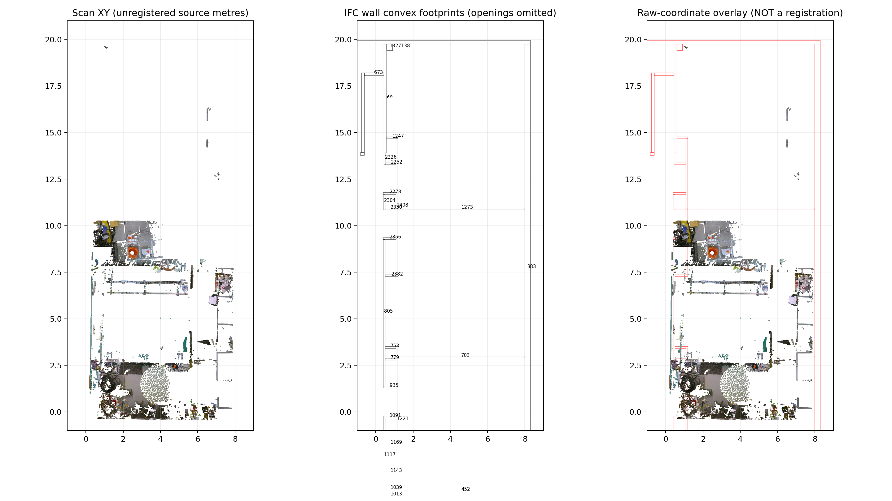
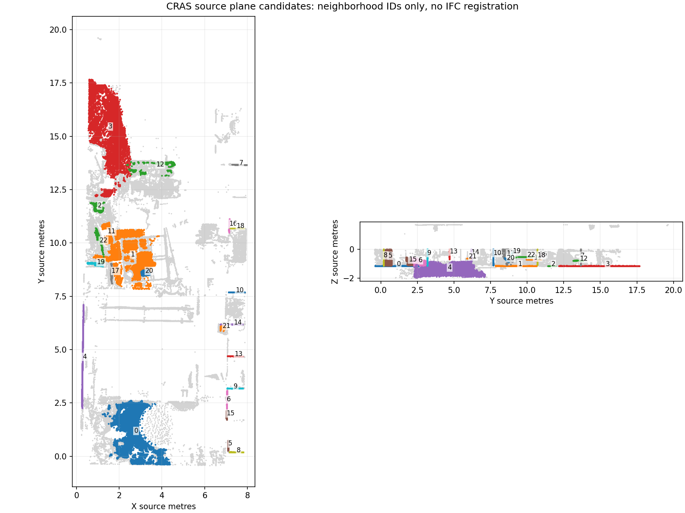

# Real scan/IFC acceptance data — #4381

CRAS is a downloaded, licensed **candidate**, not a passed registration or
appearance-transfer acceptance test. The independent check-point gate remains
open. [Inspection manifest](cras-source-inspection.json) contains measured source
identity, units, component counts and bounded scan-prefix statistics.

## Provenance and acquisition

The authors' [Zenodo record](https://zenodo.org/records/7948116) pairs a real RGB
laser capture with an as-built IFC of the same CRAS laboratory. The record's
[API metadata](https://zenodo.org/api/records/7948116) declares CC BY 4.0. Retain
attribution to Nuno Abreu and collaborators, the record DOI, license and every
crop/normal-estimation/registration operation in derived samples. Metadata was
queried directly during this inspection; no gated access agreement was accepted.

The complete IFC was downloaded and its published MD5 verified. Its SHA-256 is
pinned in the manifest. Independent IfcOpenShell 0.8.5 parsing finds IFC2X3,
metre units, 61 walls, five slabs, six doors and 44 windows. An IFC4-only writer
must explicitly handle this schema difference before claiming this sample works.
Site/building placements are identity, but that says nothing about the scan's
registration. Storey TÉRREO has a 0.1 m Z placement.

The scan ZIP directory contains one 26,752,658,348-byte ASCII member. HTTP Range
requests fetched the final 65,536 archive bytes and the first 1,048,576 bytes.
Raw DEFLATE decoding after the local ZIP header, discarding the incomplete final
line, produced 137,887 complete source points. Their XYZ/RGB/intensity/label rows
are unchanged. All prefix labels are zero; this is file-order sampling, **not**
a selected room, representative wall coverage, or a semantic benchmark. The
complete 4.27 GB ZIP was not downloaded: its published checksum remains unverified.
A range digest cannot establish integrity of bytes that were never fetched.

Local artifacts (outside Git):

- `/tmp/ifclite-public-captures/original/craslabbim.ifc`
- `/tmp/ifclite-public-captures/cras-scan-prefix.txt`
- `/tmp/ifclite-public-captures/cras-record-current.json`
- `/tmp/ifclite-public-captures/cras-zip-tail.bin`

Downloads are available through `https://zenodo.org/api/records/7948116/files/`
followed by `craslabbim.ifc/content` or `craslabannotated.zip/content`.
No binary fixture is committed. Any eventual CI fixture must follow the existing
fixture manifest/upload flow, preserving attribution and explicit crop provenance.

## Why the acceptance gate is still open

The [dataset paper, section 6.2](https://www.mdpi.com/2306-5729/8/6/101)
describes a separate coarse-to-fine ICP registration from capture to BIM. The
reported 3 mm figure concerns registration among laser scans; it is **not** a
measured scan-to-IFC error. Neither the downloaded IFC nor the inspected archive
directory supplies independent corresponding survey check points. There is no
verified scan-to-IFC transform in this evidence. Identity is deliberately absent
from the manifest, rather than guessed from metre units or similar bounds.

The record exposes only IFC and one ASCII scan archive, with no distinct
registration/check-point file. That establishes the absence of a separate file
in this record, not the absence of survey evidence everywhere. Visual matching,
ICP fit residuals, or landmarks used to solve the transform must not be relabeled
as independent surveyed accuracy.

## Concrete remaining acceptance protocol

1. Acquire a bounded spatial crop covering several identifiable building corners,
   retaining original source row indices and exact bounds. File-order prefix alone
   is insufficient; stream the full verified archive or use another documented crop.
2. Identify fitting landmarks separately from spatially distributed held-out
   check landmarks. Record who identified them, both coordinate triples, feature
   interpretation and measurement uncertainty. Manually corresponding corners are
   independent of the fit but are not independently surveyed control points.
3. Fit and freeze the proper rigid/uniform-scale transform on fitting points only.
   Publish held-out residual vectors and metric summary before choosing bake
   tolerances. Do not optimize on check points or select only convenient walls.
4. Establish oriented normals with a documented neighborhood and orientation
   method; this ASCII source contains no normals or per-point scanner origins.
   Reject ambiguous orientations rather than accepting opposite wall faces.
5. Run appearance transfer on the same registered IFC/crop, report unknown area,
   thin-wall bleed and image sampling limits, then verify identity, Undo/Redo,
   independent IFC reopening and room sharing. Capture color is measured; missing
   areas remain explicitly unknown. No quality claim is made by this inspection.

This preparation makes real source bytes available for importer work while
keeping registration evidence as an explicit unfinished deliverable.

## Bounded reachability re-check (2026-09-11)

The earlier acquisition note recorded HTTP 504 timeouts from the public
archive. A bounded re-check from this host at 2026-09-11T17:46:03Z–17:46:04Z
found the record reachable again: `HEAD` on
`https://zenodo.org/api/records/7948116/files/craslabbim.ifc/content` and
`.../craslabannotated.zip/content` both returned HTTP 200 after redirects, and
a ranged `GET` of archive bytes `0–1048575` returned HTTP 206 with 1,048,576
bytes in 0.43 s (SHA-256
`c6a66bf3df477f5a635028948951fe37a76fcc86dcf38a331e63e7150a2b1c46`, kept
outside Git); a second ranged `GET` of the same bytes at 2026-09-11T19:41:39Z
returned HTTP 206 with 1,048,576 bytes in 0.54 s and an identical SHA-256.
No further bytes were fetched: the earlier 128 MiB prefix already
showed that file-order prefixes add no upper-wall coverage, so a full-archive
spatial query (4.27 GB compressed, 26.7 GB decoded) is the next acquisition
step, and it only becomes useful once the workbench can take an RGB point cloud
as a transfer source with oriented normals and point landmarks. The independent
check-point gate therefore remains open; reachability is not evidence.

## Bounded alternatives check

Three additional primary inventories were inspected before returning to CRAS:

| Candidate | Observed artifacts | Decision for this appearance gate |
| --- | --- | --- |
| [SUM4Re, record 19678608](https://zenodo.org/records/19678608) | API declares CC BY 4.0 and lists 20 LAZ files. Although the description mentions target IFC models, this version's file list contains no IFC or check-point file. | Promising real sensor data; cannot infer an available pair from the description. |
| [HePIC authors' repository](https://github.com/LTTM/Scan-to-BIM) and linked public Drive | Recursive listing contains 79 `.txt`/`.md` files. The downloaded dataset README declares CC BY-SA 4.0 and specifies XYZ, class name and instance number. No RGB or IFC is listed. | Useful semantic research; selected release is not an appearance-transfer pair. |
| [Kladno, record 14221915](https://zenodo.org/records/14221915) | CC BY 4.0; one 6,513,510,452-byte LAS file, no IFC or check-point file. | A downstream predicted IFC is not independent paired ground truth. |

These findings concern the inspected releases, not an assertion that authors
possess no additional files. No requests were sent to authors.

## Bounded spatial crop now available

`/tmp/ifclite-public-captures/cras-spatial-crop.tsv` contains 41,697 unchanged
RGB points within source-metre bounds `[5,14,-1]` to `[6.7,16.4,1.7]`, with their
zero-based original data-row index prepended. It is 2,155,293 bytes. The adjacent
JSON records its SHA-256, compressed byte-range digest and processing bounds.
This is a spatial filter over 2,112,397 complete rows decoded from the first
16 MiB of the archive, **not** a complete-archive spatial query. No downsampling
was necessary. The box was chosen in scan coordinates, without claiming a
matching IFC room or pre-solving registration. It is usable for RGB import and
manual correspondence exploration; completeness, normals and registration remain
unestablished. Preserve that limitation in any derived PLY or acceptance report.

The accompanying `cras-spatial-crop.ply` is a 1.66 MB ASCII RGB PLY preserving
source coordinates and row index. It carries no guessed normals. Orthographic
inspection of this crop shows disconnected narrow surface patches near X=6.5 m,
Z=1.35–1.67 m, rather than reliably identifiable building corners. Consequently
no fitting or check-point coordinates have been fabricated for it. A manual
registration session needs a broader acquisition containing matched structural
features before this gate can advance.

For that session, reserve at least four distributed structural intersections
(e.g. wall-wall-floor corners or well-defined jamb/lintel corners) for fitting,
and at least four different intersections for checks, including different heights
and separated room locations. Freeze the two feature-ID lists and tolerance before
solving. Store scan point indices or fitted local plane neighborhoods, IFC GlobalId
and representation-derived corner definition, chosen position and selection
uncertainty for each. Reject a feature if clutter or an unmodeled offset prevents
an unambiguous match. Held-out manual agreement measures consistency with those
correspondences; it does not establish survey-grade absolute accuracy.

## IFC4 schema derivative

The source can be migrated with the existing IfcOpenShell schema migrator;
this is a derivative of the published IFC, not a BIM invented from scan points:

```python
import ifcopenshell
from ifcopenshell.util.schema import Migrator

original = ifcopenshell.open("craslabbim.ifc")
derived = ifcopenshell.file(schema="IFC4")
migrator = Migrator()
for entity in original:
    migrator.migrate(entity, derived)
derived.write("craslabbim-ifc4.ifc")
```

The inspected run used IfcOpenShell 0.8.5. Migration prints notices for target
attributes that have no source equivalent; this is not a general guarantee of
lossless property/schema migration. EXPRESS IDs are reassigned. A preserved
GlobalId set and matched tessellation do not certify every IFC relationship or
material property. Both the source and derivative must remain available.

The inspected derivative is available at
`/tmp/ifclite-public-captures/derived/craslabbim-ifc4.ifc` (66,261,284 bytes).
[Migration evidence](cras-ifc4-migration.json) pins both hashes. All 2,414 source
IfcRoot GlobalIds are preserved. Independent reopening and world-coordinate
geometry generation checked every represented IfcBuildingElement: 136 objects,
590,643 nonempty source vertices. Of these, 134 have exact vertex/index arrays;
two walls reorder vertices/triangles. Canonicalizing only cyclic corner rotations
and triangle order, preserving winding and applying no rounding, proves those
two oriented triangle sets exactly equal as well. The raw 18 m array-index delta
is a reordering artifact, not a geometric displacement. This establishes the
checked building geometry, not a blanket migration-fidelity claim.

IfcOpenShell schema/cardinality validation reports zero errors; EXPRESS rules
were not run. The first geometry comparison attempt was rejected because temporary
native shape handles yielded empty arrays. The accepted run retains both shape
handles and asserts every original mesh is nonempty before comparison.

This IFC4 derivative removes the source-schema obstacle for an appearance
experiment. It does **not** supply the still-missing scan registration, normals,
full spatial coverage or held-out feature correspondences.

## Broader building-region exploration

A second bounded acquisition examines the first **64 MiB compressed bytes**,
not the whole archive. Its 8,429,719 complete rows span source metres
`[0.1985, -0.4335, -2.0665]` to `[7.9005, 19.6315, 1.6895]`.
Every 64th unchanged row yields 131,715 RGB points with original row indices.
All examined labels remain zero. The [manifest](cras-broader-sample.json) records
both range and output hashes; full-archive integrity/completeness is still not
established. `tools/texture-authoring/cras-prefix-sample.py` reproduces the bounded
acquisition and TSV without fabricating points or a registration.

Local `cras-broader-sample.ply` (5.1 MiB) is now a usable manual exploration
source. Reopening it and comparing all rows against the TSV proves exact XYZ,
RGB and source-index identity. No normals or transform are appended. It preserves
far more context than the original 41,697-point narrow crop: a room-sized layout
and lower structural surfaces are visible around source X 0.2–8 m, Y 0–10.5 m.
This observation does not establish completeness or semantic point labels.



The IFC panel comes from independent IfcOpenShell world-coordinate tessellation
of the original source. It shows convex wall footprints, deliberately omitting
openings, and labels original EXPRESS IDs. The third panel simply overlays raw
coordinate numbers: **it is not a registered result**. The visible offsets are
one reason matching bounds cannot justify an identity transform.

Concrete IFC reference owners for a correspondence session include east wall
`383` (`0FDABnXCHCUR8gI54b$Kx2`), cross walls `703`
(`1gsZ4XbYD0qRhfvwOUEI1z`) and `1273` (`3qeiF73TD1uOeHIcNGcTy8`), and floor
`159`. Preserve GlobalIds when using the IFC4 derivative, where EXPRESS IDs differ.
These are reference-owner candidates, **not accepted scan/IFC point pairs**.

The achievable next gate is a documented *manual correspondence consistency*
experiment on this real pair: freeze fitting and held-out structural feature
lists, identify their actual scan neighborhoods and IFC surface intersections,
then solve and report checks separately. The inspected prefix does not yet expose
four fitting plus four distinct, vertically distributed check intersections
unambiguously; sparse upper patches and clutter must not be relabeled as corners.
The next acquisition artifact should add that structural coverage (a further
bounded prefix or a full verified archive spatial query), retaining source rows.
Only then can normals/orientation and texture-transfer uncertainty be qualified.
The original survey-accuracy gate remains unpassed, and the paper's scan-to-scan
3 mm registration statistic remains inapplicable to this scan-to-IFC experiment.

### Prefix coverage comparison and the 128 MiB stop

Before expanding again, occupied 25 cm cells were measured over **every decoded
point**, and coordinate quantiles over every 64th original row. The
[coverage report](cras-prefix-coverage.json) separates disjoint compressed blocks
from cumulative statistics. These are source-coordinate distributions, not
semantic wall/floor classes.

| Compressed block | Complete new rows | New XYZ voxels | New XY cells | Block Z 5th / median / 95th percentile (m) |
| --- | ---: | ---: | ---: | --- |
| 0–16 MiB | 2,112,397 | 726 | 311 | -1.537 / -1.009 / 1.438 |
| 16–32 MiB | 2,135,691 | 444 | 188 | -1.152 / -1.137 / -0.170 |
| 32–64 MiB | 4,181,631 | 880 | 300 | -1.147 / -0.694 / -0.053 |
| 64–128 MiB | 8,325,670 | 1,441 | 566 | -1.148 / -0.674 / -0.090 |

The 32–64 MiB block contributed substantial new horizontal coverage, so one
capped expansion to 128 MiB was performed. It adds coverage up to Y=17.6635 m,
but every new point still has Z below zero; it supplies **no additional upper
wall-height coverage**. All 16,755,389 examined labels are zero. Acquisition
stops at this bound: further prefix growth is not asserted to solve the missing
vertically distributed correspondences.

The [128 MiB manifest](cras-expanded-sample.json) pins the 130,902-point systematic
sample and its local `cras-expanded-sample.ply`. PLY reopening again proves exact
XYZ/RGB/source-index equality. Both 64 and 128 MiB samples can be reproduced with
`cras-prefix-sample.py OUTPUT_DIRECTORY [64|128]`; the coverage comparison is
reproduced by `cras-prefix-coverage.py DIRECTORY_CONTAINING_128M_PREFIX`.
No scan normals, registration matrix, fitted point pair or check residual has
been invented.

The [candidate-owner catalog](cras-reference-owner-candidates.json) pins the exact
original and IFC4-derivative SHA-256 hashes and maps the four reference GlobalIds
to both EXPRESS-ID spaces. It intentionally contains an empty correspondence
list. A next manual registration artifact must populate source-row neighborhoods,
actual feature definitions and uncertainty, partitioned into fit/check sets
before solving. The current pair is useful for that UI exploration; the quality
gate remains open because those measurements have not been made.

## Offline correspondence feasibility: measured planar support

The next bounded investigation used the existing pinned 130,902-point sample,
with **no further download**. [Source-plane report](cras-planar-support.json)
records 23 connected planar neighborhoods, exact source-row examples and hashes
of their complete row lists. These are geometric candidates, not semantic walls,
IFC correspondences, or accepted fitting/check landmarks.

Reproduce offline with NumPy, SciPy and Matplotlib installed:

```sh
OPENBLAS_NUM_THREADS=1 python3 tools/texture-authoring/cras-planar-support.py /tmp/ifclite-public-captures
```

The script verifies the input TSV hash before work. It retains the first unchanged
source point per 3 cm voxel (63,219 points), estimates **unoriented** local normals
from 20 neighbors within 20 cm, and admits 24,633 locally planar points under the
recorded eigenvalue criteria. Seeded plane hypotheses use 2 cm distance and normal
agreement thresholds. Connected components within 22 cm separate distant support;
components with fewer than 60 points are omitted. These are exploratory fixed
parameters, not a quality threshold chosen from held-out registration results.
Source RGB is not used to classify the patches. Normal signs are canonicalized
only for reporting, not established as outward-facing scan normals.



Candidates 0–3 are near-horizontal components around source Z=-1.147 m, spanning
separate source Y regions. Their local plane RMS values are 0.7–2.8 mm. Candidate
4 is a long near-vertical patch spanning Y=2.262–7.104 m and Z=-1.958–-0.772 m;
it extends both above and below the horizontal level. Its geometry alone does
not establish that it corresponds to an IFC wall or which face. Other candidates
include shorter planes around X=7 m with repeated orientations. They must not be
silently paired to repeated IFC walls merely because a nearest-surface fit exists.
No four fitting plus four distinct, vertically distributed check intersections
have been identified from these neighborhoods.

The five candidate normals (0–4) expose a concrete failure mode: the normal
matrix has singular values `[1.999998, 1.000004, 0.000972]`, a condition number of
**2,058**. Translating one metre along its weakest direction changes the signed
plane distances by at most **0.671 mm**. This is an observability calculation on
source-plane normals, **not an estimated scan-to-IFC transform**. Finite patch
boundaries or verified additional features could constrain that direction, but
those would require their own matched evidence. A low point-to-plane residual
on these surfaces alone can therefore coexist with a large positional error.
The millimetre local RMS values cannot be presented as registration accuracy.

The run writes full source-row lists outside Git as `cras-plane-NN-rows.txt`.
The report hashes the ordered lists as little-endian signed 64-bit integers;
representative row indices allow quick inspection without committing the scan.
Results were repeated in the recorded NumPy/SciPy environment. Neighborhood ties
and numerical eigensolvers may vary across platforms; this is an evidence tool,
not a cross-platform golden geometry test. No published package API changed.

### Useful next implementation: auditable correspondence selection

The next useful slice is a correspondence workbench using the existing reference
frame/alignment model, before automatic transfer is offered for this pair:

1. Select a source neighborhood in 3D and persist its source asset hash, original
   row indices, coordinate frame and actual point/plane/intersection definition.
   Show its fitted residual and support extent separately from registration error.
2. Pick an IFC feature through the canonical model/entity resolver, retaining model
   identity, `GlobalId`, source hash and representation-derived feature definition.
   Require explicit confirmation of a match; a nearest surface is only a suggestion.
3. Mark each correspondence **fit** or **check**, record uncertainty and freeze the
   lists before solving. Display spatial coverage and rank/conditioning; refuse an
   accuracy verdict for ambiguous or inadequately distributed constraints. Changing
   a feature or partition invalidates the previously measured verdict.
4. Solve only on fitting features. Report every held-out residual vector, aggregate
   metrics and transform revision without discarding inconvenient checks. Preserve
   the source points and IFC geometry. A manual match test remains distinct from
   surveyed absolute accuracy.

For CRAS, the missing artifact is still a reviewed list of identifiable matching
features, with multiple heights and separated room locations, **not another ICP
score**. The measured neighborhoods make selection reviewable and reveal where
more structural context is required. This run supplies neither registration nor
held-out residuals, so #4381 and the original F4 acceptance gate remain open.
