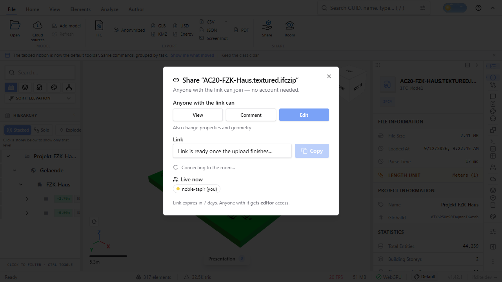
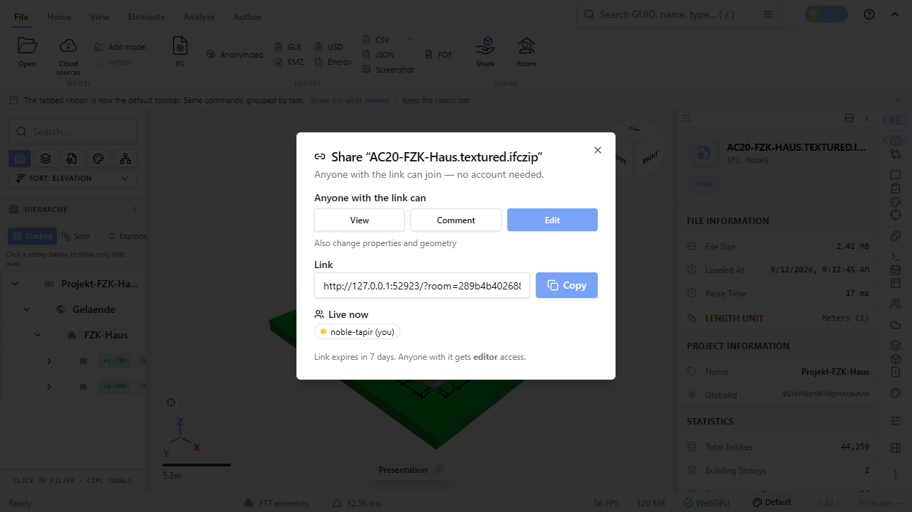
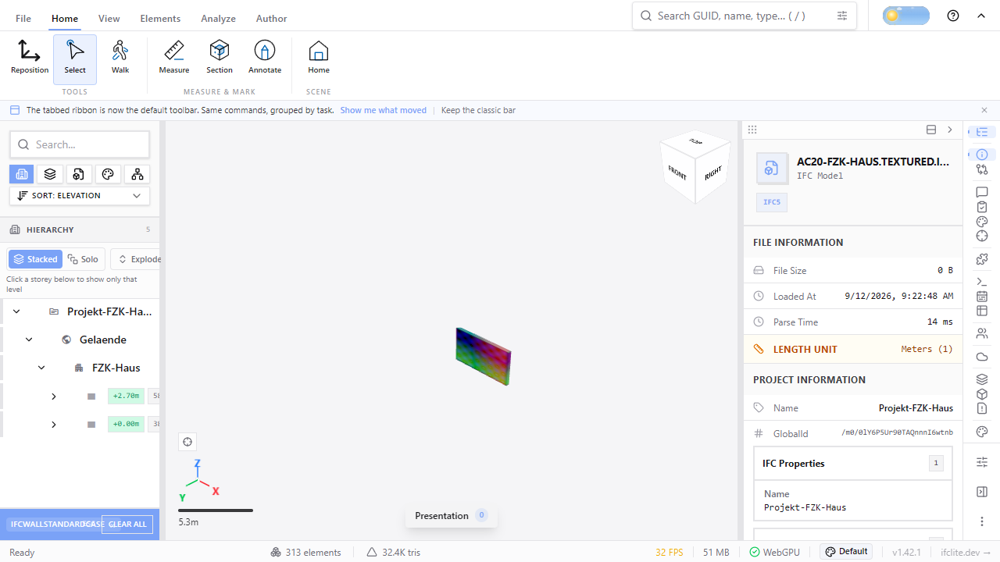
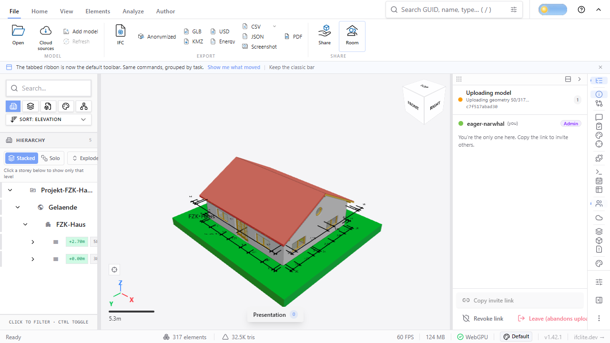
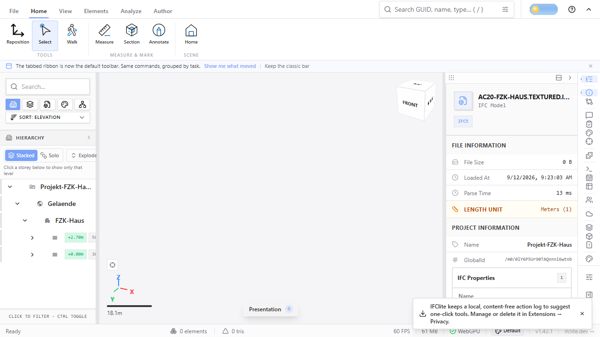
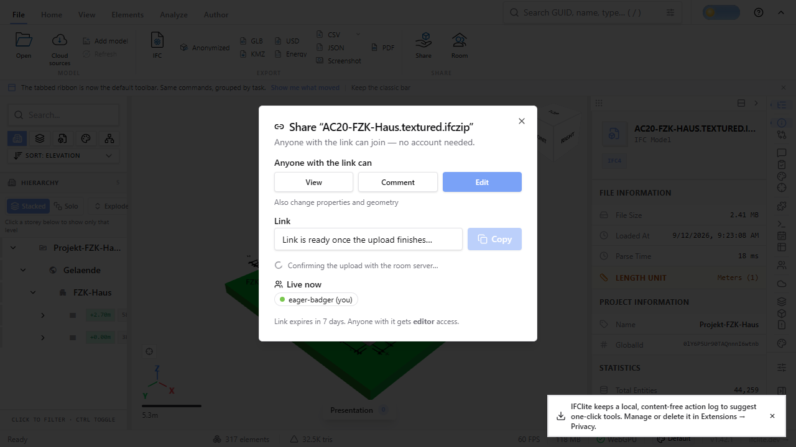

# Share invite withheld until the relay holds the seed (#4446)

Automated relay acceptance for the issue's reproduction: a textured
AC20-FZK-Haus IFCZIP is shared over a disposable **signed** local relay, the
owner's browser context is closed the instant the completed share action
(Copy) is enabled, and a fresh guest, a rejoin and the guest's export are
checked. Everything here is produced by
`tests/e2e/collab-share-seed.e2e.spec.ts` (Playwright project
`viewer-collab-e2e`); [result.json](result.json) is that run's evidence file.

## How it was run

```sh
pnpm fixtures                                  # tests/models/ara3d/AC20-FZK-Haus.ifc
pnpm turbo build --filter=@ifc-lite/viewer     # apps/viewer/dist (the ordinary build, no collab env)
pnpm --filter @ifc-lite/collab-server build    # packages/collab-server/dist/bin.js
pnpm test:e2e:collab                           # playwright test --project=viewer-collab-e2e
```

The spec starts, on ephemeral loopback ports, a `@ifc-lite/collab-server`
with a random `COLLAB_TOKEN_SECRET` and a temp data dir (deleted afterwards),
and a private `vite preview` of this checkout's `apps/viewer/dist`. Collab is
enabled per browser context through the viewer's `localStorage` overrides
(`ifc-lite:collab:enabled`, `ifc-lite:collab:server-url`), so no rebuild
with `VITE_COLLAB_*` is needed. Every token is minted through the relay's
`POST /collab/token` (first mint = admin, then admin-minted invites); no
existing user, room or token is involved.

Host: Windows 11, Chrome (channel) headless with WebGPU, Node 22.16,
Playwright 1.60. Three consecutive full runs of the spec passed
(3 tests each, ~36 s per run) after the fix below; the numbers in this
directory are from the last of them.

## The textured input

The issue names a "textured AC20-FZK-Haus IFCZIP". No such fixture exists, so
`tests/e2e/collab/textured-ac20.ts` builds one at run time from the plain
fixture and commits nothing: wall `2XPyKWY018sA1ygZKgQPtU` (Wand-Int-ERDG-4,
the first interior wall without openings) keeps its `IfcWallStandardCase`
identity and gets its Body replaced by the tessellation the repo's own WASM
pipeline produces for it — an `IfcTriangulatedFaceSet` (24 vertices, 12
triangles) in world coordinates under an identity `IfcLocalPlacement`, with an
`IfcIndexedTriangleTextureMap` onto a generated 8×8 RGBA PNG test card (64
distinct opaque colours, FNV-1a `39bd94b5`). The generator re-tessellates its
output and refuses a file whose wall moved. Independent oracle (IfcOpenShell
0.8.1, `USE_WORLD_COORDS`): the tessellated wall's world box is
`[7.41, 4.01, 0.00]–[11.70, 4.25, 2.50]` — identical to the extruded original;
127 `IfcProduct` before and after; the texture map and PNG decode as expected.

## Acceptance (test 1)

| Step | Result |
|---|---|
| Owner loads the IFCZIP | 317 meshes; exactly one textured mesh (12 triangles); decoded PNG pixels FNV-1a `39bd94b5` = the generated card |
| File → Share | `role="status"` row visible first (`Connecting to the room…`), Copy disabled, link field reads `Link is ready once the upload finishes…` |
| Seed phases (store subscription) | `none → syncing 136 ms → structure 36 ms → geometry 345 ms → confirming 10 ms → ready`; Copy enabled 0.8 s after the progress row was first asserted (a screenshot in between) |
| Room at `ready` (owner's Y.Doc) | **184 structural entries, 313 geometry records** (313 entity→geometry refs, 1 textured record), 1 model slot; transport `connected` over `indexeddb+websocket` |
| Owner context closed | immediately after reading the link |
| Fresh guest | same 184 / 313 / 313 / 1; 313 hydrated meshes; `collabGeometryNotice` null; seed phase `none`; textured wall byte-identical: positions `37de7dad`, UVs `4745cfcd`, texture 8×8 `39bd94b5` |
| Guest export | ordinary Export dialog → `AC20-FZK-Haus.textured_export.ifcx` download, 111 IFCX nodes ("Exported IFCX: 111 nodes, 90 meshes, 47 properties") |
| Rejoin (third context, both earlier ones closed) | identical counts and fingerprints; guest `ifcDataStore.entityCount` 184 both times |

The issue quotes 185 structural / 272 geometry entries for its own textured
AC20; this input yields 184 / 313 (313 unique mesh blobs out of 317 offered;
one entity's byte-identical representation items collapse into one ref).





## Control 1 — the gate mid-upload (test 2)

Blob `PUT`s are slowed to 1.5 s each (16 in parallel), so the geometry phase
lasts ~30 s. At the moment the pre-#4540 dialog handed out the link
(`collabRoomId` set, `collabStatus === 'connected'`), the store read
`collabSeedPhase: 'geometry'`, `collabSeedProgress: 50/317`; the dialog showed
`Uploading geometry 50/317…`, Copy disabled. The Room panel read
"Uploading model", "Copy invite link" disabled (title "Available once the
upload finishes"), Leave labelled **Leave (abandons upload)**.

Clicking that Leave and joining the room with an admin-minted token shows what
such a link used to deliver: **184 entities, 0 geometry records, 0 meshes**
(geometry records are written after the last blob), and no notice — the room
has no seed marker, which the joiner cannot tell from a structure-only share.




## Control 2 — a relay that receives the frames late (test 3)

Writing the spec surfaced a gap in the round-1 gate (by reading what `ready`
meant, not by observing lost bytes on this host: over loopback the frames
always landed in time). `'ready'` was reported when the seed's last **local**
transaction settled, but y-websocket hands the bytes to the browser's socket
queue and nothing tells the origin peer when the server has applied them; a
tab closed in that window loses them. The control makes the window
deterministic: with `page.routeWebSocket` holding every frame of the owner's
live socket for 2.5 s, the seed's local writes were done while the relay
held nothing.

Fix (this PR): the seed ends in a new phase **`confirming`** — the owner opens
a throw-away connection, reads the relay's state vector from the sync-step-1
frame the server sends on every connection (`fetchRoomStateVector`,
`@ifc-lite/collab`), and reports `ready` only once it covers the owner's own
(`stateVectorCovers`), polling every 250 ms up to 30 s, else `failed` with an
owner-facing message. In this run: phases
`syncing 2599 ms → structure 53 ms → geometry 348 ms → confirming 2687 ms → ready`,
129 frames held, 12 sockets (live + 11 probes); Copy stayed disabled with
`Confirming the upload with the room server…` until the relay had the model;
the guest after the owner left was complete (184 / 313 / 313, texture
`39bd94b5`). Without the hold the confirmation costs ~10 ms (test 1).



## Not covered here

- CI does not run this project (no relay in the required lanes); it is opt-in
  via `pnpm test:e2e:collab`.
- A pixel probe on the canvas was not used; the texture check is byte-exact on
  the decoded RGBA the guest resolved from the room's texture blob, compared
  with the owner's `ImageBitmap` pixels and with the generated PNG.
- The abandoned-upload room carries no seed marker, so a joiner of such a room
  sees an empty scene silently (control 1). The gate keeps that room from ever
  being linked to; stamping an "interrupted" marker on Leave is a separate
  hardening.
