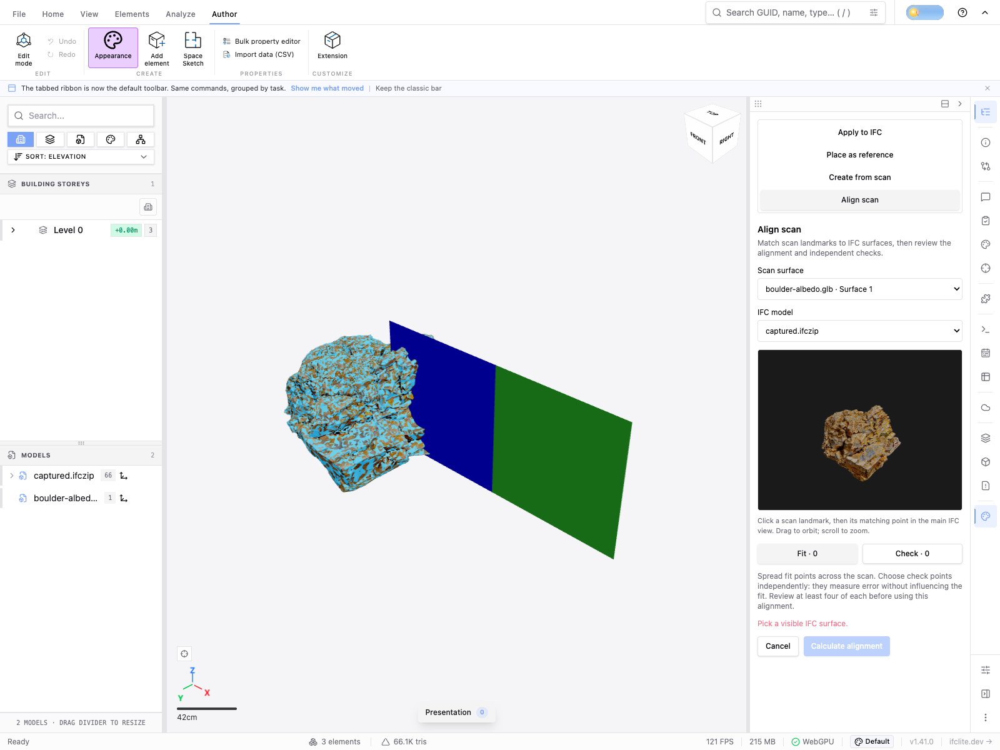

# Textured scene-raycast browser regression (#4407)

Actual Chromium/WebGPU execution of the in-progress scan landmark workbench
exposed a renderer defect: regular/batched/instanced meshes participated in
`raycastScene`, while textured drawables did not. This evidence qualifies that
shared renderer fix, not the unfinished scan registration or transfer UI.

The same 1600×1200 browser viewport, Open/Add order and visible source models
were used before and after. Both the CC0 textured boulder GLB and its captured
IFC were visible. Their near-coincident surfaces mean either one's retained
triangle may be slightly nearer; the caller must honor the actual closest owner.

Before the fix, a source landmark followed by its corresponding main-view click
reported “Pick a visible IFC surface” despite the textured surface being visible.
This is an observed UI failure, not an independently captured pre-fix ray JSON.

After the fix, the same CSS pixel resolves textured GLB owner 1000067, original
triangle 47569, at distance 5.187405092529856m. [The actual return value](after.json)
records world point, normal, barycentrics, fractional canvas bounds, source hashes
and the exact combined workbench runtime/renderer commit. The workbench now
correctly asks for the chosen IFC model because the foreground owner is the GLB.
It no longer treats textured geometry as absent or selects through it.

The new renderer suite also executes real Scene/Camera/Raycaster paths with
controlled textured-only, origin-offset, front/back, hidden/isolation and
same-ID model-scope cases. All 1,449 renderer tests pass, with one existing skip.
GPU-only handles are inert in those CPU geometric tests. Browser evidence above
exercises the actual textured upload and rendering path.

The source boulder provenance and CC0 attribution are retained in
[the captured GLB evidence](../captured-glb/README.md). This change does not make
texture alpha clip CPU ray intersections, nor does it add section/crop clipping
to that raycast API. The scan workbench must separately qualify those cases.
