# Geometry Pipeline

Detailed architecture of geometry processing in IFClite.

## Overview

The geometry pipeline transforms IFC shape representations into GPU-ready triangle meshes:

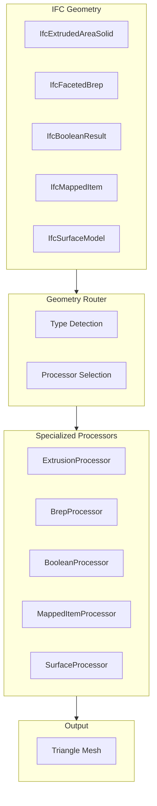

## Geometry Representation Types

### IFC Geometry Hierarchy

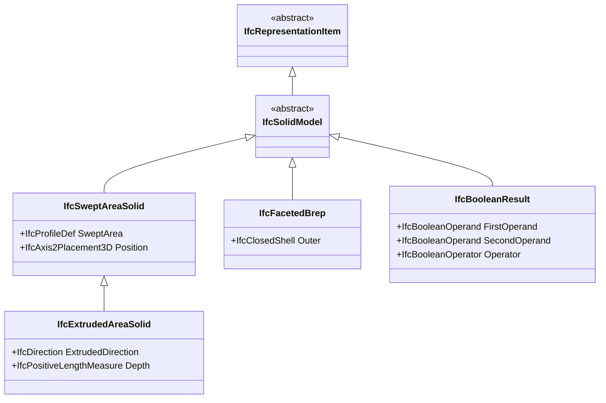

### Coverage by Type

| Geometry Type | Coverage | Notes |
|---------------|----------|-------|
| IfcExtrudedAreaSolid | Full | Most common |
| IfcFacetedBrep | Full | Pre-triangulated |
| IfcBooleanClippingResult | Partial | CSG operations |
| IfcMappedItem | Full | Instancing |
| IfcSurfaceModel | Partial | Surface meshes |
| IfcTriangulatedFaceSet | Full | IFC4 triangles |

## Extrusion Processing

### Pipeline

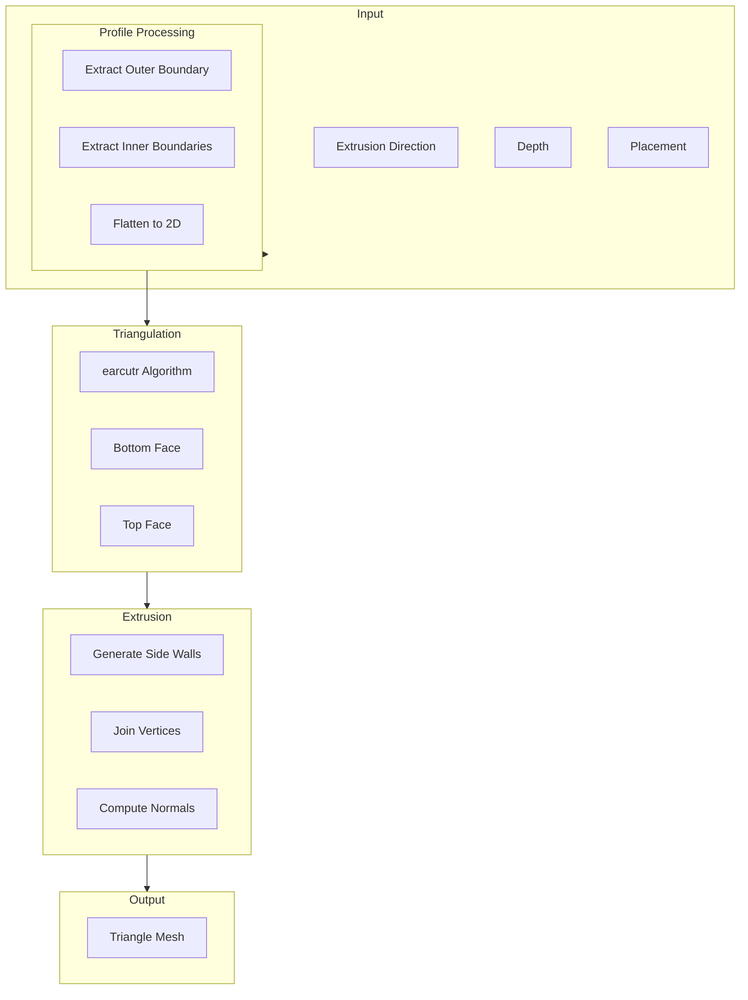

### Profile Types

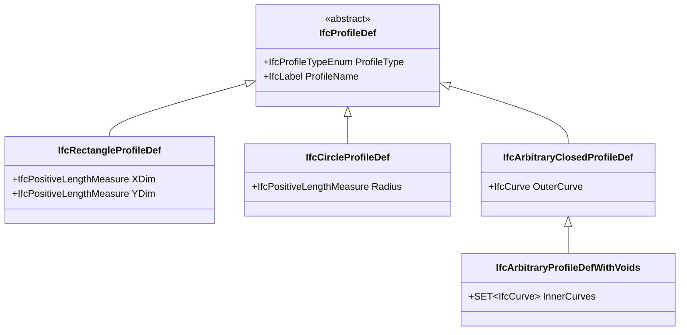

### Earcut Algorithm

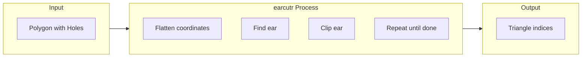

```rust
use earcutr::earcut;

fn triangulate_profile(
    outer: &[Point2],
    holes: &[Vec<Point2>]
) -> Vec<u32> {
    // Flatten to coordinate array
    let mut coords: Vec<f64> = Vec::new();
    let mut hole_indices: Vec<usize> = Vec::new();

    // Add outer boundary
    for p in outer {
        coords.push(p.x);
        coords.push(p.y);
    }

    // Add holes
    for hole in holes {
        hole_indices.push(coords.len() / 2);
        for p in hole {
            coords.push(p.x);
            coords.push(p.y);
        }
    }

    // Triangulate
    earcut(&coords, &hole_indices, 2)
        .unwrap()
        .into_iter()
        .map(|i| i as u32)
        .collect()
}
```

## Brep Processing

### FacetedBrep Pipeline

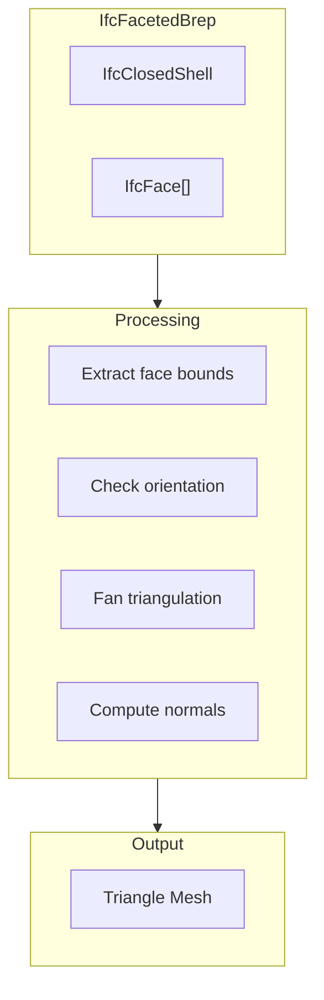

### Face Triangulation

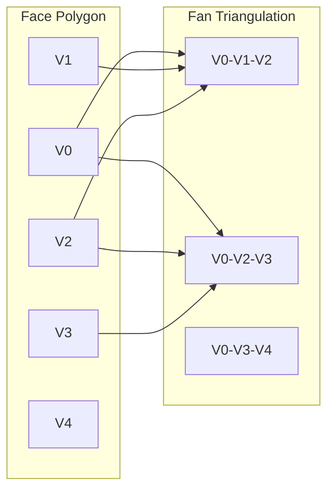

## Boolean Operations

### CSG Pipeline

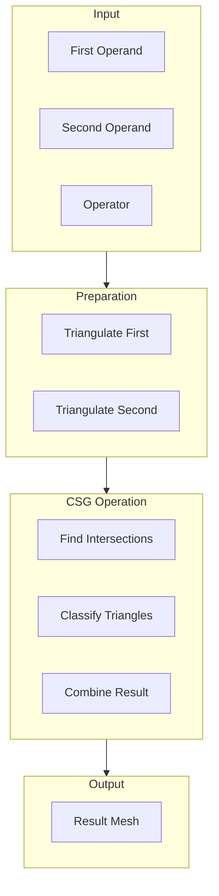

### Boolean Operators

| Operator | Description | Common Use |
|----------|-------------|------------|
| DIFFERENCE | A - B | Wall openings |
| UNION | A + B | Composite shapes |
| INTERSECTION | A ∩ B | Clipping |

## Coordinate Transformations

### Placement Stack

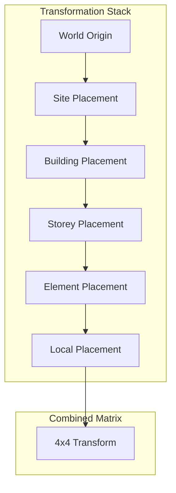

### Matrix Operations

```rust
use nalgebra::{Matrix4, Point3, Vector3};

fn compute_transform(placements: &[Placement]) -> Matrix4<f64> {
    let mut result = Matrix4::identity();

    for placement in placements {
        let local = Matrix4::new_translation(&placement.location)
            * Matrix4::from_axis_angle(&placement.axis, placement.angle);
        result = result * local;
    end

    result
}

fn transform_point(point: Point3<f64>, matrix: &Matrix4<f64>) -> Point3<f64> {
    matrix.transform_point(&point)
}
```

### Large Coordinate Handling

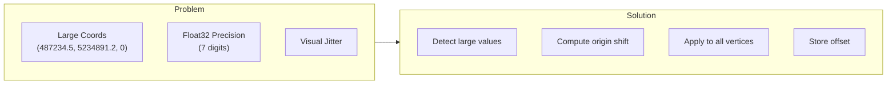

```typescript
function computeOriginShift(bounds: BoundingBox): Vector3 {
  const threshold = 10000; // Shift if > 10km from origin

  if (Math.abs(bounds.center.x) > threshold ||
      Math.abs(bounds.center.y) > threshold) {
    return {
      x: -bounds.center.x,
      y: -bounds.center.y,
      z: 0
    };
  }

  return { x: 0, y: 0, z: 0 };
}
```

## Quality Modes

### Curve Discretization

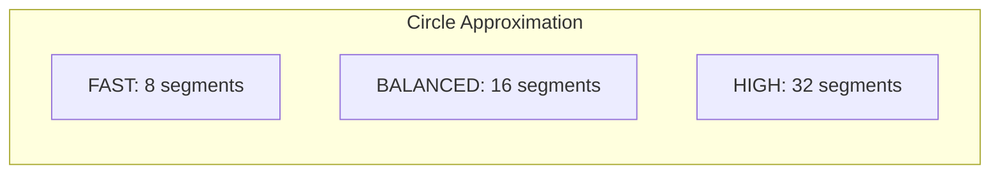

| Mode | Segments | Triangles | Use Case |
|------|----------|-----------|----------|
| FAST | 8 | Fewer | Mobile, preview |
| BALANCED | 16 | Medium | Default |
| HIGH | 32 | More | Detailed viewing |

## Mapped Representations

IFC reuses geometry via `IfcMappedItem` (a source `IfcRepresentationMap` plus a
per-instance placement transform). The engine **expands** each mapped item into
its own tessellated mesh — the source geometry is tessellated once and the
result is transformed per placement. There is no GPU-instancing path: the
renderer instead groups the resulting meshes by colour into a small number of
batched draw calls (see the rendering guide), which keeps draw-call counts low
without a separate instance buffer.

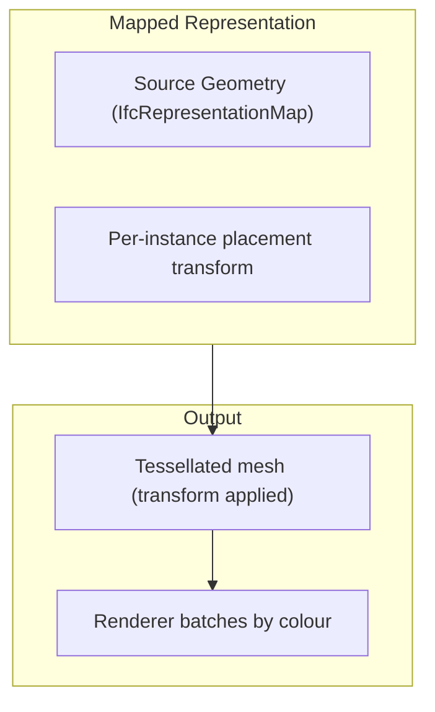

## Streaming Pipeline

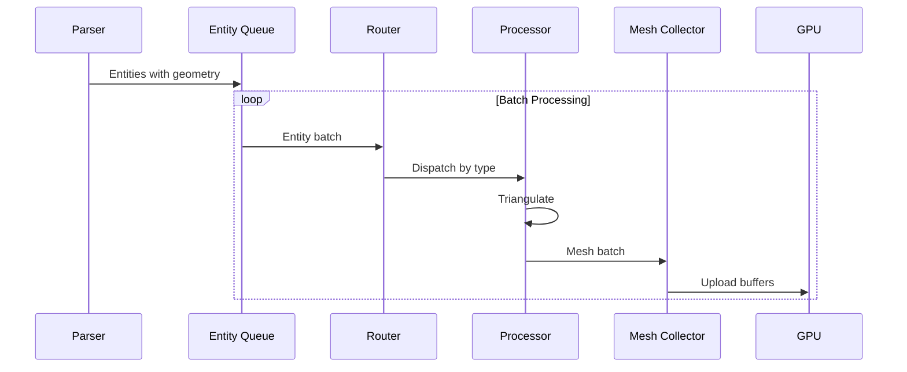

### Batch Processing

```typescript
async function processGeometryBatches(
  entities: Entity[],
  batchSize: number,
  onBatch: (batch: MeshBatch) => Promise<void>
): Promise<void> {
  const geoEntities = entities.filter(e => e.hasGeometry);

  for (let i = 0; i < geoEntities.length; i += batchSize) {
    const batch = geoEntities.slice(i, i + batchSize);
    const meshes = await Promise.all(
      batch.map(e => processEntity(e))
    );

    await onBatch({
      meshes,
      bounds: computeBounds(meshes),
      progress: (i + batch.length) / geoEntities.length
    });
  }
}
```

## CSG Kernel

Two boolean / CSG kernels coexist behind a Cargo feature flag. **Manifold
is the canonical kernel; the in-tree BSP port is the fallback.** Kernel
selection is purely compile-time — *which kernel a binary ships depends on
its Cargo features* (see the build matrix below), so it is possible for two
binaries built from the same source to produce different boolean results.

### Manifold (canonical)

Behind the `manifold-csg` feature, which is **on by default** for native
consumers (`rust/geometry/Cargo.toml` `default = ["manifold-csg"]`) and
enabled for the viewer via `manifold-csg-wasm-uu`. Uses
[Manifold](https://github.com/elalish/manifold) (Apache-2/MIT, native C++
kernel built through cmake) for `IfcBooleanResult.{DIFFERENCE, UNION,
INTERSECTION}`. No operand-polygon cap, manifold-by-construction output. A
vertex-weld pre-pass in `rust/geometry/src/manifold_kernel.rs` collapses the
polygon-soup mesh layout ifc-lite's extruded-solid builder produces (24
verts per cube → 8) so Manifold accepts the input, and a global
signed-volume `reorient_outward` pass fixes Brep operand winding.

Manifold is cross-platform **non-deterministic** for some near-coincident /
near-coplanar clips (Linux x86_64 can collapse a result that macOS aarch64
resolves correctly — see `manifold_kernel.rs` and `csg.rs`
`manifold_result_looks_degenerate`). The dispatcher backstops this by
retrying such cases through BSP (`try_bsp_difference`).

### BSP (fallback + determinism backstop)

`rust/geometry/src/bsp_csg.rs` — a Rust port of csg.js (Evan Wallace, MIT),
triangle-mesh BSP. It is compiled into **every** build (not cfg-removed) and
serves two roles:

1. **The de-facto kernel on any `default-features = false` build.**
   `rust/processing` and `apps/server` declare the geometry dependency
   *without* `manifold-csg` (no C++ toolchain in the server image), so **the
   Railway `/api/v1/parse` server runs BSP, not Manifold** (confirmed:
   `cargo tree -p ifc-lite-server` links zero `manifold-*` crates).
2. **The determinism backstop on Manifold builds** (`try_bsp_difference`),
   for the cross-platform collapse described above.

BSP hard-caps each operand at **128 polygons** (`MAX_CSG_POLYGONS_PER_MESH`,
256 combined; `csg.rs`). On cap-exceeded it records `OperandTooLarge` and the
void router falls back to an analytic axis-aligned-box cut — so **curved /
arched openings that exceed the cap export as square holes on the BSP (server)
path while the viewer's Manifold carves the true profile.** `BoolFailure`
records and `GeometryRouter::take_csg_failures` work identically under both
kernels (drained on the viewer path; not yet on the server path).

### Kernel build matrix

| Build | Feature | Kernel |
|---|---|---|
| native default / CLI / tests | `manifold-csg` (default) | Manifold |
| viewer (`ifc-lite-wasm`) | `manifold-csg-wasm-uu` | Manifold |
| Railway server (`apps/server` → `rust/processing`) | `default-features = false` | **BSP** |

### Direction

The standing goal is **one canonical pure-Rust kernel** everywhere — removing
the server↔viewer drift, the C++ FFI process-abort surface, and Manifold's
cross-platform non-determinism in one move. Phase 1 routes plane-clip
front/back decisions through exact Shewchuk predicates (opt-in
`exact-predicates` feature, `robust` crate) so topology is platform-identical;
see `exact_predicate_determinism.rs` (the cross-platform sign floor) and
`Plane::orient_front`.

### WASM status

`--features manifold-csg-wasm-uu` is **enabled** as of `wasm-cxx-shim`
v0.5.0 / `manifold-csg-sys` 3.5.100 (May 2026); the libc++ / musl-locale
issues that previously blocked the wasm build have been resolved
upstream. `rust/wasm-bindings/Cargo.toml` opts into the feature and
`scripts/vercel-install.sh` provisions the host toolchain.

Build prerequisites — the shim accepts any of:

- **`EMSDK` env var pointing at an emsdk install** (cleanest;
  works hermetically with no system packages). The Emscripten
  bundle includes a complete LLVM 23 with libc++ headers, `wasm-ld`,
  and `llvm-ar` under `$EMSDK/upstream/bin/`. The shim's CMake
  toolchain probe (`cmake/toolchain-wasm32.cmake`) discovers it
  automatically when `EMSDK` is set.
- **Host LLVM 18+** with `clang++`, `wasm-ld`, `llvm-ar`, and libc++
  headers at `<llvm-prefix>/include/c++/v1/`. Override the probe
  with `WASM_CXX_SHIM_LLVM_BIN_DIR` and
  `WASM_CXX_SHIM_LIBCXX_HEADERS` when the layout doesn't match the
  standard ladder.
- CMake 3.18+ for the `wasm-cxx-shim` FetchContent build of Manifold +
  Clipper2 (pre-installed in Vercel's image).

Vercel:

`scripts/vercel-install.sh` clones `emsdk` into `/vercel/cache/emsdk`
on first deploy and runs `./emsdk install latest` (~340 MB download).
The cache survives across deploys per Vercel's build-cache policy.
We chose emsdk over `dnf install clang20` because Vercel's pinned
AL2023 image (`2023.2.20231011.0`) only ships `clang15`.

Local dev:

- macOS: `brew install llvm lld`. The shim's toolchain file
  auto-detects `/opt/homebrew/opt/llvm@N/bin`; no env vars required.
- Debian/Ubuntu: `apt install clang-20 lld-20 libc++-20-dev libc++abi-20-dev`.
- Cross-platform: `git clone https://github.com/emscripten-core/emsdk && cd emsdk && ./emsdk install latest && export EMSDK=$PWD`.

Runtime properties of the wasm-side Manifold:

- Single-threaded execution (TBB is gated off — wasm has no threading
  in the unknown-unknown target). Same correctness as native, lower
  throughput on multi-core inputs.
- No exception runtime; the shim aborts on throw rather than unwinds.
  Malformed input that would have thrown native becomes a wasm
  `unreachable` trap. In practice this is the same surface area the
  pre-Manifold BSP path used to panic on, just with a cleaner
  diagnostic.
- Wasm bundle size impact: +250–400 KB (Manifold + Clipper2 + shim
  glue, after `wasm-opt`).

The legacy in-tree BSP port (`bsp_csg.rs`) is kept as a compile-time
fallback under `default-features = false` for downstream consumers who
need to build the geometry crate without LLVM available. There is no
runtime selection — the active kernel is decided at build time by the
feature set.

## Performance Metrics

| Operation | Time (typical) | Notes |
|-----------|---------------|-------|
| Profile extraction | 0.1 ms | Per entity |
| Earcut triangulation | 0.5 ms | Simple profile |
| Extrusion | 0.2 ms | Per entity |
| Boolean operation | 5-50 ms | Complex |
| Transform application | 0.01 ms | Per vertex |

### Throughput

- **Simple extrusions**: ~2000 entities/sec
- **Complex Breps**: ~200 entities/sec
- **Boolean operations**: ~20 entities/sec

## Next Steps

- [Rendering Pipeline](rendering-pipeline.md) - WebGPU rendering
- [API Reference](../api/rust.md) - Geometry API
