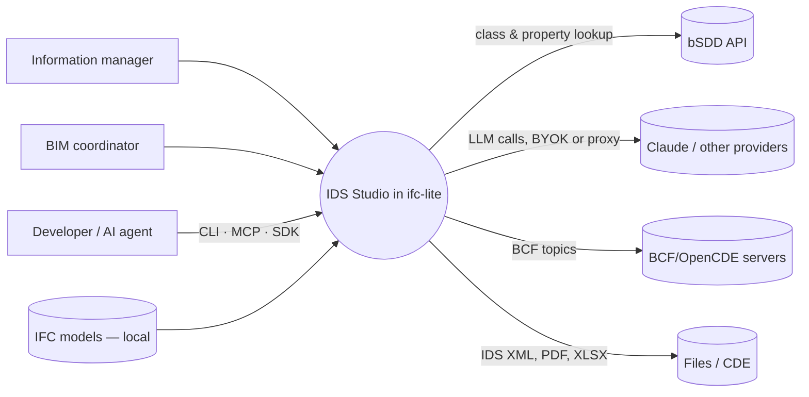
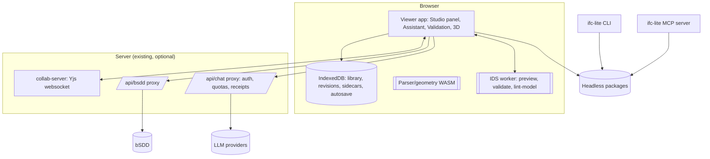
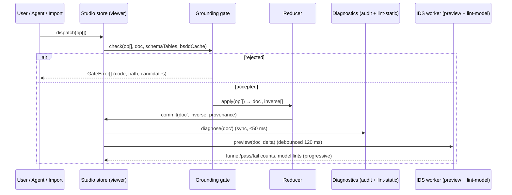

# Architecture overview (arc42-lite + C4)

## 1. Goals and constraints
- **Quality goals** (in priority order): correctness of the IDS output, grounding (no invented names), responsiveness of live previews, privacy (local-first), headless parity, maintainability (repo house rules).
- **Constraints:** TypeScript packages + React 19/Zustand viewer; Rust is the source of truth for decoding and geometry, while IDS lives in TS (`@ifc-lite/ids`); MPL-2.0; public repo; ≤400-line modules; exact EXPRESS names.

## 2. C4 — System context

## 3. C4 — Containers

## 4. C4 — Components (headless packages)

| Package | Status | Responsibility | Depends on |
|---|---|---|---|
| `@ifc-lite/ids` | existing, extended | Types, parser, **writer (moved here)**, validator, audit, translation, **plain-language renderer**, **explain trace** | data, encoding, parser, regex-guard |
| `@ifc-lite/ids-authoring` | **new** | `StudioDocument` (IDs, sidecar), **op vocabulary + reducer + inverses**, **grounding gate**, **lint engine + rule catalogue + quick fixes**, diff/merge, fmt, templates, test-suite model | ids, data (schema), regex-guard |
| `@ifc-lite/ids-model-loop` | **new** (or a subpath of ids-authoring) | Funnel computation, requirement preview, infer-from-selection, coverage, value suggestions. Pure functions over an `IFCDataAccessor` | ids (bridge, validator internals), query |
| `@ifc-lite/ids-agent` | **new** | Agent loop (tool registry, budgets, proposals), tool implementations over authoring + model-loop + bSDD, ingestion (PDF/DOCX/XLSX chunkers), Excel mapper, eval harness hooks | ids-authoring, ids-model-loop, ai, sdk (bsdd) |
| `@ifc-lite/ids-interop` | **new** (may start inside ids-authoring) | Excel/CSV/YAML/JSON import-export, readable HTML/DOCX/PDF appendix renderer, 0.9.7 upgrade | ids-authoring |
| `@ifc-lite/ids-testgen` | **new** | Synthetic pass/fail IFC fixture generation from specs | ids-authoring, create |
| `packages/sdk` bsdd namespace | existing | bSDD client | — |
| `packages/mcp`, `packages/cli` | existing, extended | Headless surfaces | all of the above |
| `apps/viewer` | existing, extended | Studio UI, store slice, worker, assistant integration | all |

> Package count is a recommendation. If the maintainer prefers fewer packages, `ids-model-loop`, `ids-interop` and `ids-testgen` can be subpath exports of `@ifc-lite/ids-authoring`. The agent stays separate because of its AI dependency surface.

## 5. Runtime view — an edit

## 6. Runtime view — an AI run
See `06-ai-agent.md` §4. In short, the agent proposes op batches through `ids.apply_ops` in **sandbox mode**: a forked doc, with the gate, diagnostics and preview applied. It iterates until diagnostics are clean or the budget runs out, then returns a Proposal. The user reviews, and accepted batches are dispatched through the same path as any edit.

## 7. Data and persistence
- **IDS XML**: the interchange artefact only.
- **Sidecar** `StudioMeta`, keyed by document UUID:
  - node IDs ↔ XML paths
  - provenance per op/node (user, ai-run, import, source span)
  - comments, suppressions
  - test suites (fixture refs + expectations)
  - revisions (hash chain), sign-offs, saved Excel mappings
- **Library** in IndexedDB. It supersedes the localStorage definition library (raw XML, max 100), with a migration that imports existing entries as rev 1.
- **Export bundle** `.idsz`: a zip of `ids.xml`, `studio.json` (sidecar), `fixtures/*.ifc` and `appendix.pdf`. The format is a plain zip so anyone can inspect it.

## 8. Cross-cutting concepts
- **Identity:** node IDs are UUIDv7. A spec's `identifier` (IDS attribute) is separate and user-controlled.
- **Units:** values are stored in SI as IDS requires. Display converts using the model's project units; numeric input accepts units ("2400 mm") and converts them (reusing check-authoring `ids-constraint.ts` conversions).
- **Versions:** each spec carries `ifcVersion[]`. Gate and pickers use the intersection of the tables.
- **i18n:** all UI strings in catalogues. Plain-language templates live in `@ifc-lite/ids/translation`. Add `it`.
- **Privacy:** analytics events carry op *kinds* and counts only, never names or values.
- **Performance:** static diagnostics are incremental (only touched specs are re-linted). Model work runs in the worker, reusing `ApplicabilityPropertyIndex` across edits. The index is invalidated only when models or overlays change.
- **Error handling:** gate errors are values, not exceptions. The writer still throws on unwritable input. That should be unreachable from Studio because the gate refuses first, and it is asserted in tests.

## 9. Risks to the architecture
See `05-delivery/05-raid.md`. The top two:
- Funnel performance on federated 1M+ element sets. Mitigation: per-stage index reuse, sampling with `maxEntities` and confidence display.
- Op vocabulary churn while the AI depends on it. Mitigation: versioned op schema, with the agent's tool schemas generated from the op types.
