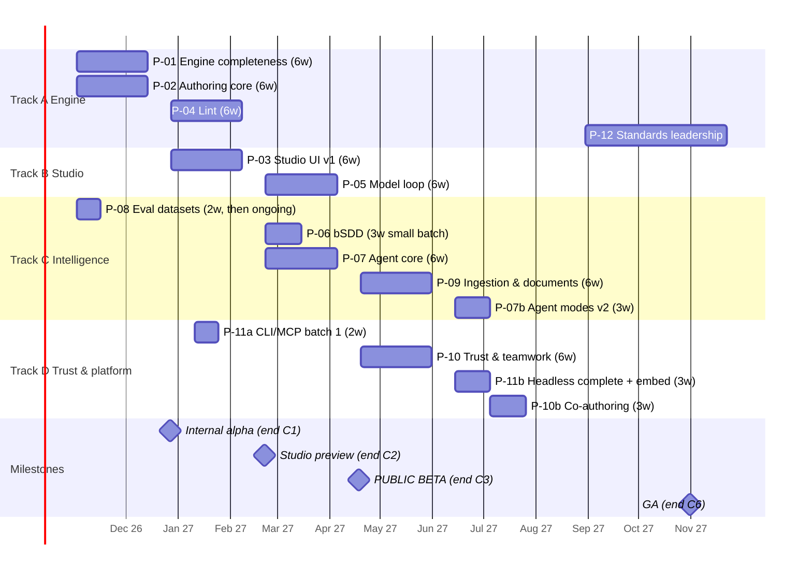

# Roadmap (Shape Up)

## Rules of the game
- **Cycle** = 6 weeks of build + 2 weeks of cooldown (bug fixes, docs, evidence, small polish, shaping the next pitches). Eight weeks per cycle.
- **Appetite** is a fixed time budget per pitch. When it runs out, scope is cut, not time extended (Shape Up's circuit breaker). Unfinished work is re-shaped and re-pitched at the betting table. It is never silently rolled over.
- **Betting table** at the start of each cycle: the maintainer bets on pitches. Under the recorded D8 campaign exemption, each bet lists its bounded backlog IDs in pitch PR bodies instead of creating charter issues or requiring `ready` labels. The maintainer applies the repository's escape label when needed; this plan does not bypass the queue gate in code.
- **Tracks** run in parallel, because work is largely agent-executed. Each track has one accountable human submitter (AGENTS.md accountability rule).
- **Hill charts:** each pitch reports "figuring it out" vs "making it happen" per backlog scope in its pitch PR weekly.

## Tracks
| Track | Focus | Pitches |
|---|---|---|
| **A — Engine** | IDS correctness, authoring core, lint | P-01, P-02, P-04, P-12 |
| **B — Studio** | UI, model loop | P-03, P-05 |
| **C — Intelligence** | bSDD, agent, eval, ingestion | P-06, P-07, P-08, P-09 |
| **D — Trust & platform** | diff/revisions/tests/collab, headless | P-10, P-11 |

## Timeline

*Dates assume a start on 2026-11-02 and are illustrative. Cooldowns are omitted from the Gantt for readability.*

## Cycle plan

| Cycle | Weeks | Bets | Exit criteria (demo-able) |
|---|---|---|---|
| **C1** | 1–8 | P-01, P-02, P-08 (datasets) | Writer total; `AUDIT_UNDETECTED` empty; ops + gate + reducer with property tests; E2 dataset ready. **Internal alpha:** headless authoring via a test script |
| **C2** | 9–16 | P-03, P-04, P-11a | Studio panel usable end-to-end without a model; ≥25 lint rules; CLI `audit/lint/fmt`; MCP `ids_apply_ops`. **Studio preview** to friendly users |
| **C3** | 17–24 | P-05, P-06, P-07 | Funnel/explain/infer/coverage on real models; bSDD pickers; agent Draft/Edit/Explain/Repair with eval scores. **PUBLIC BETA** |
| **C4** | 25–32 | P-09, P-10 (diff, revisions, tests) | PDF/DOCX/Excel ingestion with traceability; readable appendix; semantic diff; test suites (IFC4) |
| **C5** | 33–40 | P-07b, P-11b, P-10b | Review/Infer/Translate modes; full CLI/MCP/SDK; embed; co-authoring; fix-in-place |
| **C6** | 41–48 | Hardening bet + GA launch | All FR-M items done; NFRs measured; docs complete; benchmark page; **GA** |
| **C7+** | 49– | P-12, dictionary write-back (D6), local/offline model exploration | IDS 1.1 preview; conformance dashboard |

## Critical path
`IDS-016 → 017 → 018 → 019 → 021/022 → (UI 033/034) → (model loop 056) → (agent 077/078) → 083`.

Off the critical path but gating beta quality: `IDS-046` (lint engine) and `IDS-087` (E2 eval data). Eval data must exist *before* the agent is tuned (P-08 starts in C1).

## What would make us cut scope (circuit breakers)
- If the funnel can't meet p95 300 ms on 100k elements by week 4 of C3, ship with sampling and a confidence display, and move exact counting to C4 cooldown.
- If agent executable agreement on E2 is < 70% by week 4 of P-07, cut Infer/Translate from beta, ship Draft/Edit/Explain only, and spend C4 cooldown on tool and prompt quality.
- If IFC2X3/IFC4X3 fixture generation (IDS-112) exceeds its appetite, ship IFC4-only test suites at GA with a clear label.
