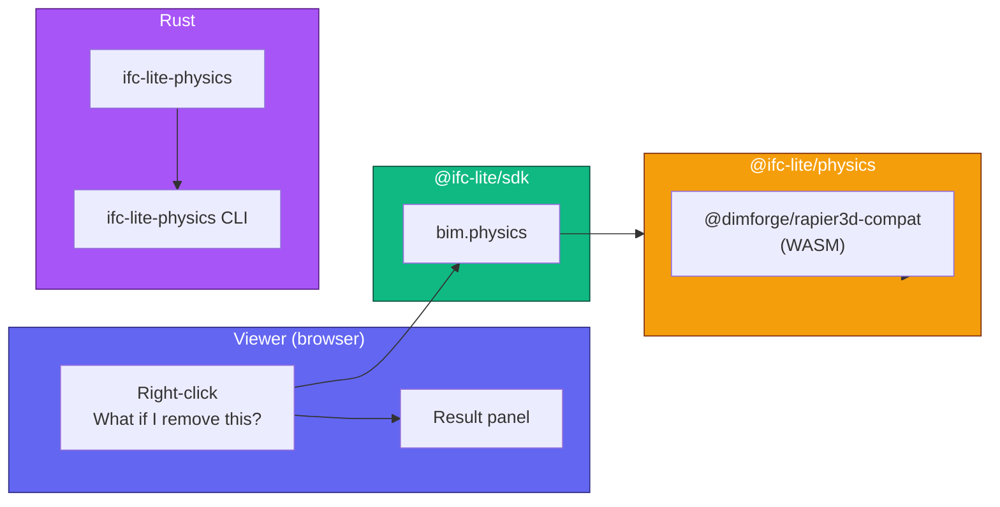

# Physics What-If

IFClite ships a rigid-body simulator powered by [Rapier](https://rapier.rs)
that answers questions like *"if I remove this column, will anything fall?"*
It works in the browser viewer, in Node, and natively on the server.

> **This is a plausibility check, not structural engineering.**
> No bending, buckling, material yield, or dynamic loading. Real analysis
> belongs in an FEM tool fed via `IfcStructuralAnalysisModel`. Use this for
> early-stage intuition, BIM coordination, education, and demos.

## Architecture



The same simulator is exposed two ways:

| Surface | Engine | When to use |
|---|---|---|
| `bim.physics.simulate()` (SDK) | `@ifc-lite/physics` (JS Rapier WASM) | Browser viewer, Node CLI / scripts |
| `ifc-lite-physics` binary | `ifc-lite-physics` Rust crate | Terminal automation, CI, no JS toolchain |

Both produce the same `SimulationResult` shape.

## How it works

For each call:

1. **World build.** Every loaded mesh becomes one rigid body, translated to its AABB center, with vertices recentered around the body origin.
2. **Anchoring.** Anything in `IfcFooting` / `IfcPile` / `IfcFoundation`, plus `IfcSlab` / `IfcFooting` / `IfcPile` / `IfcFoundation` whose underside touches the model floor, becomes a fixed body. Caller-supplied IDs in `anchor` always win. If no element classifies as anchored, the lowest unanchored element is fixed as a fallback so the world doesn't sink.
3. **Joint inference.** Two sources are unioned and deduplicated:
    - **AABB-touch:** any two bodies whose bounding boxes intersect within `adjacencyTolerance` (default 0.05 m) get a fixed joint.
    - **IFC relationships:** the viewer adapter walks `IfcRelConnectsElements`, `IfcRelConnectsPathElements`, `IfcRelConnectsStructuralMember`, and `IfcRelConnectsWithRealizingElements` from the active model and feeds the resulting pairs in as explicit `connections`.

    Joints are local-anchor pairs that preserve the bodies' current relative pose — they don't yank far-apart welded elements together.
4. **Collider strategy.** `auto` (default) picks per-IFC-type:
    - `IfcColumn`, `IfcBeam`, `IfcMember`, `IfcFooting`, `IfcPile`, `IfcPlate` → convex hull (fast, contact-stable).
    - Everything else → triangle mesh (preserves openings / holes).

    Override with `colliderStrategy: 'trimesh' | 'convexHull'`.
5. **Step.** Run for `durationSeconds` at `timeStep`. Default 3 s at 1/60 s.
6. **Classify.** For each body:
    - Anchored → **stable** (always).
    - `-verticalDisplacement > fallThreshold` (0.20 m) or `displacement > fallThreshold` → **falling**.
    - `angularDisplacement > tiltThreshold` (~3°) → **tilted**.
    - Otherwise → **stable**.

## Browser / Node usage

```ts
import { createBimContext } from '@ifc-lite/sdk';

const bim = createBimContext({ backend });

// Boots Rapier's WASM module — call once at app startup.
await bim.physics.ready();

// "What happens if I remove express id 42?"
const result = bim.physics.simulate({ remove: [42] });

console.log(`${result.falling.length} elements would fall`);
console.log(`${result.tilted.length} would tip`);
console.log(`${result.joints.length} joints inferred`);

// Visualize
bim.viewer.colorizeRgba(
  result.falling.map(id => ({ modelId, expressId: id })),
  [0.86, 0.15, 0.15, 0.95],
);
```

In the bundled viewer, the right-click menu exposes
**"What if I remove this? (Physics)"**, which colorizes the result and pops a
floating panel with counts and Re-run / Reset buttons.

## CLI usage

The native binary `ifc-lite-physics` is built from the
[`ifc-lite-engine`](../api/index.md) crate:

```bash
cargo build --release --bin ifc-lite-physics

# Human-readable summary
./target/release/ifc-lite-physics model.ifc --remove 42

# Machine-readable JSON
./target/release/ifc-lite-physics model.ifc --remove 42 --json | jq '.falling'
```

Flags:

| Flag | Description |
|---|---|
| `--remove <id>` | Express ID to delete before stepping. Repeatable. |
| `--anchor <id>` | Force fixed. Repeatable. |
| `--duration <s>` | Simulation duration in seconds (default 3). |
| `--json` | Emit the full `SimulationResult` as JSON. |

## Options reference

```ts
interface PhysicsSimulateOptions {
  remove?: number[];                    // express IDs to delete
  anchor?: number[];                    // express IDs to fix
  connections?: Array<[number, number]>; // explicit weld pairs
  gravity?: [number, number, number];   // m/s², default [0, 0, -9.81]
  durationSeconds?: number;             // default 3.0
  timeStep?: number;                    // default 1/60
  adjacencyTolerance?: number;          // m, default 0.05
  fallThreshold?: number;               // m, default 0.20
  tiltThreshold?: number;               // rad, default 0.05
  groundAnchorTolerance?: number;       // m, default 0.05
  anchorIfcTypes?: string[];            // default footing/pile/foundation
  colliderStrategy?: 'auto' | 'trimesh' | 'convexHull';
}
```

The viewer adapter populates `connections` automatically from the IFC
relationship graph, so most callers leave it unset.

## Result shape

```ts
interface PhysicsSimulationResult {
  bodies: PhysicsBodyOutcome[];
  removed: number[];   // sorted, deduplicated
  stable: number[];
  falling: number[];
  tilted: number[];
  anchored: number[];
  joints: Array<[number, number]>;  // unioned AABB + IFC connections
}

interface PhysicsBodyOutcome {
  expressId: number;
  ifcType: string;
  stability: 'stable' | 'tilted' | 'falling' | 'removed';
  anchored: boolean;
  anchorReason: 'explicit' | 'ifcType' | 'lowestElement' | null;
  displacement: number;          // meters, total translation magnitude
  verticalDisplacement: number;  // signed Z; negative = fell
  angularDisplacement: number;   // radians
}
```

## Honest limitations

- **Single-model only.** Federated multi-model is intentionally out of scope for v1.
- **Mass is heuristic.** Density is a coarse table keyed by IFC type
  (concrete-ish for structural, light for fenestration). Real mass/density
  per element isn't read from `IfcMaterial` yet.
- **No deformation.** Bodies are rigid. Beams don't bend, walls don't crack.
- **Joints over-approximate.** Two non-touching, non-IFC-connected elements
  won't be welded even if a real load path exists. AABB-touch over-connects
  when boxes overlap but the actual surfaces don't.
- **Collider quality.** `auto` is good for typical structural elements; if
  you have a column with a complex non-convex cross-section, force `trimesh`.
- **Determinism.** Not bit-identical across runs; results are fine for
  intuition but don't depend on exact numbers for downstream gates.

## When to use real FEM

If you need:

- Stress / strain values
- Buckling, deflection, or load capacity
- Code-compliance numbers
- Dynamic / seismic loading

…export `IfcStructuralAnalysisModel` to a proper FEM solver
(OpenSees, Karamba3D, RFEM, ETABS, …). This package is for the moments
*before* you'd reach for one of those.
