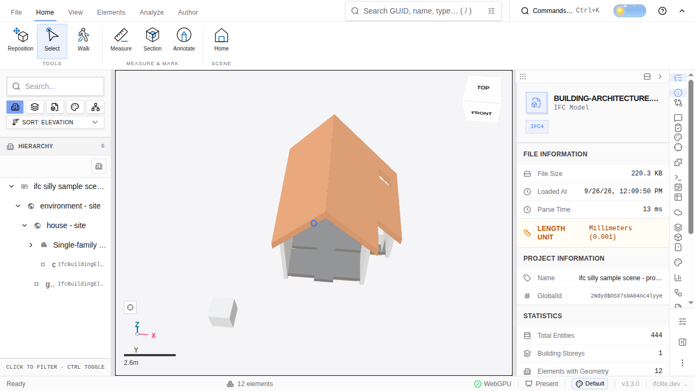

# Web viewer pointer controls

These controls apply to the first-party web viewer, with one model or a federation of models.

| Gesture | Action |
| --- | --- |
| Left drag | Orbit, except when the active tool claims the drag |
| Shift + left drag | Pan in every tool, including Measure |
| Middle drag | Pan in every tool |
| Right drag | Fly mode: look around while the button is held; use WASD and Q/E to move, and the wheel to change fly speed |
| Wheel without right drag | Zoom |

The Select tool uses Ctrl/⌘ + left drag for rectangle selection. In the Measure
tool, plain left drag starts a drag measurement; Alt + left drag orbits instead.
In polyline, angle, and radius measurement modes, a left drag orbits and clicks
place points. Shift + left drag always pans, even when a measurement is active.

While you orbit, a small accent marker shows the fixed point the camera is
rotating around. The marker follows that point on screen and fades when you
release the pointer. Panning does not show a pivot marker.

An embed with camera controls disabled does not fly or navigate. Right-button
fly is the viewer's established behavior (#4868); it takes priority over the
ordinary right-button pan mapping used when fly is unavailable.

## Navigation presets

Choose a preset in **Settings → Display → Navigation**. The choice is saved in
this browser and applies to every loaded model.

| Preset | Pointer difference | Wheel or trackpad |
| --- | --- | --- |
| Default | The mapping above | Vertical wheel movement zooms; horizontal movement pans |
| Navisworks-like | Shift + middle drag orbits; middle drag pans | Wheel zooms |
| Trackpad | The default pointer mapping | Two-finger scroll pans in both directions; pinch or Ctrl + wheel zooms |

Right-button fly remains available in every preset when camera controls are
enabled. Shift + left drag pans in every preset and tool.
