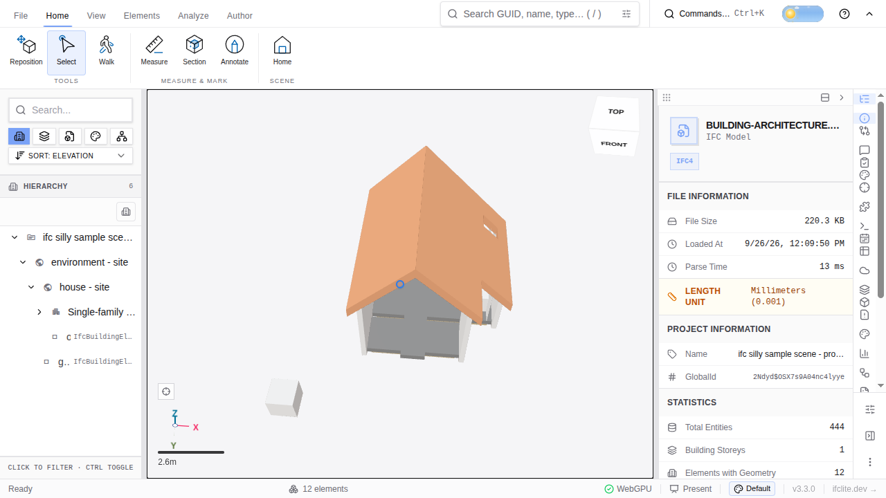

# Web viewer pointer controls

These controls apply to the first-party web viewer, with one model or a federation of models.

| Gesture | Action |
| --- | --- |
| Left drag | Orbit, except when the active tool claims the drag |
| Shift + left drag | Pan in every tool, including Measure |
| Middle drag | Pan in every tool |
| Right drag | Fly mode: look around while the button is held; use WASD and Q/E to move, and the wheel to change fly speed |
| Wheel without right drag | Zoom |

The Select tool uses Ctrl/⌘ + left drag for rectangle selection. In the Measure
tool, plain left drag starts a drag measurement; Alt + left drag orbits instead.
In polyline, angle, and radius measurement modes, a left drag orbits and clicks
place points. Shift + left drag always pans, even when a measurement is active.

In the Model workspace, plain left movement and dragging update the active
command preview without moving the camera. Placement commands commit on
click; polygon placement still closes on double-click. Room shape editing
grabs a corner on press, previews its movement, and commits on release as one
Undo/Redo operation. A lost capture, focus loss, or command change cancels the
owned room drag. A captured drag can finish outside the canvas. Shift + left,
middle, and right-button navigation keep the controls above.

While you orbit, a small accent marker shows the fixed point the camera is
rotating around. The marker follows that point on screen and fades when you
release the pointer. Panning does not show a pivot marker.

An embed with camera controls disabled does not fly or navigate. Right-button
fly is the viewer's established behavior (#4868); it takes priority over the
ordinary right-button pan mapping used when fly is unavailable.

## Navigation presets

Choose a preset in **Settings → Display → Navigation**. The choice is saved in
this browser and applies to every loaded model.

| Preset | Pointer difference | Wheel or trackpad |
| --- | --- | --- |
| Default | The mapping above | Vertical wheel movement zooms; horizontal movement pans |
| Navisworks-like | Shift + middle drag orbits; middle drag pans | Wheel zooms |
| Trackpad | The default pointer mapping | Two-finger scroll pans in both directions; pinch or Ctrl + wheel zooms |

Right-button fly remains available in every preset when camera controls are
enabled. Shift + left drag pans in every preset and tool.

## Alignment sections

Open **Section → Alignment**, select the model and its `IfcAlignment`, then
change **Horizontal distance from start** to move the cut along that axis.
The cut follows the evaluated 3D tangent, including grade and curvature.
Distance is geometric horizontal metres from the physical start; it is neither
authored chainage nor 3D arc length. Approximate supported curves are labelled.
Unresolvable units, invalid placements and unsupported curves report an error
instead of substituting a straight line.

The plane uses the selected model's frame and workspace placement. Moving that
model updates the cut; pending IFC edits rebuild the selected evaluator. Removing
the owner disables its bound cut. Closing the tool releases its worker and detaches the cut into an ordinary
custom plane. Select the alignment again to resume station control.

Dragging the plane handle makes it an ordinary custom cut and detaches it from
the alignment. Choose **Alignment** and select the axis again to resume station
control. Flip, cut visibility, cap style, cardinal cuts, face picks and section
boxes retain their ordinary behavior.

Acceptance was exercised in the production viewer with the original OIP 2017
`844_terrain_and_alignment.ifc` fixture (`IfcAlignment` #39). The distance field
moved its section through 0, 10 and 20 m; flipping the cut remained active at
20 m. An independent circular-arc calculation using the authored radius and
start heading matched the displayed horizontal station coordinates within
0.000001 m. The viewer screenshot records the rotated cut and active controls;
this check uses an original authoring-tool model, not a fabricated screenshot.

## Finding a panel

The right-hand activity rail and **Analyze → Browse panels** in the ribbon use
the same task groups. A panel can be opened from either place. Customize mode
can hide or reorder rail icons; Browse panels still lists every available panel.

| Group | Use it for |
| --- | --- |
| Coordinate | Model hierarchy, properties, sources, zones, and placement |
| Check | Topics, validation, clashes, changes, and model comparison |
| Quantify | Measurements, lists, charts, costs, and schedules |
| Automate | Scripts, flows, and extensions |
| Site | Point clouds, appearance, environment, drawings, and presentations |

The Point Clouds panel remains available before a scan loads; it explains what
to load. The Session panel appears only when collaboration is enabled.

### Viewer terms

| Term | Meaning |
| --- | --- |
| Collection | A saved working set of selected model objects. Older guides call it a basket. |
| Session | A shared live workspace with other people. Older guides call it a room. |
| Profile | A saved viewer setup, including layout and analysis settings. Older guides call it a flavor. |
| Edge shading | Point-cloud depth enhancement. Technical settings may call it EDL (Eye-Dome Lighting). |
| Spatial index | A structure that speeds up finding nearby objects. Technical material may call it a BVH. |
| Tolerance | The permitted measurement difference in a spatial check. Technical material may call it epsilon. |
| Boundary-crossing element | An element that intersects more than one location zone. Technical material may call it a straddler. |
| Write zones to model | Create IFC `IfcSpatialZone` entities for the zones; older controls said “emit zones.” |
| Validation | Checking model information against rules, including IDS requirements. |
| Clash | A spatial conflict between model objects, with clearance settings when applicable. |
| Placement | The model's position and orientation, including georeferencing. |
