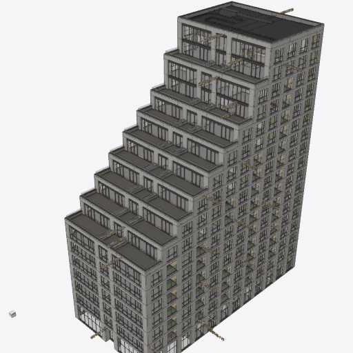
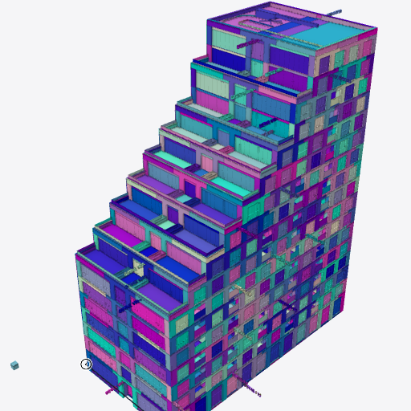
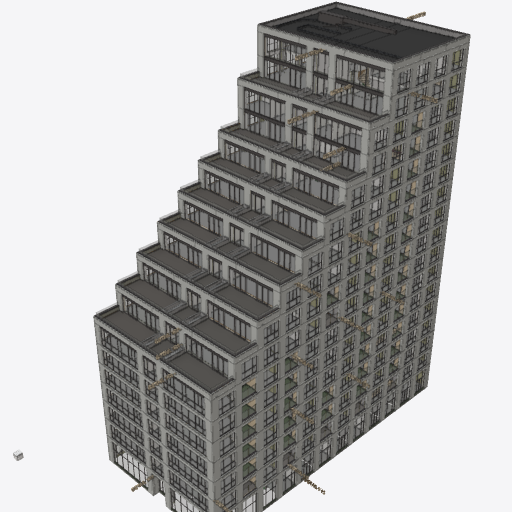
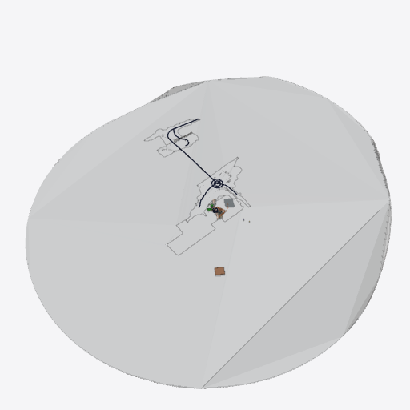
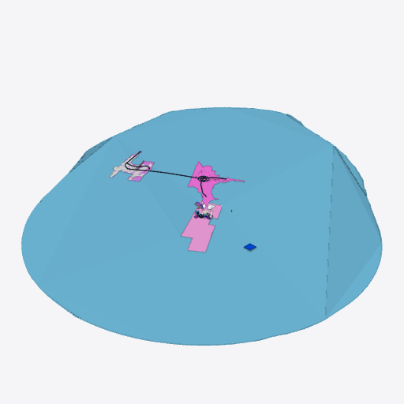
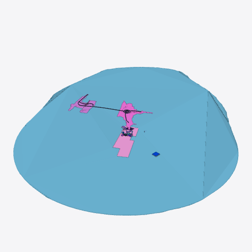

<!-- This Source Code Form is subject to the terms of the Mozilla Public
     License, v. 2.0. If a copy of the MPL was not distributed with this
     file, You can obtain one at https://mozilla.org/MPL/2.0/. -->

# Colour override browser run for PR #6148

Run on 2026-09-26 against base `8f83154af` and patched head `e0edbd9a2`, built with `pnpm build --filter=@ifc-lite/viewer`. The model was the repo's catalogued `tests/models/various/O-S1-BWK-BIM architectural - BIM bouwkundig.ifc` (326.8 MiB). Its IFC header identifies an IFC2X3 export from Graphisoft Archicad 21 on 2019-12-03. It was read from a local Windows Dropbox copy; the model bytes are not committed here. Both builds reported 55,577 geometry-streaming meshes and 16,395 scene IDs.

The browser was Windows Chrome 153.0.8010.50 in a fresh Playwright page for each run, on an AMD Ryzen 9 9900X3D and NVIDIA RTX 5070 Ti. Each build ran as a Vite production preview from WSL2. Runs were sequential in base → branch → base order; the table uses the second base pass, whose no-override draw count matches the branch's. Chrome's Linux SwiftShader device dropped during a preliminary attempt, so **all numbers below are from Windows Chrome**.

The temporary measurement hook in both builds made a `Map` entry for every `scene.getAllMeshDataExpressIds()` ID, with the same deterministic opaque RGBA palette in each build. It timed only `scene.setColorOverrides(map, device, pipeline)` via `performance.now()` and requested a render. The read-only viewport hook supplied frame stats and resident bytes. Windows `Win32_Process.PrivatePageCount` supplied GPU-process private memory immediately before and about three seconds after the override. An automated drag issued 80 pointer moves over the canvas; the observed frame rate counts distinct `getFrameStats().timestamp` values over that drag's elapsed time. These are render frame observations, **not a CPU-time profile of `render()`**.

| Metric | Base, second pass | PR #6148 |
|---|---:|---:|
| Draw calls, no overrides | 1,373 | 1,369 |
| Draw calls, all 16,395 IDs overridden | 8,891 | 1,369 |
| GPU-process private memory, before → after | 1,146,916 → 2,255,384 KiB | 1,142,444 → 1,148,500 KiB |
| GPU-process private memory added | 1,082 MiB | 5.9 MiB |
| One `setColorOverrides` call | 771.5 ms | 30.1 ms |
| Orbit, 80 pointer moves | 11.3 observed fps | 22.1 observed fps |
| Renderer-reported resident geometry | 36,311,204 B before and after | 36,245,920 B before and after |

The reported resident geometry counter excludes the colour table and old overlay allocations; process private memory is the relevant allocation observation. GPU-process private memory also includes unrelated browser allocations, so its delta is an approximate cost of this operation. The geometry-streaming mesh count matched, while final summary mesh counts varied slightly even between base runs; this run does not establish byte-identical complete output.

## Visual check

`renderer.captureColorFrame()` produced these 512 × 512 frames at the viewer's initial camera position:

| | No override | Deterministic opaque colours |
|---|---|---|
| Base |  |  |
| PR #6148 |  |  |

The clear and coloured pictures show the same building surfaces and colour placement by visual inspection. A raw pixel comparison found a mean absolute RGB difference of 0.12/255 per channel in the coloured images; 2,647 of 262,144 pixels differed by more than five levels in at least one channel. The clear images also differed at 2,930 pixels by that criterion, consistent with ordinary raster/load variation; this is visual parity rather than pixel identity.

## Remaining acceptance

The one-model run does not exercise federation IDs past 2²⁴, transparent/glass or `IfcSpace` promotion, a fractional-alpha override, focused-clash emphasis, X-Ray/ghost, or a model streamed in after colours are applied. It also does not measure `render()` CPU time or per-model load time with the lens already active.

## Supplementary 55-model federation

On the same Windows machine, a second browser run loaded **55 distinct real IFC files** from the top level of the mounted Dropbox `09_Testmodelle/IFC` folder. These were the 55 smallest files between 300 kB and 4.1 MB, ordered by file size; their combined source size was 68,219,793 bytes. They include authored building, structure, MEP, terrain, and infrastructure models. The viewer's normal multi-file Open/Add controls loaded each file through `useIfcLoader.loadFile` and registered 55 separate models. Both builds had 8,848 mesh-bearing global IDs after loading. The test palette and `setColorOverrides` probe were identical to the one-model run above.

This was an interleaved base → branch → base run in fresh Windows Chrome processes with the same 55 files and a fresh page each time. The table uses the second base pass. `Win32_Process.PrivatePageCount` was read from that dedicated Chrome process's GPU child immediately before and about three seconds after colouring; a negative delta means the measurement is within browser allocation/reclamation noise. The orbit trace sampled 80 distinct rendered frames over 80 pointer moves on the coloured scene.

| Metric | Base, second pass | PR #6148 |
|---|---:|---:|
| Draw calls, no overrides → all 8,848 IDs coloured | 891 → 10,372 | 891 → 891 |
| GPU-process private memory, before → after | 576,196,608 → 2,572,419,072 B | 579,407,872 → 563,023,872 B |
| GPU-process private memory added | +1,904 MiB | −15.6 MiB (flat within noise) |
| One `setColorOverrides` call | 449.1 ms | 4.77 ms |
| Coloured orbit, 80 pointer moves | 15.4 observed fps | 19.0 observed fps |
| Renderer-reported resident geometry | 46,354,844 B before and after | 46,370,084 B before and after |

The four 512 × 512 renderer readbacks show the same terrain/building placement and colour assignment. The coloured base and branch frames differ by a mean absolute RGB value of 0.072/255 per channel; 848 of 262,144 pixels differ by more than five levels in at least one channel. The camera fit is dominated by a large terrain model, so small building details are easier to inspect in the one-model images above.

| | No override, after orbit | Deterministic opaque colours, before orbit |
|---|---|---|
| Base |  |  |
| PR #6148 |  |  |

This is **a substitute 55-model federation**, not the original 82,478-element, 147.8 M-triangle federation cited in the PR. It exercises 55 model registrations and their global IDs, but does not establish the original federation's exact allocation or orbit result. The appearance-state and late-streaming cases listed above also remain outside this browser run; focused renderer tests cover those paths separately.
