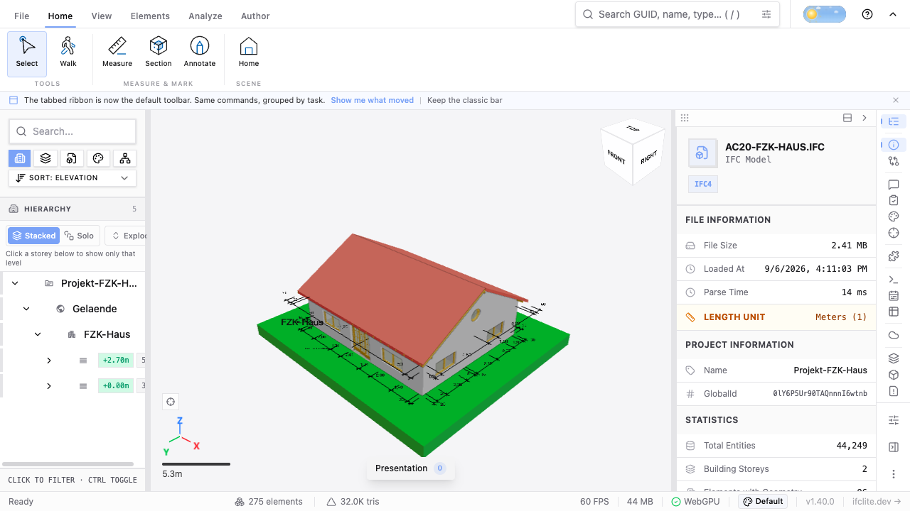

# Harness readiness functional evidence (#3978 / #4035)

[Capture and exact fixture/runtime hashes](capture.json) retain both fresh-process
records, successful metadata/geometry/renderer-finalization log lines, warnings,
launch identity and the insufficient-pairs reporter verdict. Paths identifying the
local workspace were removed; original artifact hashes are retained. Both runs use
the same viewer build, so their timings establish no performance improvement.

The screenshot was captured after the observed completion boundary. It proves a
visible real model for this smoke, not the exact first-paint timestamp or interactive
picking/property/cache coverage. Polling adds up to a poll interval plus automation
overhead. The legacy app summary remains a separate metric.

Both successful runs used headed installed Chrome with explicit GPU arguments,
cross-origin isolation and SharedArrayBuffer. Local Vercel analytics script
warnings remain in the capture; this is not a zero-console-error qualification.
The first three attempts are retained and listed as invalid renderer qualification:
headless Chromium had no GPU adapter. One also retained the legacy fixed wait and
two lacked the eventual isolated-worker setup. These failed attempts motivated the
renderer witness, origin, isolation and manual wait corrections; none is a claimed
performance control. The small public subset does not replace their raw archives.

Search readiness, full cache-completion memory, strong geometry fingerprint,
properties/picking, federation and Firefox remain outside this bounded smoke.
