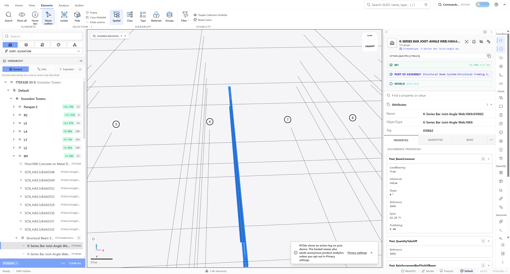

<!-- This Source Code Form is subject to the terms of the Mozilla Public
     License, v. 2.0. If a copy of the MPL was not distributed with this
     file, You can obtain one at https://mozilla.org/MPL/2.0/. -->

# Native viewport qualification for #6709 / PR #6711

Verdict: the isolated GPU-instanced member control passes on both subjects.
The timing cohorts are unqualified. This archive establishes no speed improvement
and does not reproduce or resolve the private-model regression in #6516.

The unchanged compiled subjects are baseline
`62be9dbf0cdb8fc084b4bfb7365bdcf0546ed480` and candidate
`4d2b84faf624f644277d65e5d3cc1a1d2d4b2a94`. Their common Rust tree is
`5127e1d6bb2e24b9836f48d1f9058d5fa875f06c`, and the actual received WASM bytes
hash to `a8216da63bd0d2eaa9652c91ce95a934268a080d6b35ed682910cc9e49824b02`.
The independently normalized build configurations match; their proof is retained.
These subjects precede later changes to main's Rust and WASM interface. Final
integration needs a matching current engine and fresh qualification.

## Completed actual viewer control

`6711-snowdon-instancing-functional-7` loads the manifest-backed public Revit
Snowdon structural IFC first in each fresh native Chrome context. The fixture SHA
is `fab102eb5f9152bc7053d7e4920a8b75d0d34683c834078f0735c88308eb00a4`.
Chrome reports version `154.0.8037.93`, NVIDIA Blackwell, actual origin isolation,
and available SharedArrayBuffer. The served WASM response bodies are hashed.

Each subject completes the canonical file-input load with 7,151 retained flat
meshes and 612,080 flat triangles, alongside 298 distinct GPU-instanced entity IDs
and 794 uploaded templates. Distinct entity IDs are not mesh occurrences; adding
them to the flat mesh count would be incorrect. GPU instance buffer byte identity
is not established by this control.

The control finds an actual entity whose source model retains no flat meshes,
using the canonical entity resolver. It isolates and frames that entity through
the existing viewer actions. Actual structural-material pixels from a screenshot
provide the target; a real GPU pick must still return the correct owner. Both
subjects pick and select `#7877`, IFC GlobalId `3ZT5EhLQn6JfRlijT8hoYQ`, through
a trusted UI click. Direct picking uses the actual isolation/visibility filters.

The candidate uses the reduced drawing buffer during navigation and restores the
full buffer after settling and capture. The baseline retains its full buffer.
Owner and model index stay equal before, during the stationary cap, and after
restoration. The camera really changes relative to its framed pose under the
trusted orbit. This is an isolated member control; full-model, federation and
world-position coverage are separate qualifications.

## Refusals and observer failures retained

The first fixed 24-row timing cohort refused every row after other local work
resumed. The separately declared second cohort accepted one Holter baseline row
and refused or failed the remaining rows. Intermittent Windows CPU activity,
observable Linux build graphs and later insufficient available memory prevented
a complete comparison. No row replacement, pooling, threshold relaxation or
third timing cohort followed. Neither cohort establishes a winner or a slowdown.

The restored default HTTP servers also omitted the production COOP/COEP headers.
Without SharedArrayBuffer, the adaptive load used its flat fallback. Those
observations cannot qualify production worker instancing; the otherwise valid
single baseline is also outside that target environment. The corrected server
uses same-origin COOP and credentialless COEP, matching the viewer configuration.
Future certificates and timings must record actual isolation and load-path
capability alongside source and engine identities.

All failed functional attempts remain. The broad picking grid missed the thin
structural member. The initial flat-only oracle mistakenly used scene enumeration,
which includes instanced entities; the corrected oracle uses source mesh arrays.
The external image decoder was unavailable, so the final observer uses the native
browser's image decoder. Direct picks without isolation options correctly saw
other scene geometry; the completed control supplies the filters and additionally
proves actual UI selection. None of these failures establishes a production defect.

The first WASM admission observer captured no worker under the missing headers.
The second bootstrap observer timed out and remains failed evidence. No native
admission-funnel conclusion is drawn from either observer. The later unmodified
viewer controls establish positive upload and picking coverage directly.

## Original records

`inventory.json` lists every archived file, its original SHA-256 and archive hash.
Gzip files preserve original bytes with a zero timestamp; use `gzip -dc` to inspect
them. Original scripts and their owned absolute paths are retained. Fixtures and
compiled application assets are not copied into this archive. Reproduction needs
freshly pinned sources, matching generated runtime, the declared public fixture,
an owned native browser and the recorded server policy.

The functional control's memory floor is separate from the unchanged timing
admission floor. Functional passage is not a performance verdict. This evidence
branch changes no implementation or measurement subjects, and PR #6711 remains
held for a complete comparison and current-source integration.
